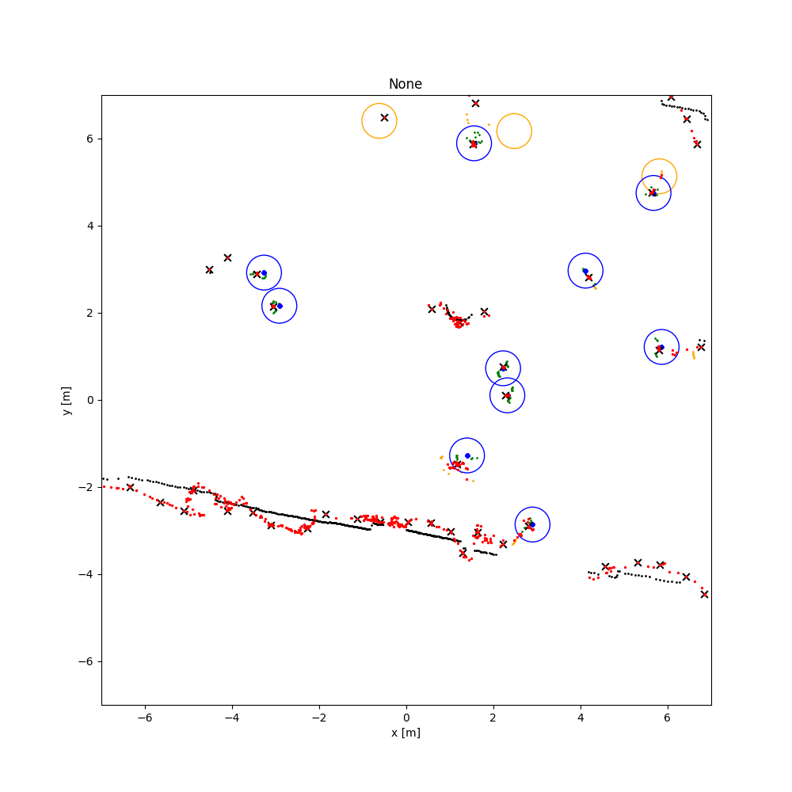

# 2D 激光雷达行人检测

## 1 介绍
该项目基于DROW3和DR-SPAAM模型，实现了实时的2D激光雷达行人检测。 主要处理流程为：输入预处理后的激光雷达点云序列（帧）->行人检测模型推理->行人检测模型后处理->检测结果输出及可视化。

### 1.1 支持的产品

- Ascend 310
- Atlas 200DK

### 1.2 支持的版本

Ascend-CANN：5.0.4
SDK：2.0.4

### 1.3 软件方案介绍
基于MindX SDK的2D激光雷达行人检测业务流程为：待检测LiDAR序列经预处理后得到按时间顺序的帧，输入本项目开发的模型推理插件，得到模型的推理结果。

表1.1 系统方案功能描述：
序号 | 模块 | 功能
--- | -----|-------
1 | 序列处理 | 接收输入激光雷达点云序列路径，对序列进行处理，并将得到的帧存储到dataloader中，并发送到模型推理插件。
2 | 模型推理 | 行人目标检测，输入为坐标转换后的帧，输出tensor为预测点分类结果和预测点坐标。
3 | 行人检测后处理 | 实现对输入tensor解析，提取最终行人位置坐标。
4 | 行人检测可视化 | 将后处理得到的每一帧的检测目标可视化，并显示在2D平面上。


### 1.4 代码目录结构与说明

本工程提供的测试数据集目录如下：

```
$(PROJECT_DIR)
├── dataset
│   ├── DROWv2
│   │   ├── test
│   │   ├── train
│   │   ├── val
│   ├── JRDB
│   │   ├── test_dataset
│   │   ├── train_dataset
...
```
本工程目录如下：

```
$(PROJECT_DIR)
├── README_cn.md
├── lidar_quicktest.sh
├── lidar_submit.sh
├── release_lidar_main.py
├── release_lidar_speedtest.py
│   ├── result.png
├── LaserDet
│   ├── dr_spaam_ros
│   │   ├── src
│   │   │   ├── dr_spaam_ros
│   │   │   │   ├── launch
│   │   │   │   │   ├── dr_spaam_ros.launch
│   │   │   │   ├── scripts
│   │   │   │   │   ├── drow_data_converter.py
│   │   │   │   ├── __init__.py
│   │   │   │   ├── CMakeLists.txt
│   │   │   │   ├── dr_spaam_ros.py
│   │   │   │   ├── node.py
│   │   │   │   ├── package.xml
│   │   │   │   ├── setup.py
│   │   ├── example.rviz
│   ├── scripts
│   │   ├── det.py
│   │   ├── eval_external.py
│   │   ├── onnx_om_convertor.sh
│   │   ├── setup_jrdb_dataset.py(自行下载)
│   ├── srcs
│   │   ├── data_handle
│   │   │   ├── __init__.py
│   │   │   ├── drow_handle.py
│   │   │   ├── jrdb_handle_handle.py
│   │   ├── data_loader
│   │   │   ├── __init__.py
│   │   │   ├── builder.py
│   │   │   ├── drow_dataset.py
│   │   │   ├── jrdb_dataset.py
│   │   ├── nexts
│   │   │   ├── __init__.py
│   │   │   ├── dr_spaam.py
│   │   │   ├── drow_net.py
│   │   │   ├── get_model.py
│   │   ├── utils
│   │   │   ├── __init__.py
│   │   │   ├── precision_recall.py
│   │   │   ├── utils.py
│   │   ├── __init__.py
│   │   ├── detector.py
│   ├── outputs_{*}
│   ├── pipelines
│   │   ├── *.pipeline
│   ├── release_logs

```

### 1.5 技术实现流程图

DROW/DR-SPAAM模型**前处理**流程为：
- 读取输入激光雷达点阵序列，根据预设的参数对序列进行裁剪和变换，得到原始模型支持的输入格式。
- 得到的模型输入按时间顺序排列。

**后处理**的整体思路为：

- 读取模型推理插件输出的帧中行人的位置信息，对位置信息进行坐标变换。
- 进行NMS，通过空间距离作为两个点是否重合的度量标准，给定最小距离冗余阈值，移除可能重复检测点，提高置信度。

### 1.6 适应场景

本案例可实现2D激光雷达行人检测，对输入有以下限制：
- 模型训练使用的数据为225 deg/360 deg，精度为0.5 deg，若采用其他测试样例，需额外增加补零或裁剪操作。
- 输入要求为txt格式，其中.txt存储内容为float32数据类型。
- 适用于单帧输入。

## 2 环境依赖

名称 | 版本 (310适用)
------- | --------
MindX SDK | 2.0.4
Ubuntu | 18.0.4 LTS
Ascend-CANN-toolkit | 5.0.4
Python | 3.9.2


## 3 软件依赖

如需要生成自己的数据集，涉及的第三方软件依赖如下：
软件 | 版本 | 功能描述
------- | -------- | --------
json | NA | 读写.json文件。
rosbag | 1.15.11  | 读取.bag格式的激光数据。
roslz4 | 4.0.2 | To solve "Failed to load Python extension for LZ4 support. LZ4 compression will not be available." rosbag正常运行依赖之一。
python-lzf | 0.2.4 | 压缩/解压缩.pcd格式的点云数据。


## 4 模型转换

本项目使用的模型checkpoints可通过[here](
https://mindx.sdk.obs.cn-north-4.myhuaweicloud.com/ascend_community_projects/2D_lidar_pedestrian_target_detection/Archive_pth_om_v2.zip)获取。压缩文件下载后解压，checkpoints文件后缀是.pth，下载后先将checkpoints转换成onnx格式，再使用模型转换工具[ATC](https://support.huaweicloud.com/tg-cannApplicationDev330/atlasatc_16_0005.html)将onnx转换成om模型。

### 4.1 DROW3 模型转换

<em>4.1.1 checkpoint文件转onnx文件</em>

将.pth模型下载并解压到(PROJECT_PATH)/dr\_spaam/ckpts/路径下，修改(PROJECT_PATH)/LaserDet/scripts/det.py代码中的参数ckpt,model,和panoramic_scan。模型名称model应与ckpt对应。
需要修改的参数共计6个，即

- 类Detector()中的ckpt_path: {PATH_TO_UNZIPPED_CHECKPOINTS}
- 类Detector()中的dataset: "DROW"或"JRDB"
- 类Detector()中的model: "DROW3"或"DR-SPAAM
- 类Detector()中的panoramic_scan: 如果数据集为DROWv2，则panoramic\_scan=False；如果数据集为JRDB，则panoramic\_scan=True。
- num_pts:
- torch.onnx.export()中的第三个参数，即输出onnx的文件名

为了简化执行步骤，前往det.py文件所在路径，执行以下步骤：
```
$ cd ${PATH_TO_PROJECT}/LaserDet/
# activate any torch env
# make sure you check the args, ckpt, model, and panoramic_scan, of class Detector in det.py
$ python scripts/det.py --ckpt_path ${PATH_TO_UNZIPPED_CHECKPOINTS}
```
该步骤后，生成的onnx默认保存在当前文件夹下。

<em>4.1.2 onnx文件转om文件</em>

进入onnx所在文件夹，执行以下步骤：
```
$ atc --model=$(PATH_TO_YOUR_DROW3_ONNX)/(DROW_MODEL_NAME).onnx --framework=5 --output={OUTPUT_NAME} -soc_version=Ascend310
```
生成的文件模型 *.om一般默认保存在当前执行命令所在路径下。执行后终端输入为：
```
ATC run success, welcome to the next use.
```
表示模型转换流程完成。

### 4.2 DR-SPAAM 模型转换

<em>4.2.1 checkpoint文件转onnx文件</em>

同4.1.1，前往det.py文件所在路径，执行以下步骤：
```
$ cd ${PATH_TO_PROJECT}/LaserDet/scripts
# activate any torch env
# make sure you check the args, ckpt, model, and panoramic_scan, of class Detector in det.py
$ python det.py --ckpt_path ${PATH_TO_UNZIPPED_CHECKPOINTS}
```

<em>4.2.2 onnx文件转om文件</em>
进入onnx所在文件夹，执行以下步骤：

>``` bash
># onnx_om_convertor.sh
>atc --model=$(PATH_TO_YOUR_DR_SPAAM_ONNX)/(DR_SPAAM_MODEL_NAME).onnx --framework=5 --output={OUTPUT_NAME} -soc_version=Ascend310
>```

生成的文件模型 *.om一般默认保存在当前执行命令所在路径下。执行后终端输入为：
```
ATC run success, welcome to the next use.
```
表示模型转换流程完成。

## 5 准备
### 5.1 数据集准备
<em>5.1.1 下载测试数据集</em>

创建dataset目录，确保下载并解压完毕后的dataset目录结构为
```
$(PROJECT_DIR)
├── dataset
│   ├── DROWv2
│   │   ├── test
│   │   ├── train
│   │   ├── val
│   ├── JRDB
│   │   ├── test_dataset
│   │   ├── train_dataset
...
```
数据集DROWv2下载地址：
- [DROW dataset](https://mindx.sdk.obs.cn-north-4.myhuaweicloud.com/ascend_community_projects/2D_lidar_pedestrian_target_detection/DROWv2-data.zip)

数据集JRDB下载地址：

- [JackRabbot dataset - train with activity](https://jrdb.erc.monash.edu/static/downloads/JRDB2022/train_dataset_with_activity/train_dataset_with_activity.zip)
- [jrdb22_test.zip](https://jrdb.erc.monash.edu/static/downloads/JRDB2022/test_dataset_without_labels/jrdb22_test.zip)

请注意，通过上述两个链接下载的数据集原名为test_dataset_without_labels与train_dataset_with_activity，请按照上述的目录结构更改为test_dataset及train_dataset。下载后请确保文件夹内包含rosbags文件夹，且内包含.bag原文件。

<em>5.1.2 预处理 JRDB 数据集</em>

即将激光测量数据从RAW格式的rosbag中提取出来，并且按时间轴与摄像头获取的图像对其，先安装必要的包：
```
# install required dependencies
$ pip install python-lzf
$ pip install lz4
$ pip install --extra-index-url https://rospypi.github.io/simple/ rosbag
$ pip install roslz4 --extra-index-url https://rospypi.github.io/simple/

```

接下来请从[2D_lidar_person_detection/setup_jrdb_dataset.py at master · VisualComputingInstitute/2D_lidar_person_detection · GitHub](https://github.com/VisualComputingInstitute/2D_lidar_person_detection/blob/master/dr_spaam/bin/setup_jrdb_dataset.py)上下载setup_jrdb_dataset.py脚本，放置于LaserDet/scripts文件夹下，并修改代码的第8行，使`_jrdb_dir`指向5.1.1下载的JRDB数据集。然后执行该脚本。

```
# extract laser measurements from raw rosbag and synchronize with images
$ python LaserDet/scripts/setup_jrdb_dataset.py
```

(可根据需要，只处理test测试集的部分，删除setup_jrdb_dataset.py文件的166与167行代码即可。)

### 5.2 pipeline文件准备

本项目提供了四个pipeline文件以满足测试要求，请将pipelines文件保存在以下路径。
```
$(PROJECT_DIR)
├── pipelines
│   ├── dr_spaam_drow_e40.pipeline
│   ├── dr_spamm_jrdb_e20.pipeline
│   ├── drow3_drow_e40.pipeline
│   ├── drow3_jrdb_e20.pipeline
...
```
其中DROWv2数据集对应的pipeline文件为dr_spaam_e40.pipeline和drow_e40.pipeline，JRDB数据集对应的pipeline文件为drow_jrdb_e20.pipeline和dr_spaam_jrdb_e20.pipeline。 确保pipeline文件中模型推理插件**mxpi_tensorinfer**的参数["props"]["model_path"]是正确的。

## 6 编译与运行
S1. 按 __2 环境依赖__ 中的步骤设置环境变量。

S2. 按 __4 模型转换__ 中的步骤获得om模型推理文件，并按 __5.2 pipeline文件准备__ 中的步骤确认模型推理文件是否可以被正确调用。

S3. 按 __5.1 数据集准备__ 中的步骤准备测试用数据集。

S4. 运行行人检测推理。首先找到可执行文件所在路径，在当前项目根目录下。
```
$ cd $(PROJECT_PATH)
```
命令执行成功后，终端打印出测试精度，并将可视化结果保存在项目根目录下。关于测试文件的使用方法详见 __7 性能与精度测试__

## 7 性能与精度测试

### 7.1 性能测试
执行 __6 编译与运行__ 中 S1-S3步骤完成准备工作，执行以下命令：

首先确保lidar_quicktest.sh中的python命令行如下：

>```bash
> # lidar_quicktest.sh
>nohup python -u release_lidar_speedtest.py --data_path $1 --pipe_store $2 --split $3 --seq_name $4
>```
[^注] 当测试完整数据集时，split可以为val/test；当测试单个序列时，split可以为train_nano/test_nano；当测试单个帧时，split可以为train_single/test_single。对于DROWv2数据集，序列名称即为train/test文件夹下.csv文件的名称；对于JRDB数据集，序列名称可以在train_dataset/lasers或test_dataset/lasers下快速查找得到。

测试整个数据集的平均性能：
>```bash
> # lidar_quicktest.sh
>nohup python -u release_lidar_speedtest.py --data_path $1 --pipe_store $2 --split $3
>```
```
$ cd $(PROJECT_PATH)
$ bash lidar_quicktest.sh dataset/{DATASET_NAME} pipelines/{NAME.pipeline} {VAL_OR_TEST}
# e.g. bash lidar_quicktest.sh dataset/DROWv2 pipelines/drow3_drow_e40.pipeline val
# e.g. bash lidar_quicktest.sh dataset/DROWv2 pipelines/dr_spaam_drow_e40.pipeline val
# e.g. bash lidar_quicktest.sh dataset/JRDB pipelines/drow3_jrdb_e40.pipeline val
# e.g. bash lidar_quicktest.sh dataset/JRDB pipelines/dr_spaam_jrdb_e40.pipeline val
```
（注意：关于指令`split`，在drowv2数据集下可选择val或者test,在jrdb数据集下仅可选择test)

经测试，推理性能可达到如下表所示，满足性能要求。实际推理速度与输入帧每一行的点数、数据集的大小有关，同时也与CPU的可分配资源有关。

该命令不包含可视化输出。

**性能推理结果如下：**

**1）**On DROW val dataset (450 points, 225 degrees field of view)

|        | FPS (Ascend 310) |
|--------|------------------|
|DROW3   | 6.6274 |
|DR-SPAAM| 3.0385 |

[^注] 因为预处理方式不同，DR-SPAAM模型的输入是DROW3的十倍，模型本身体量差异不大，执行性能体现在FPS上。


**2）**On JackRabbot (JRDB) val dataset (1091 points, 360 degrees field of view)

|        | FPS (Ascend 310) |
|--------|------------------|
|DROW3   | 11.0865 |
|DR-SPAAM| 10.9769 |

[^注] JRDB数据集的性能测试不包括计算精度的时间。

### 7.2 精度测试

执行 __6 编译与运行__ 中 S1-S3步骤完成准备工作。

#### <em>7.2.1 DROWv2数据集测试</em>

** 基于序的评价指标 **

* AP (ROC curve 与 AUC)：将所有的样本-标签对按照预测值逆序排列，从坐标点$(0,0)$出发，若第1个为正，则向上走一步，否则向右走一步，向上走一步的步距为$1/P$，向右走一步的步距为$1/N$，其中$|P|$为实际正标签的的总数，$|N|$为实际负标签的的总数。这样获得的曲线称为ROC（Receiver Operating Characteristic Curve），而AUC（Area Under Curve）就是该曲线与坐标轴围成的面积。本项目的测试指标AP即AUC。

* peak-F1：将所有的样本-标签对按照预测值逆序排列，第$k$次认为前$k$个样本-标签对为正，以此画出F1曲线，最终取该曲线中最大值，称之为peak-F1.

* EER：均等错误率EER（Equal Error Rate）是ROC曲线中FPR+TPR==1.0的地方，即ROC曲线与经过点$(1,0)$和点$(0,1)$的直线的交点。

若选择测试数据集为DROWv2，执行命令后终端输出测试精度。
首先确保lidar_submit.sh中的python命令行的输入如下：
>```bash
> # lidar_submitt.sh
>nohup python -u release_lidar_main.py --data_path $1 --pipe_store $2 --split $3 --visu $4
>```
再执行如下
```
$ cd $(PROJECT_PATH)
$ bash lidar_submit.sh dataset/DROWv2 pipelines/{NAME.pipeline} {VAL_OR_TEST} {True or False}
# e.g. bash lidar_submit.sh dataset/DROWv2 pipelines/drow3_drow_e40.pipeline test False
# e.g. bash lidar_submit.sh dataset/DROWv2 pipelines/drow3_drow_e40.pipeline val False
# e.g. bash lidar_submit.sh dataset/DROWv2 pipelines/dr_spaam_drow_e40.pipeline test False
# e.g. bash lidar_submit.sh dataset/DROWv2 pipelines/dr_spaam_drow_e40.pipeline val False
```
On DROW test dataset (450 points, 225 degrees field of view)
|        | AP<sub>0.3</sub> | AP<sub>0.5</sub> | peak_F1<sub>0.3</sub> | peak_F1<sub>0.5</sub>  | EER<sub>0.3</sub> | EER<sub>0.5</sub>  |
|--------|------------------|------------------|-----------------------|------------------|-----------------------|------------------|
|DROW3  (GPU) | 0.6375 | 0.6589 | 0.6431 | 0.6505 | 0.6407 | 0.6483 |
|DROW3  (310) | 0.6374 | 0.6586 | 0.6427 | 0.6502 | 0.6586 | 0.6478 |
|DR-SPAAM (GPU)| 0.7072 | 0.7227 | 0.6941 | 0.6979 | 0.6822 | 0.6878 |
|DR-SPAAM (310)| 0.7092 | 0.7250 | 0.6970 | 0.7010 | 0.6862 | 0.6918 |

On DROW val dataset (450 points, 225 degrees field of view)
|        | AP<sub>0.3</sub> | AP<sub>0.5</sub> | peak_F1<sub>0.3</sub> | peak_F1<sub>0.5</sub>  | EER<sub>0.3</sub> | EER<sub>0.5</sub>  |
|--------|------------------|------------------|-----------------------|------------------|-----------------------|------------------|
|DROW3  (GPU) | 0.4346 | 0.4507 | 0.4953 | 0.5024 | 0.4932 | 0.5000 |
|DROW3  (310) | 0.4347 | 0.4503 | 0.4949 | 0.5023 | 0.4929 | 0.4997 |
|DR-SPAAM (GPU)| 0.5107 | 0.5284 | 0.5476 | 0.5552 | 0.5458 | 0.5535 |
|DR-SPAAM (310)| 0.5128 | 0.5297 | 0.5488 | 0.5560 | 0.5474 | 0.5551 |

[^注] DROWv2数据集的val部分比test部分包含更多hard samples，故两个推理模型的val检测结果比test检测结果差。

#### <em>7.2.2 JRDB数据集测试</em>

若选择测试数据集为JRDB，因计算精度是几何增加的运算复杂度，执行命令后会将检测结果保存在路径下，需要切换测试环境（任意支持scipy和sklearn依赖的环境）以获得最终测试精度。首先执行以下命令
```
$ cd $(PROJECT_PATH)
$ bash lidar_submit.sh dataset/JRDB pipelines/{NAME.pipeline} {VAL_OR_TEST} False
# e.g. bash lidar_submit.sh dataset/JRDB pipelines/drow3_jrdb_e40.pipeline test False
# e.g. bash lidar_submit.sh dataset/JRDB pipelines/dr_spaam_jrdb_e40.pipeline test False
# e.g. bash lidar_submit.sh dataset/JRDB pipelines/drow3_jrdb_e40.pipeline val False
# e.g. bash lidar_submit.sh dataset/JRDB pipelines/dr_spaam_jrdb_e40.pipeline val False
```
默认的检测结果和对应的groundtruth将会被保存到$(PROJECT_PATH)/outputs_{MODEL_NAME}_JRDB/下，保存的结果如下所示：
```
$(PROJECT_DIR)
├── output_JRDB_{MODEL_NAME}
│   ├── detections
│   │   ├── <sequence_name_0>
│   │   │   ├── 000000.txt
│   │   │   ├── 000001.txt
│   │   │   ├── ...
│   │   ├── <sequence_name_1>
│   │   │   ├── 000000.txt
│   │   │   ├── 000001.txt
│   │   │   ├── ...
│   ├── groundtruth
│   │   ├── <sequence_name_0>
│   │   │   ├── 000000.txt
│   │   │   ├── 000001.txt
│   │   │   ├── ...
│   │   ├── <sequence_name_1>
│   │   │   ├── 000000.txt
│   │   │   ├── 000001.txt
│   │   │   ├── ...
...
```
如果测试单个序列，保存路径有少许不同，如下
```
$(PROJECT_DIR)
├── output_JRDB_{seq_name}_{MODEL_NAME}
│ ├── detections
│ │ ├── 000000.txt
│ │ ├── 000001.txt
│ │ ├── ...
│ ├── groundtruth
│ │ ├── 000000.txt
│ │ ├── 000001.txt
│ │ ├── ...
```
确认输出结果存在后，可在支持[scipy](https://new.scipy.org/install.html)和[sklearn](https://scikit-learn.org/stable/install.html)的环境中安装依赖。注意安装顺序，首先安装numpy和scipy，再安装sklearn：
```
# # If using pip
# To install scipy, try:
$ pip install scipy
# If this fails, then try:
$ python -m pip install --user numpy scipy matplotlib ipython jupyter pandas sympy nose
# To install sklearn, try:
$ pip install -U scikit-learn

# # If using conda
$ conda install -c anaconda scipy
$ conda install -c anaconda scikit-learn
```
我们提供了可供参考的脚本LaserDet/scripts/eval_external.py：

将参数 --result_dir 修改为正确的输出结果txt集地址，执行以下指令：

```
$ cd $(PROJECT_PATH)/LaserDet
$ python scripts/eval_external.py --result_dir ${OUTPUTS_RESULTS_DIR}
```
执行命令后终端输出测试精度。

On JackRabbot(JRDB) test dataset (1091 points, 360 degrees field of view)
|        | AP<sub>0.3</sub> | AP<sub>0.5</sub> | peak_F1<sub>0.3</sub> | peak_F1<sub>0.5</sub>  | EER<sub>0.3</sub> | EER<sub>0.5</sub>  |
|--------|------------------|------------------|-----------------------|------------------|-----------------------|------------------|
|DROW3 (GPU) | 0.7642 | 0.8255 | 0.7277 | 0.7516 | 0.7229 | 0.7479 |
|DROW3 (310) | 0.7357 | 0.8170 | 0.7138 | 0.7468 | 0.7096 | 0.7344 |
|DR-SPAAM (GPU) | 0.7856 | 0.8377 | 0.7482 | 0.7744 | 0.7477 | 0.7741 |
|DR-SPAAM (310) | 0.7560 | 0.8289 | 0.7320 | 0.7677 | 0.7311 | 0.7673 |

[^注] 验证DROWv2和JRDB的精度值不能跨数据集比较。

### 7.3 可视化测试
**需要提前安装安装matplotlib。**

运行脚本 lidar_submit.sh 时,在该script中的指令中加上--visu True （示例中，--visu为bash命令的第四个arg）。

安装matplotlib命令如下：

```
$ pip3 install matplotlib
```
确保lidar_submit.sh的python命令行修改如下，本例设置了6个外部输入变量。

请注意，**本节主要用于对单帧进行可视化的分析**，如需进行完整测试集的可视化测试请在7.2节中修改`visu`指令为True即可。

>``` bash
> # lidar_submit.sh
>python -u release_lidar_main.py --data_path $1 --pipe_store $2 --split $3 --visu $4 --seq_name $5 --frame_id $6
>```

执行命令示例(对cubberly-auditorium-2019-04-22_0序列的1234帧进行可视化操作）

（请注意：`split指令`需写成train_single或者test_single的形式，`visu指令`保持为True）

```
bash lidar_submit.sh ./dataset/JRDB ./pipelines/drow3_jrdb_e40.pipeline train_single True cubberly-auditorium-2019-04-22_0 1234
```

可视化结果将保存在项目根目录的./fig文件夹下。
```
$(PROJECT_DIR)
├── figs
│ ├── sequence_name01
│ │ ├── dddddd.png
│ │ ├── dddddd.png
│ │ ├── ...
│ ├── sequence_name02
│ │ ├── dddddd.png
│ │ ├── dddddd.png
│ │ ├── ...
```



## 8 ROS环境下的测试

### 8.1 Altas 200dk 开发板 ROS环境配置

材料清单：

|名称    | 数量 |
|--------|------------------|
| Atlas-200dk开发板+配套电源线   | 1 |
| Type-C USB线 | 1 |
| 网线 | 1 |
| 可共享网络的设备（如电脑或路由器） | 1 |
| SD卡（建议100G以上） | 1 |
| 读卡器 | 1 |

请参阅[Atlas200dk-MindXSDK开发环境搭建一站式导航](https://gitee.com/ascend/docs-openmind/blob/master/guide/mindx/ascend_community_projects/tutorials/200dk%E5%BC%80%E5%8F%91%E6%9D%BF%E7%8E%AF%E5%A2%83%E6%90%AD%E5%BB%BA.md#https://gitee.com/link?target=https%3A%2F%2Fwww.hiascend.com%2Fzh%2Fsoftware%2Fmindx-sdk%2FmxVision%2Fcommunity%25EF%25BC%258C%25E9%2580%2589%25E6%258B%25A9arrch64%25E6%259E%25B6%25E6%259E%2584%25EF%25BC%258C%25E4%25B8%258B%25E8%25BD%25BDAscend-mindxsdk-mxvision_2.0.4_linux-aarch64.run)在Atlas200dk开发板或同类型平台上安装好MindXSDK。[确认python版本>3.6]

请参阅[Atlas200dk-ROS系统移植一站式导航](https://gitee.com/ascend/docs-openmind/blob/master/guide/mindx/ascend_community_projects/tutorials/200dk-ROS%E7%B3%BB%E7%BB%9F%E7%A7%BB%E6%A4%8D.md)在Atlas200dk开发板或同类型平台上安装好ROS系统。[确认ros melodic==1.14.13]

考虑到Atlas-200dk无可视化操作界面，测试结果需要借助其他平台展示，如有可视化操作界面的Linux系统，安装版本为desktop系列，windows系统下请安装虚拟机，再在虚拟机中配置Linux下的ROS系统。

### 8.2 编译与运行

#### 8.2.1 编译ROS节点

首先为执行cmake新建一个文件夹，并命名为dr_spaam_ros（原git clone项目下的dr_spaam_ros文件夹改名为dr_spaam_ros_backup或其他不冲突的名称）。
```
$ cd $(PATH_TO_LaserDet)
$ mkdir -p dr_spaam_ros
$ cd dr_spaam_ros
$ catkin_make
// This will create a build folder and a devel folder
$ catkin_make_isolated
// This will create a build_isolated folder and a devel_isolated folder
// a CMakeLists.txt file will appear under the src folder
```

完成后，dr_spaam_ros路径下应有如下：
```
$(LaserDet)
├── dr_spaam_ros
│ ├── build
│ │ ├── ...
│ ├── build_isolated
│ │ ├── ...
│ ├── devel
│ │ ├── ...
│ ├── devel_isolated
│ │ ├── ...
│ ├── src
│ │ ├── ...
│ │ ├── CMakeLists.txt
│ ├── .catkin_workspace
│ ├── example.rviz
```

#### 8.2.2 运行ROS节点

我们假设读者已正常执行步骤1-7，所需模型与数据集已就位。默认在ROS环境下，每开启一个新的终端都在路径$(PATH_TO_LASERDET)/LaserDet/dr_spaam_ros下，并执行source devel/setup.bash添加ROS环境路径。至目前该ROS节点支持JRDB数据集，模型输入为.bag文件，一般位于JRDB/(train OR test)/rosbag/SEQUENCE_NAME.bag，同时需要时间戳文件，一般位于JRDB/(train OR test)/timestamps/SEQUENCE_NAME/frames_pc_im_laser.json。测试用bag文件和json文件的序列名称SEQUENCE_NAME是一一对应的。

首先编辑LaserDet/dr_spaam_ros/src/dr_spaam_ros/node.py主程序中的
>```python
>if __name__ == '__main__':
>    # init ros node here
>    rospy.init_node("dr_spaam_ros")
>    mode = 1 # 1: eval , 2: render
>    seq_name = # TODO BAGFILE_NAME (.bag) and the model detection outputs will be saved under the folder named by seq_name
>    timestamps_path = # TODO $(PATH_TO_TIMESTAMP_FILE)/frames_pc_im_laser.json
>    pipe_store = # TODO $(PATH_TO_MODEL_PIPELINES)/XXX.pipeline
>    is_rviz_supported = False # TODO if you have rviz-supported env or not
>```
若mode为1，模型推理结果将保存在LaserDet/dr_spaam_ros/src/outputs/seq_name下，按时间戳文件中的顺序逐帧写入txt文件，当rosbag play（步骤3）正常结束后，roslaunch（步骤2）也会正常退出。同时，也可以设置is_rviz_supported为False，每一帧的可视化结果将会保存到LaserDet/dr_spaam_ros/src/bag2png下。若mode为2，则节点会一直处于等待接收sensor message的状态，rosbag play（步骤3）结束后，roslaunch（步骤2）不会自动退出，必须手动ctrl+C。

运行步骤如下：

1. 开启一个终端输入：roscore，在测试过程中第一个终端不能关闭或停止roscore。

2. 开启另一个终端输入：roslaunch dr_spaam_ros dr_spaam_ros.launch，启动DR-SPAAM-ROS节点，等待片刻，直至推理模型初始化完毕，即终端显示stream创建成功。
```
I20221105 11:21:15.085721 29942 MxStreamManager.cpp:175] Creates streams successfully.
I20221105 11:21:15.085903 30016 MxsmStream.cpp:326] state changed: NULL->READY
-----------------Create Stream Successfully, ret=0-----------------
I20221105 11:21:15.086086 30016 MxsmStream.cpp:326] state changed: READY->PAUSED
I20221105 11:21:15.086273 30016 MxsmStream.cpp:326] state changed: PAUSED->PLAYING
loop TOTAL_NUM_OF_FRAMES_IN_A_BAG_FILE_TO_BE_READ
```

3. 开启第三个终端输入：rosbag play -r 0.015 BAG_FILE，DR-SPAAM-ROS节点开始接收每一帧信息。其中，-r是play rate，为避免丢帧造成模型推理无法正常进行，我们不得不适当降低rosbag play的速率至0.015-0.020这个范围。

终端显示
```
[ INFO] [1667556035.108439173]: Opening xxx.bag

Waiting 0.2 seconds after advertising topics... done.

Hit space to toggle paused, or 's' to step.
 [RUNNING]  Bag Time: xxx   Duration: xxx / xxx               xxx
Done.
```
直至bag文件播放结束。若rosbag play执行结束后，roslaunch的节点没有正常输出以下指示并正常退出，可能是因为速率过高造成的丢帧，不同于C++下的ROS，rospy.spin()的使用会使节点一直处于等待接收信息的状态，只能在第二个开启的终端中执行ctrl+C退出roslaunch或rosrun，
```
Mission completed, please check your output dir and welcome for the next use.
```
optional：

4. 开启第四个终端输入：
```
$ cd $(PATH_TO_LaserDet)/dr_spaam_ros
$ source devel/setup.bash
$ mkdir bagfiles
$ cd bagfiles
$ rosbag record -a
// OR ALTERNATIVE
$ rosbag record -O subset /segway/scan_multi /dr_spaam_rviz /dr_spaam_detections
```
其中-a表示把rosrun发表的所有topics都保存到新建的.bag文件中。这个方法不需要提前执行rostopic list -v查看所有topics，且后期更换任意一支持平台可视化时更方便，只需执行rosrun rviz rviz -d example.rziz，启动GUI界面。注意该选项要求开发板预留足够的free space（至少大于当前bag文件+1GB）。注意，若选择用rosbag保存subset，后两个topics即{/dr_spaam_rviz, /dr_spaam_detections}是在节点启动后才会发布的。
```
$:rostopic hz /segway/scan_multi # SensorMessage input of node dr_spaam_ros
$:rostopic hz /dr_spaam_rviz # Published topic of node dr_spaam_ros
$:rostopic hz /dr_spaam_detections # Published topic of node dr_spaam_ros
```

### 8.3 ROS精度测试

本项目提供精度测试代码，位于LaserDet/scripts/eval_external_ros.py，使用方法与LaserDet/scripts/eval_external.py相同，此处不作过多展开。

## 9 常见问题

### 9.1 测试输入用例不存在

解决方案：检查输入路径。

### 9.2 测试输入格式错误

解决方案：严格按照数据集处理流程处理测试数据。

### 9.3 测试数据不符合模型输入

如果采用本说明提供的数据集以外的数据作为测试用例，可能需要自行实现前处理。

## 10 参考文献
```BibTeX
@article{Jia2021Person2DRange,
  title        = {{Self-Supervised Person Detection in 2D Range Data using a
                   Calibrated Camera}},
  author       = {Dan Jia and Mats Steinweg and Alexander Hermans and Bastian Leibe},
  booktitle    = {International Conference on Robotics and Automation (ICRA)},
  year         = {2021}
}

@inproceedings{Jia2020DRSPAAM,
  title        = {{DR-SPAAM: A Spatial-Attention and Auto-regressive
                   Model for Person Detection in 2D Range Data}},
  author       = {Dan Jia and Alexander Hermans and Bastian Leibe},
  booktitle    = {International Conference on Intelligent Robots and Systems (IROS)},
  year         = {2020}
}
```
