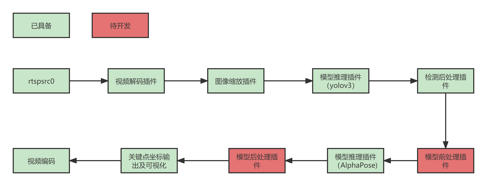

# AlphaPose人体关键点估计

## 1 介绍

AlphaPose 人体关键点估计前、后处理插件基于 MindX SDK 开发，在昇腾芯片上进行人体关键点估计，将结果进行可视化并保存。主要处理流程为：输入视频 >视频解码 >图像缩放 >行人检测模型推理 >行人检测模型后处理 >人体关键点估计模型前处理 >人体关键点估计模型推理  > 人体关键点估计模型后处理 >关键点输出及可视化 >视频编码。

人体关键点检测是指在行人检测的基础上，对检测出来的所有行人进行人体 17 个关键点的检测，包括鼻子、左眼、右眼、左耳、右耳、左肩、右肩、左肘、右肘、左手腕、右手腕、左髋、右髋、左膝、右膝、左踝、右踝。然后将关键点正确配对组成相应的人体骨架，展示人体姿态。本方案采取 AlphaPose 人体关键点检测模型，将待检测图片输入模型进行推理，推理得到包含人体 17 个关键点信息的 Heatmaps，再从 Heatmaps 中提取得到人体关键点位置等信息。

### 1.1 支持的产品

Atlas 200DK

### 1.2 支持的版本

本样例配套的 CANN 版本为 [5.0.5alpha001](https://www.hiascend.com/software/cann/community)。支持的 SDK 版本为 [2.0.4](https://www.hiascend.com/software/Mindx-sdk)。

### 1.3 软件方案介绍

基于 MindX SDK 的 AlphaPose 人体关键点估计业务流程为：待检测视频存放在 live555 服务器上经 mxpi_rtspsrc 拉流插件输入，然后使用视频解码插件 mxpi_videodecoder 将视频解码成图片，再通过图像缩放插件 mxpi_imageresize 将图像缩放至满足行人检测模型要求的输入图像大小要求，缩放后的图像输入行人检测模型推理插件 mxpi_tensorinfer0 得到行人检测结果，本项目开发的 AlphaPose 前处理插件处理行人推理结果，得到满足AlphaPose模型要求的输入图像，AlphaPose 前处理后的图像经过 AlphaPose 模型推理插件 mxpi_tensorinfer1 得到包含人体 17 个关键点信息的 Heatmaps，本项目开发的 AlphaPose 后处理插件处理 AlphaPose 模型推理结果，得到人体关键点位置与置信度信息。最后输出插件 appsink 获取 AlphaPose 后处理插件输出结果，并在外部进行人体姿态可视化描绘与视频编码。

表1.1 系统方案各子系统功能描述：

| 序号 | 子系统               | 功能描述                                                     |
| ---- | -------------------- | :----------------------------------------------------------- |
| 1    | 视频输入             | 接收外部调用接口的输入视频路径，对视频进行拉流，并将拉取的裸流存储到缓冲区（buffer）中，并发送到下游插件。 |
| 2    | 视频解码             | 用于视频解码，当前只支持 H264/H265 格式。                    |
| 5    | 图像缩放             | 对解码后的 YUV 格式的图像进行指定宽高的缩放，暂时只支持 YUV 格式的图像。 |
| 6    | 模型推理             | 行人目标检测，目前只支持单 tensor 输入（图像数据）的推理模型。 |
| 7    | 目标检测后处理       | 实现对 yolo 目标检测模型输出的 tensor 解析，获取对于行人的目标检测框。 |
| 8    | 人体关键点估计前处理 | 根据目标检测后处理插件对视频解码后的图像进行仿射变换处理。   |
| 9    | 模型推理             | 人体关键点检测，目前只支持单 tensor 输入（图像数据）的推理模型。 |
| 7    | 人体关键点估计后处理 | 实现对 AlphaPose 模型输出的 tensor 解析，获取人体关键点位置与置信度信息。 |
| 11   | 人体姿态可视化       | 实现对每帧图像标注人体关键点并进行连接。                     |
| 12   | 视频编码             | 将标注后的图片进行视频编码，输出视频。                       |

### 1.4 代码目录结构与说明

本工程名称为 AlphaPose，工程目录如下图所示：

```
.
├── README.md
├── build.sh
├── image
│   ├── acctest.png
│   ├── SDK流程图.png
│   └── speedtest.png
├── models
│   ├── aipp_192_256_rgb.cfg
│   ├── aipp_yolov3_416_416.aippconfig
│   ├── yolov3.names
│   └── yolov3_tf_bs1_fp16.cfg
├── pipeline
│   ├── evaluate.pipeline
│   ├── image.pipeline
│   └── video.pipeline
├── plugin
│   ├── postprocess
│   │   ├── CMakeLists.txt
│   │   ├── MxpiAlphaposePostProcess.cpp
│   │   ├── MxpiAlphaposePostProcess.h
│   │   └── build.sh
│   └── preprocess
│       ├── CMakeLists.txt
│       ├── MxpiAlphaposePreProcess.cpp
│       ├── MxpiAlphaposePreProcess.h
│       └── build.sh
├── proto
│   ├── CMakeLists.txt
│   ├── build.sh
│   └── mxpiAlphaposeProto.proto
├── run.sh
└── src
    ├── evaluate.py
    ├── image.py
    ├── utils
    │   └── visualization.py
    └── video.py
```


### 1.5 技术实现流程图



AlphaPose模型前处理插件的输入有两个，一个是视频解码插件输出的 YUV 格式的图像帧，一个是检测后处理插件输出的图像帧中人体的位置信息。AlphaPose模型前处理插件整体流程为：

1.  读取视频解码插件输出的 yuv 格式的图像帧数据，并对其进行 YUV 到 RGB 色域的转换。
2.  读取检测后处理插件输出的图像帧中人体的位置信息，根据该位置信息计算人体中心的位置与人体所占面积的宽高。
3.  根据前面两个步骤所获得的信息，对第一步的 RGB 图像进行放射变换。

AlphaPose模型后处理插件的输入也有两个，一个是检测后处理插件输出的图像帧中人体的位置信息，一个是AlphaPose模型推理插件输出的张量，包含图像帧中检测到的所有人体 17 个关键点信息的 Heatmaps。后处理插件的整体流程为：

1.  读取检测后处理插件输出的图像帧中人体的位置信息，根据该位置信息计算人体中心的位置与人体所占面积的宽高。
2.  读取检测AlphaPose模型推理插件输出的包含图像帧中检测到的所有人体 17 个关键点信息的 Heatmaps，寻找每张 Heatmap 中的最大值作为该关键点的得分，最大值的位置作为该关键点在 Heatmap 中的位置，然后再结合第一步的信息通过放射变换获取该关键点在原图上的坐标。
3.  进行PoseNMS，通过姿态距离+空间距离作为度量标准，设定阈值，筛选出单一的姿态。

###  1.6 特性及适应场景

本案例可以满足人体关键点估计内容，但同时对输入的图像或视频有以下限制：

1.  输入图像要求为 jpg、jpeg、JPG、JPEG编码格式。
2.  输入视频要求为 h264 或 h265 的格式。
3.  当输入图片或视频帧中中的人员过于密集，会影响检测效果。
4.  适用于单视频流输入。

## 2 环境依赖

推荐系统为 ubuntu 18.04，环境依赖软件和版本如下表：

| 软件名称            | 版本          |
| ------------------- | ------------- |
| MindX SDK           | 2.0.4         |
| ubuntu              | 18.04.5 LTS   |
| Ascend-CANN-toolkit | 5.0.5alpha001 |
| python              | 3.9.2         |

在编译运行项目前，需要设置环境变量：

-   MindX SDK 环境变量介绍

    ```shell
    . ${SDK-path}/set_env.sh
    ```

-   CANN 环境变量介绍

    ```shell
    . ${ascend-toolkit-path}/set_env.sh
    ```

## 3 软件依赖

推理中涉及到第三方软件依赖如下表所示。

| 依赖软件 | 版本       | 说明                             | 使用教程                                                     |
| -------- | ---------- | -------------------------------- | ------------------------------------------------------------ |
| live555  | 1.09       | 实现视频转 rstp 进行推流         | [链接](https://gitee.com/ascend/mindxsdk-referenceapps/blob/master/docs/参考资料/Live555离线视频转RTSP说明文档.md) |
| ffmpeg   | 2022-06-27 | 实现 mp4 格式视频转为264格式视频 | [链接](https://gitee.com/ascend/mindxsdk-referenceapps/blob/master/docs/参考资料/pc端ffmpeg安装教程.md) |


## 4 模型转换

### 4.1 YOLOv3 模型转换

本项目中适用的第一个模型是 YOLOv3 模型，可通过[地址](https://www.hiascend.com/zh/software/modelzoo/detail/1/ba2a4c054a094ef595da288ecbc7d7b4)获取，下载后使用模型转换工具 ATC 将 pb 模型转换为 om 模型，模型转换工具相关介绍参考链接：https://support.huaweicloud.com/tg-cannApplicationDev330/atlasatc_16_0005.html 。

模型转换，步骤如下：

1. 将上述 pb 模型下载至 `AlphaPose/models` 文件夹下，文件名为：`yolov3_tf.pb` 。
2. 进入 `AlphaPose/models` 文件夹下执行命令：

```shell
atc --model=./yolov3_tf.pb --framework=3 --output=./yolov3_tf_bs1_fp16 --soc_version=Ascend310 --insert_op_conf=./aipp_yolov3_416_416.aippconfig --input_shape="input:1,416,416,3" --out_nodes="yolov3/yolov3_head/Conv_22/BiasAdd:0;yolov3/yolov3_head/Conv_14/BiasAdd:0;yolov3/yolov3_head/Conv_6/BiasAdd:0"
```

执行该命令后会在当前文件夹下生成项目需要的模型文件 `yolov3_tf_bs1_fp16.om`。执行后终端输出为：

```shell
ATC run success, welcome to the next use.
```

表示命令执行成功

### 4.2 AlphaPose 模型转换

第二个模型是 AlphaPose 模型，onnx 模型可通过[地址](https://mindx.sdk.obs.cn-north-4.myhuaweicloud.com/ascend_community_projects/AlphaPose/model.zip)获取。下载后使用模型转换工具 ATC 将 onnx 模型转换为 om 模型。

模型转换，步骤如下：

1. 将上述 onnx 模型下载至 `AlphaPose/models` 文件夹下，文件名为：`fast_res50_256x192_bs1.onnx` 。
2. 进入 `AlphaPose/models` 文件夹下执行命令：

```shell
atc --framework=5 --model=fast_res50_256x192_bs1.onnx --output=fast_res50_256x192_aipp_rgb --input_format=NCHW --input_shape="image:1,3,256,192" --soc_version=Ascend310 --insert_op_conf=aipp_192_256_rgb.cfg
```

执行该命令后会在当前文件夹下生成项目需要的模型文件 `fast_res50_256x192_aipp_rgb.om`。执行后终端输出为：

```shell
ATC run success, welcome to the next use.
```

表示命令执行成功。


## 5 准备

按照第 3 小结**软件依赖**安装 live555 和 ffmpeg，按照 [Live555离线视频转RTSP说明文档 ](https://gitee.com/ascend/mindxsdk-referenceapps/blob/master/docs/参考资料/Live555离线视频转RTSP说明文档.md) 将 mp4 视频转换为 h264 格式。并将生成的 264 格式的视频上传到 `live/mediaServer` 目录下，然后修改 `AlphaPose/pipeline` 目录下的 `video.pipeline` 文件中 mxpi_rtspsrc0 的内容。

```
        "mxpi_rtspsrc0": {
            "props": {
                "rtspUrl":"rtsp://xxx.xxx.xxx.xxx:xxxx/xxx.264",      // 修改为自己开发板的地址和文件名
                "channelId": "0"
            },
            "factory": "mxpi_rtspsrc",
            "next": "mxpi_videodecoder0"
        },
```


## 6 编译与运行

**步骤1** 按照第 2 小节 **环境依赖** 中的步骤设置环境变量。

**步骤2** 按照第 4 小节 **模型转换** 中的步骤获得 om 模型文件，放置在 `AlphaPose/models` 目录下。

**步骤3** 按照第 5 小节 **准备** 中的步骤准备好输入视频流。

**步骤4** 编译。进入 `AlphaPose` 目录，在 `AlphaPose` 目录下执行命令：

```shell
bash build.sh
```

**步骤5** 运行视频流推理。在 `AlphaPose` 目录下执行命令：

```shell
bash run.sh video
```

命令执行成功后会在 `AlphaPose/out` 目录下生成 `alphapose.avi` 和 `alphapose.json` 文件，其中 `alphapose.avi` 为人体姿态可视化后的视频输出，`alphapose.json` 为每一帧图像中人物的关键点位置与置信度信息，查看文件验证人体关键点估计结果。

**步骤6** 运行图片推理。在 `AlphaPose` 目录下创建 `data` 目录，然后将需要推理的图片放在 `AlphaPose/data` 目录下。回到在 `AlphaPose` 目录下执行命令：

```shell
bash run.sh image
```

命令执行成功后会在 `AlphaPose/out` 目录下生成以测试图片名称命名的 json 文件，该文件包含图像中人物的关键点位置与置信度信息。查看文件验证人体关键点估计结果。


## 7 性能与精度测试

#### 7.1 性能测试

执行第 6 小节 **编译与运行** 中的步骤 1 至步骤 3 完成准备工作，进入 `AlphaPose` 目录，在 `AlphaPose` 目录下执行命令：

```shell
bash run.sh video --speedtest
```

命令运行后终端会每 10 帧打印一次当前帧数，前 10 帧的运行时间以及前10帧的平均帧率。经测试，性能可以达到 19 fps 左右，满足性能要求。

[^注]: 输入视频帧率应高于25，否则无法发挥全部性能。且由于 Alphapose 人体关键点估计是一种自上而下的方式，所以实际推理速度与视频中的人数存在负相关关系，即人数越多，推理用时越多，速度越慢。上述展示的推理速度是在视频帧大小为 720*1280，且视频中只有一个人的条件下所得到的性能。

#### 7.2 精度测试

1.  安装 COCO 数据集 python API。

    ```shell
    pip3 install pycocotools
    ```

2.  下载 COCO VAL 2017 数据集，[验证集下载链接](http://images.cocodataset.org/zips/val2017.zip)，[验证集标签下载链接](http://images.cocodataset.org/annotations/annotations_trainval2017.zip)。在`AlphaPose/src` 目录下创建 `dataset` 目录，将验证集和标签压缩文件解压至 `AlphaPose/src/dataset` 目录下。确保下载完数据集和标注文件后的 `AlphaPose/src` 目录结构为：

    ```
    .
    ├── dataset
    │   ├── annotations
    │   │   └── person_keypoints_val2017.json
    │   └── val2017
    │       ├── 000000581615.jpg
    │       ├── 000000581781.jpg
    │       └── other-images
    ├── evaluate.py
    ├── image.py
    └── video.py
    ```


3.  执行第 6 小节 **编译与运行** 中的步骤 1 至步骤 3 完成准备工作，进入 `AlphaPose` 目录，在 `AlphaPose` 目录下执行命令：

    ```shell
    bash run.sh evaluate
    ```

    命令执行结束后输出 COCO 格式的评测结果，并生成 val2017_keypoint_detect_result.json 检测结果文件。经测试，在coco验证集上的 mAP 为 0.732，满足精度要求。


## 8 常见问题

#### 8.1 输出视频无法播放

**问题描述：**

运行视频流推理时，发现生成的 `alphapose.avi` 无法播放。

**解决方案：**

1.  检查 `AlphaPose/src/video.py` 中的 `VIDEO_WIDTH` 和 `VIDEO_HEIGHT` 参数，确保这两参数的值是输入的视频的宽和高。
2.  去掉运行命令的 `--speedtest` 选项，在进行性能测试时将不进行视频编码操作。

#### 8.2 视频流推理自动退出

**问题描述：**

运行视频流推理时，一个视频流推理到最后会出现提示 `Please check the rtspUrl of the video is correct or the video exists`，然后自动退出。

**解决方案：**

这是因为没有做循环推流，只是有限的视频流，当有限的视频流结束时，将收不到推流，即断流。可以参考  [Live555离线视频转RTSP说明文档 ](https://gitee.com/ascend/mindxsdk-referenceapps/blob/master/docs/参考资料/Live555离线视频转RTSP说明文档.md)  设置循环推流。