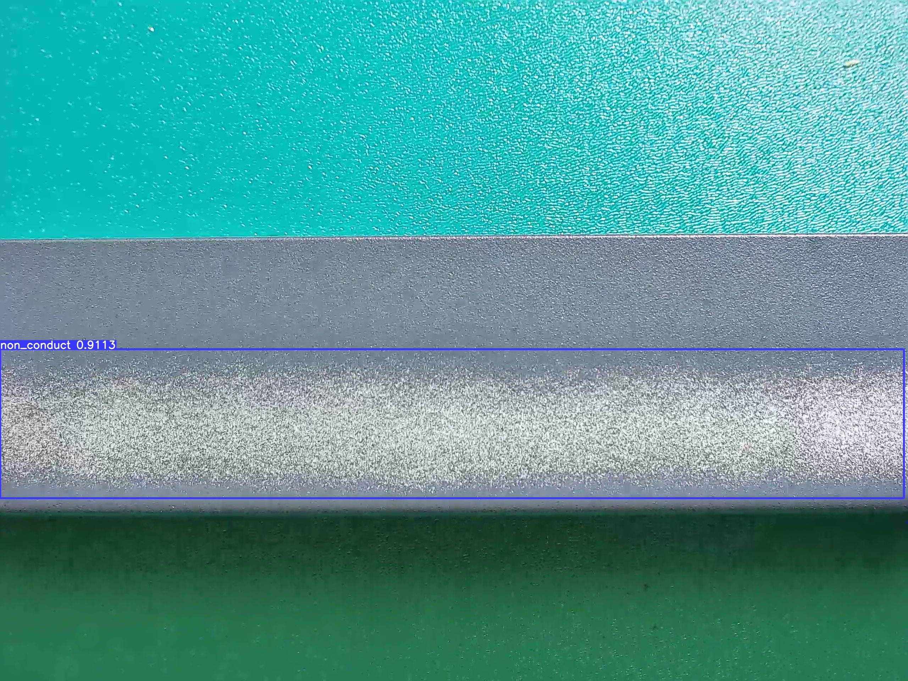
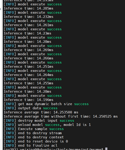

# 铝材表面缺陷检测

## 1 介绍
在本系统中，目的是基于MindX SDK，在华为云昇腾平台上，开发端到端**铝材缺陷检测**的参考设计，实现**对图像中的铝材进行缺陷类型分类和定位**的功能，达到功能要求样例输入：带有缺陷的jpg图片。

样例输出：框出并标有铝材表面缺陷与置信度的jpg图片

### 1.1 支持的产品

支持昇腾310芯片

### 1.2 支持的版本

支持21.0.4版本

eg：版本号查询方法，在Atlas产品环境下，运行命令：

```
npu-smi info
```

### 1.3 软件方案介绍

本系统设计了不同的功能模块。主要流程为：图片传入流中，对图像进行缩放，利用AIPP对数据进行预处理，将YUV图像格式转化为RGB格式，利用Yolov5的检测模型检测铝材缺陷，最后以键值对形式输出识别结果。各模块功能描述如表2.1所示：

表1 系统方案中各模块功能：

| 序号 | 子系统   | 功能描述                                                     |
| :--- | :------- | :----------------------------------------------------------- |
| 1    | 图像输入 | 调用MindX SDK的appsrc输入图片                                |
| 2    | 图像放缩 | 调用MindX SDK的mxpi_imageresize，放缩到640*640大小           |
| 3    | 缺陷检测 | 利用yolov5的检测模型，配合后处理插件，检测出图片中缺陷类型以及位置 |
| 4    | 结果输出 | 将缺陷位置信息，缺陷分类结果，识别置信度输出                 |

### 1.4 代码目录结构与说明

本工程名称为AluminumDefectDetection，工程目录如下图所示：

```
├── models
│   ├── yolov5
│   │   ├── aldefectdetection.names     # 铝材缺陷检测类别
│   │   ├── insert_op.cfg				# yolov5 aipp转换配置
│   │   ├── yolov5_add_bs1_fp16.cfg		# yolov5后处理配置
│   │   ├── yolov5_add_bs1_fp16.om      # 铝材缺陷检测模型
├── pipeline
│   └── AlDefectDetection.pipeline      # pipeline文件
├── main.py	
├── eval.py	
├── eval_pre.py
├── plots.py							# 绘图工具类
├── utils.py							# 工具类
└── test.jpg
```

### 1.5 技术实现流程图


图1 铝材表面缺陷检测流程图


图2 铝材表面缺陷检测pipeline示意图

### 1.6 特性及适用场景

项目适用于光照条件较好，背景简单，且图片较清晰的测试图片

## 2 环境依赖

eg：推荐系统为ubuntu 18.04或centos 7.6，环境依赖软件和版本如下表：

|   软件名称    |    版本     |
| :-----------: | :---------: |
|    ubantu     | 18.04.1 LTS |
|   MindX SDK   |    2.0.4    |
|    Python     |    3.9.2    |
|     CANN      |    5.0.4    |
|     numpy     |   1.22.3    |
| opencv-python |    4.5.5    |

在编译运行项目前，需要设置环境变量：

- 环境变量介绍

```bash
# 执行如下命令，打开.bashrc文件
vim ~/.bashrc
# 在.bashrc文件中添加以下环境变量
export MX_SDK_HOME=${SDK安装路径}

export LD_LIBRARY_PATH=${MX_SDK_HOME}/lib:${MX_SDK_HOME}/opensource/lib:${MX_SDK_HOME}/opensource/lib64:/usr/local/Ascend/ascend-toolkit/latest/acllib/lib64:/usr/local/Ascend/driver/lib64/

export GST_PLUGIN_SCANNER=${MX_SDK_HOME}/opensource/libexec/gstreamer-1.0/gst-plugin-scanner

export GST_PLUGIN_PATH=${MX_SDK_HOME}/opensource/lib/gstreamer-1.0:${MX_SDK_HOME}/lib/plugins

export PYTHONPATH=${MX_SDK_HOME}/python:$PYTHONPATH

# 保存退出.bashrc文件
# 执行如下命令使环境变量生效
source ~/.bashrc

#查看环境变量
env
```

## 3 编译与运行

**步骤1** 

修改`pipeline/AlDefectDetection.pipeline`文件中: **mxpi_objectpostprocessor0**插件的`postProcessLibPath`属性，修改为

```
{SDK安装路径}/lib/modelpostprocessors/libyolov3postprocess.so
```

**步骤2**

在测试集中或自行选择一张jpg文件，放入项目根目录中，再执行

```bash
python main.py
```

结果展示：




### 性能测试

**步骤1 **:安装性能测试工具msame。

命令行方式下载: git clone <https://gitee.com/ascend/tools.git>

**步骤2**: 设置环境变量

```bash
export DDK_PATH=${HOME} /Ascend/ascend-toolkit/latest
 export NPU_HOST_LIB=${HOME}/Ascend/ascend-toolkit/latest/acllib/lib64/stub
```

**步骤3**: 将待测图片转换为.bin格式保存，放入待测目录

**步骤4** 进入msame目录运行编译脚本生成可执行文件

```bash
./build.sh g++ $HOME/AscendProjects/tools/msame/out
```

**步骤5** 进入步骤四out目录下输入以下命令对bin文件进行测试

```bash
./main --model ${model_path}  --output ${txt_path} --outfmt TXT --loop 100
```

输出结果：




### 精度测试

**步骤1**：准备测试数据和om模型文件：https://mindx.sdk.obs.cn-north-4.myhuaweicloud.com/ascend_community_projects/Aluminum_surface_defect_detection/yolov5_add_bs1_fp16.om

**步骤2**：执行如下命令循环输入测试数据集图片

python eval.py

生成的位置信息和类别信息会以txt文件的形式保存在项目目录下的test/test_out_txt/

执行python map.py –gt ${ground_truth_path} –test_path ${test_path}输出结果

其中${ground_truth_path}为测试集数据的标签路径，${test_path}为模型输出结果的路径（即上述test/test_out_txt/），包括分类结果、位置信息和置信度参数。

结果如下图所示：


**步骤3**：下载YOLOv5官方源码git clone <https://github.com/ultralytics/yolov5.git>

**步骤4**：修改数据集配置文件以及模型配置文件如下图所示：


**步骤5**：运行如下命令对测试集进行测试得到txt文件

```bash
python val.py --data ${data.yaml}--weights best.onnx --save-txt --batch-size 1 --save-conf
```

**步骤6**：将生成的txt文件复制到推理服务器上，按照步骤2方式进行精度测试,得到的结果如下图所示：


其中mAP0.5误差为0.000770447，mAP0.5:0.95误差为0.00370027。

## 4 常见问题

### 4.1 尺寸不匹配

**问题描述：**

提示[mxpi_tensorinfer0][100017]The input of the model does not match] The datasize of concated inputTensors[0](460800) does not match model inputTensors[0](614400). Tensor Dtype: TENSOR_DTYPE_UINT8, model Dtype: TENSOR_DTYPE_UINT8.


**解决方案：**

模型经过插件处理后的图像与模型输入不匹配，检查模型经过pipeline之后的尺寸大小是否和模型输入匹配。

### 4.2 模型路径未进行正确配置

**问题描述：**

提示 Failed to get model, the model path is invalidate.


**解决方案：**

检查模型存放路径，正确配置模型路径。

### 4.3 未修改pipeline中后处理插件的postProcessLibPath属性

**问题描述：**

提示[Object, file or other resource doesn't exist] The postprocessing DLL does not exist


**解决方案：**

修改pipeline文件中**mxpi_objectpostprocessor0**插件的`postProcessLibPath`属性，修改为`{SDK安装路径}/lib/modelpostprocessors/libyolov3postprocess.so`