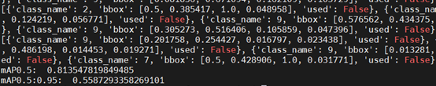
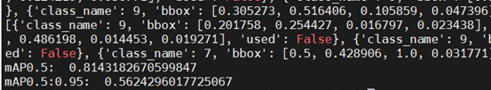

# 铝材表面缺陷检测

## 1 介绍
在本系统中，目的是基于MindX SDK，在华为云昇腾平台上，开发端到端**铝材缺陷检测**的参考设计，实现**对图像中的铝材进行缺陷类型分类和定位**的功能，达到功能要求样例输入：带有缺陷的jpg图片。

样例输出：框出并标有铝材表面缺陷与置信度的jpg图片

### 1.1 支持的产品

支持昇腾310芯片,昇腾200dk

### 1.2 支持的版本

支持21.0.4版本

eg：版本号查询方法，在Atlas产品环境下，运行命令：

```
npu-smi info
```
本样例配套的CANN版本为[5.0.4](https://www.hiascend.com/software/cann/commercial)。支持的SDK版本为[2.0.4](https://www.hiascend.com/software/Mindx-sdk)。

MindX SDK安装前准备可参考《用户指南》，[安装教程](https://gitee.com/ascend/mindxsdk-referenceapps/blob/master/docs/quickStart/1-1安装SDK开发套件.md)

### 1.3 软件方案介绍

本系统设计了不同的功能模块。主要流程为：图片传入流中，对图像进行缩放，利用AIPP对数据进行预处理，将YUV图像格式转化为RGB格式，利用Yolov5的检测模型检测铝材缺陷，最后以键值对形式输出识别结果。各模块功能描述如表2.1所示：

表1 系统方案中各模块功能：

| 序号 | 子系统   | 功能描述                                                     |
| :--- | :------- | :----------------------------------------------------------- |
| 1    | 图像输入 | 调用MindX SDK的appsrc输入图片                                |
| 2    | 图像放缩 | 调用MindX SDK的mxpi_imageresize，放缩到640*640大小           |
| 3    | 缺陷检测 | 利用yolov5的检测模型，配合后处理插件，检测出图片中缺陷类型以及位置 |
| 4    | 结果输出 | 将缺陷位置信息，缺陷分类结果，识别置信度输出                 |

### 1.4 代码目录结构与说明

本工程名称为AluminumDefectDetection，工程目录如下图所示：

```
├── models
│   ├── yolov5
│   │   ├── aldefectdetection.names     # 铝材缺陷检测类别
│   │   ├── insert_op.cfg				# yolov5 aipp转换配置
│   │   ├── yolov5_add_bs1_fp16.cfg		# yolov5后处理配置
│   │   ├── yolov5_add_bs1_fp16.om      # 铝材缺陷检测模型
│   │   ├── best.onnx                   # 用于模型转换
├── pipeline
│   └── AlDefectDetection.pipeline      # pipeline文件
├── main.py	
├── eval.py	
├── eval_pre.py							# letterbox预处理	
├── plots.py							# 绘图工具类
├── utils.py							# 工具类
└── test.jpg
```

### 1.5 技术实现流程图


图1 铝材表面缺陷检测流程图


图2 铝材表面缺陷检测pipeline示意图

### 1.6 特性及适用场景

项目适用于光照条件较好，背景简单，且图片较清晰的测试图片

以下几种情况下，检测效果不够理想：
1.在进行脏点检测时，由于脏点过小，模型不易检测到铝材表面的脏点缺陷，导致脏点缺陷检测置信度偏低
2.在进行喷流检测时，由于喷流痕迹不明显，检测置信度偏低，影响最终精度

## 2 环境依赖

eg：推荐系统为ubuntu 18.04或centos 7.6，环境依赖软件和版本如下表：

|   软件名称    |    版本     |
| :-----------: | :---------: |
|    ubuntu     | 18.04.1 LTS |
|   MindX SDK   |    2.0.4    |
|    Python     |    3.9.2    |
|     CANN      |    5.0.4    |
|     numpy     |   1.22.3    |
| opencv-python |    4.5.5    |

在编译运行项目前，需要设置环境变量：

- 环境变量介绍

```bash
# 执行如下命令，打开.bashrc文件
vim ~/.bashrc
# 在.bashrc文件中添加以下环境变量
export MX_SDK_HOME=${SDK安装路径}

export LD_LIBRARY_PATH=${MX_SDK_HOME}/lib:${MX_SDK_HOME}/opensource/lib:${MX_SDK_HOME}/opensource/lib64:/usr/local/Ascend/ascend-toolkit/latest/acllib/lib64:/usr/local/Ascend/driver/lib64/

export GST_PLUGIN_SCANNER=${MX_SDK_HOME}/opensource/libexec/gstreamer-1.0/gst-plugin-scanner

export GST_PLUGIN_PATH=${MX_SDK_HOME}/opensource/lib/gstreamer-1.0:${MX_SDK_HOME}/lib/plugins

export PYTHONPATH=${MX_SDK_HOME}/python:$PYTHONPATH
# 保存退出.bashrc文件
# 执行如下命令使环境变量生效
source ~/.bashrc

#查看环境变量
env
```

## 3 模型转换

### 3.1 模型获取

**步骤1** 训练铝材缺陷检测对应的yolov5模型，输出pt模型文件。

> pt模型文件链接：https://mindx.sdk.obs.cn-north-4.myhuaweicloud.com/ascend_community_projects/Aluminum_surface_defect_detection/best.pt

**步骤2** 将pt模型文件转换成onnx

​	下载yolov5官方源码6.1版本[Releases · ultralytics/yolov5 (github.com)](https://github.com/ultralytics/yolov5/releases)，进入项目根目录，将best.pt模型文件复制到项目目录，执行命令

```bash
   python export.py --weights best.pt --simplify
```


​         模型转换成功之后，显示的日志信息如下图所示，在项目根目录会生成best.onnx模型文件。也可直接通过以下链接下载onnx模型。

> onnx模型文件链接：https://mindx.sdk.obs.cn-north-4.myhuaweicloud.com/ascend_community_projects/Aluminum_surface_defect_detection/best.onnx

**步骤3** 将转化后的YOLOv5模型onnx文件存放至`./models/yolov5/`。

**步骤4** AIPP配置

由于yolov5模型的输入为rgb格式，pipeline中的图像解码为yuv格式，且数据类型不同，需要在atc转换模型时使用aipp预处理，aipp配置内容如下：

```json
aipp_op { 
aipp_mode : static
related_input_rank : 0
input_format : YUV420SP_U8
src_image_size_w : 640
src_image_size_h : 640
crop : false
csc_switch : true
rbuv_swap_switch : false
matrix_r0c0 : 256
matrix_r0c1 : 0
matrix_r0c2 : 359
matrix_r1c0 : 256
matrix_r1c1 : -88
matrix_r1c2 : -183
matrix_r2c0 : 256
matrix_r2c1 : 454
matrix_r2c2 : 0
input_bias_0 : 0
input_bias_1 : 128
input_bias_2 : 128
var_reci_chn_0 : 0.0039216
var_reci_chn_1 : 0.0039216
var_reci_chn_2 : 0.0039216
}
```

**步骤5** 模型转换

在项目目录下执行一下命令

```bash
# 执行前需确保环境变量正确配置
# 执行，转换YOLOv5模型
# Execute, transform YOLOv5 model.

atc  --input_shape="images:1,3,640,640" --out_nodes="Transpose_286:0;Transpose_336:0;Transpose_386:0" --output_type=FP32 --input_format=NCHW --output="./models/yolov5/yolov5_add_bs1_fp16" --soc_version=Ascend310 --framework=5 --model="./models/yolov5/best.onnx" --insert_op_conf=./models/yolov5/insert_op.cfg
"
# 说明：out_nodes制定了输出节点的顺序，需要与模型后处理适配。
```

执行完模型转换脚本后，会生成相应的yolov5_add_bs1_fp16.om模型文件。 

> 模型转换使用了ATC工具，如需更多信息请参考: https://support.huaweicloud.com/tg-cannApplicationDev330/atlasatc_16_0005.html

## 4 编译与运行

**步骤1** 

修改yolov5_add_bs1_fp16.cfg中的SCORE_THRESH=0.25

**步骤2**

在测试集中或自行选择一张jpg文件，放入项目根目录中，再执行

```bash
python main.py
```

预期结果：

终端会显示输出结果的类别、位置信息以及置信度信息。保存推理结果图为result_test.jpg,pre_test.jpg为输入到模型之前的图片预处理结果。

结果展示：


### 精度测试

**步骤1**：准备测试数据和om模型文件

	> 测试数据集链接:https://mindx.sdk.obs.cn-north-4.myhuaweicloud.com/ascend_community_projects/Aluminum_surface_defect_detection/testDatas.zip
	
	> om模型文件链接：https://mindx.sdk.obs.cn-north-4.myhuaweicloud.com/ascend_community_projects/Aluminum_surface_defect_detection/yolov5_add_bs1_fp16.om

**步骤2**：执行如下命令循环输入测试数据集图片

```bash
python eval.py
```

生成的位置信息和类别信息会以txt文件的形式保存在项目目录下的test/test_out_txt/

执行如下命令输出结果

```bash
python map.py –gt ${ground_truth_path} –test_path ${test_path}
```

其中${ground_truth_path}为测试集数据的标签路径，${test_path}为模型输出结果的路径（即上述test/test_out_txt/），包括分类结果、位置信息和置信度参数。

结果如下图所示：



**步骤3**：由于数据集为非公开的数据集，训练集测试集为自行划分，在满足mAP>80%的基础上进一步测试与GPU精度上的差距。首先，下载YOLOv5官方源码6.1版本https://github.com/ultralytics/yolov5/releases/tag/v6.1

**步骤4**：在项目data目录下创建al.yaml数据配置文件(配置精度测试时数据加载路径以及类别信息)，复制coco128.yaml的内容，并做如下修改.


​	修改modes/yolov5m.yaml模型配置文件如下形式


​	上传onnx文件到项目目录，onnx模型连接为：https://mindx.sdk.obs.cn-north-4.myhuaweicloud.com/ascend_community_projects/Aluminum_surface_defect_detection/best.onnx

​	修改val.py第204行multi_label值为False；修改utils/datasets.py第643行为参数r<1以改变缩放插值方式；修改utils/augmentation.py第137行为top, bottom =0,160，以对齐MindX SDK推理操作；将utils/general.py的648行函数修改为如下

```python
def scale_coords(img1_shape, coords, img0_shape, ratio_pad=None, pad_flag=True):
    # Rescale coords (xyxy) from img1_shape to img0_shape
    if ratio_pad is None:  # calculate from img0_shape
        gain = min(img1_shape[0] / img0_shape[0], img1_shape[1] / img0_shape[1])  # gain  = old / new
        pad = (img1_shape[1] - img0_shape[1] * gain) / 2, (img1_shape[0] - img0_shape[0] * gain) / 2  # wh padding
    else:
        gain = ratio_pad[0][0]
        pad = ratio_pad[1]

    coords[:, [0, 2]] -= pad[0]  # x padding
    if pad_flag:
        coords[:, [1, 3]] -= pad[1]  # y padding
    coords[:, :4] /= gain
    clip_coords(coords, img0_shape)
    return coords
```

修改val.py的224行代码为：

```python
scale_coords(im[si].shape[1:], predn[:, :4], shape, shapes[si][1] ,pad_flag=False)
```

以上操作为yolov5对齐MindXSDK 推理过程;eval_pre.py使用了letterbox进行预处理，对齐了yolov5官方源码推理，具有更好的精度表现。

**步骤5**：运行如下命令对测试集进行测试得到txt文件

```bash
python val.py --data al.yaml --weights best.onnx --save-txt --batch-size 1 --save-conf --iou-thres 0.5 --conf-thres 0.001
```

**步骤6**：将生成的txt文件(在项目目录runs/val/expn/labels中)复制到推理服务器上，按照步骤2方式进行精度测试,得到的结果如下图所示：



其中mAP0.5误差为0.000770447，mAP0.5:0.95误差为0.00370027。

## 5 常见问题

### 5.1 尺寸不匹配

**问题描述：**

提示[mxpi_tensorinfer0][100017]The input of the model does not match] The datasize of concated inputTensors[0](460800) does not match model inputTensors[0](614400). Tensor Dtype: TENSOR_DTYPE_UINT8, model Dtype: TENSOR_DTYPE_UINT8.


**解决方案：**

模型经过插件处理后的图像与模型输入不匹配，检查模型经过pipeline之后的尺寸大小是否和模型输入匹配。

### 5.2 模型路径未进行正确配置

**问题描述：**

提示 Failed to get model, the model path is invalidate.


**解决方案：**

检查模型存放路径，正确配置模型路径。

### 5.3 未修改pipeline中后处理插件的postProcessLibPath属性

**问题描述：**

提示[Object, file or other resource doesn't exist] The postprocessing DLL does not exist


**解决方案：**

修改pipeline文件中**mxpi_objectpostprocessor0**插件的`postProcessLibPath`属性，修改为`libyolov3postprocess.so`

