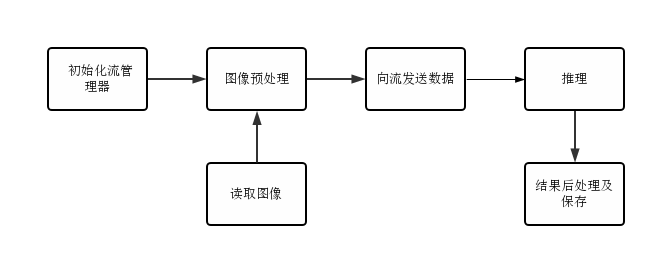

# AnimeGAN图像风格转换

## 1 介绍

本样例基于MindX SDK开发，可以实现**从真实世界图片到动漫风格图片的风格转换**，在昇腾芯片上对输入图片进行图像**风格转换**并将转换结果保存，支持多档次的动态分辨率输入。

本应用基于AnimeGAN模型。AnimeGAN是在2019年提出的用于图像风格迁移的模型，该模型基于GAN模型，可以快速地将真实世界的图像转换成高质量的动漫风格的图像。

主要处理流程为：输入图片 > 图像缩放 > 图像解码 > 风格迁移 > 推理结果后处理 >  结果保存。

### 1.1 支持的产品

Atlas 200DK

### 1.2 支持的版本

本样例配套的 CANN 版本为 [5.1.RC2](https://www.hiascend.com/software/cann/community)。支持的 SDK 版本为 [3.0.RC2](https://www.hiascend.com/software/Mindx-sdk)。

### 1.3 软件方案介绍

基于MindX SDK的AnimeGAN风格转换模型的推理流程为：

首先使用openCV将待转换图片缩放至合适的分辨率档位，然后通过appsrc插件输入，然后使用图像解码插件mxpi_imagedecoder对图片进行解码，再通过图像标准化插件mxpi_imagenormalize将图片数据标准化到[-1,1],然后输入模型推理插件mxpi_tensorinfer，最后通过自定义的后处理插件anmieganpostprocess得到对推理结果进行后处理并保存。本系统的各模块及功能如表1所示：

表1 系统方案各模块功能描述：

| 序号 | 子系统     | 功能描述                                                               |
| ---- | ---------- | ---------------------------------------------------------------------- |
| 1    | 图片输入   | 调用MindX SDK的appsrc输入图片                                          |
| 2    | 图片解码   | 调用MindX SDK的mxpi_imagedecoder解码图片为RGB数据                      |
| 3    | 图片标准化 | 调用MindX SDK的mxpi_imagenormalize将图片数据标准化到[-1,1]             |
| 4    | 模型推理   | 调用MindX SDK的mxpi_tensorinfer对输入张量进行推理                      |
| 5    | 后处理     | 调用自定义的后处理插件对模型推理输出映射回[0,255]，转换成RBG数据并保存 |


### 1.4 代码目录结构与说明

项目名称为AnimeGAN，项目目录如下图所示：

```
│  README.md
│  main.py                  # 主程序
|  eval.py                  # 测量NPU生成的图片与Tensorflow框架生成的图片的SSIM
|  animegan.pipeline        # pipeline文件
├─dataset
├─results
├─models
│      AnimeGAN_FD.om       # 应用推理所需的om模型
├─plugins
│  ├─AnimeGANPostProcessor  # AnimeGAN后处理插件
│  │      build.sh          # 编译AnimeGAN后处理插件的脚本
│  │      CMakeLists.txt
│  │      AnimeGANPostProcessor.cpp
│  │      AnimeGANPostProcessor.h
```


### 1.5 技术实现流程图



### 1.6 特性及适用场景

本案例可以满足图像风格迁移，但同时对输入的图像有以下限制：

1.  输入图像要求为 jpg、jpeg、JPG、JPEG编码格式。
2.  输入图像要求为彩色的现实图像。
3.  当输入图片尺寸过大或过小，会进行放缩处理。


## 2 环境依赖

推荐系统为ubuntu 18.04，环境依赖软件和版本如下表：

| 软件名称 | 版本    |
| -------- | ------- |
| cmake    | 3.5.+   |
| mxVision | 3.0.RC2 |
| Python   | 3.9.12  |
| CANN     | 5.1.RC1 |
| gcc      | 7.5.0   |


在编译运行项目前，需要设置环境变量：

在CANN以及MindX SDK的安装目录找到set_env.sh,并运行脚本：

```bash
bash ${SDK安装路径}/set_env.sh
bash ${CANN安装路径}/../set_env.sh
```

## 3 软件依赖

推理中涉及到Python第三方软件依赖如下表：

| 软件名称      | 版本     | 说明                                                                 |
| ------------- | -------- | -------------------------------------------------------------------- |
| opencv-python | 4.6.0.66 |
| scikit-image  | 0.19.3   | 仅在eval.py中依赖，用于测量GPU生成图片和NPU生成图片的SSIM |


## 4 依赖安装

 CANN的安装包可以在[CANN 社区版](https://www.hiascend.com/software/cann/community-history)获取。

 CANN的安装教程可以查看[CANN安装(命令行)](https://www.hiascend.com/document/detail/zh/CANNCommunityEdition/60RC1alpha02/softwareinstall/instg/atlasdeploy_03_0002.html)。

 MindX SDK的安装包可以在[mxVision 社区版](https://www.hiascend.com/zh/software/mindx-sdk/mxVision/community)获取。

 MindX SDK的安装教程可以查看[安装MindX SDK开发套件](https://www.hiascend.com/document/detail/zh/mind-sdk/30rc2/vision/mxvisionug/mxvisionug_0030.html)。

对于Python依赖，可以使用pip进行安装：

```bash
pip3 install opencv-python==4.6.0.66 scikit-image==0.19.3
```

## 5 模型转换

MindX SDK支持的模型为离线om模型，因此需进行模型转换，使用ATC模型转换工具将pb模型转化为om模型。如果原始模型是ckpt模型，还需要先转换成pb模型然后再转换成om模型。ckpt模型文件转换成pb文件的相关介绍参考[此处](https://gitee.com/ascend/ModelZoo-TensorFlow/blob/master/TensorFlow/contrib/cv/BicycleGAN_ID1287_for_TensorFlow/bicyclegan_pb_frozen.py)。ATC模型转换工具相关介绍参考[CANN文档](https://www.hiascend.com/document/detail/zh/CANNCommunityEdition/60RC1alpha02/infacldevg/atctool/atlasatc_16_0005.html)。本项目模型参考链接为[Tensorflow模型地址](https://github.com/TachibanaYoshino/AnimeGAN/releases)。

首先通过[模型OBS地址](https://mindx.sdk.obs.cn-north-4.myhuaweicloud.com/ascend_community_projects/AnimeGAN/AnimeGAN_model.zip)获取已经转换好的pb模型和支持动态分辨率的om模型。

下载pb模型之后，将pb文件移至models目录下,并在终端执行如下命令：

```bash
atc  --output_type="generator/G_MODEL/output:0:FP32" --input_shape="test:1,-1,-1,3" --out_nodes="generator/G_MODEL/output:0" --input_format=NHWC --output="models/AnimeGAN_FD" --soc_version=Ascend310 --dynamic_image_size="384,384;384,512;384,640;384,768;384,896;384,1024;384,1152;384,1280;384,1408;384,1536;512,384;512,512;512,640;512,768;512,896;512,1024;512,1152;512,1280;512,1408;512,1536;640,384;640,512;640,640;640,768;640,896;640,1024;640,1152;640,1280;640,1408;640,1536;768,384;768,512;768,640;768,768;768,896;768,1024;768,1152;768,1280;768,1408;768,1536;896,384;896,512;896,640;896,768;896,896;896,1024;896,1152;896,1280;896,1408;896,1536;1024,384;1024,512;1024,640;1024,768;1024,896;1024,1024;1024,1152;1024,1280;1024,1408;1024,1536;1152,384;1152,512;1152,640;1152,768;1152,896;1152,1024;1152,1152;1152,1280;1152,1408;1152,1536;1280,384;1280,512;1280,640;1280,768;1280,896;1280,1024;1280,1152;1280,1280;1280,1408;1280,1536;1408,384;1408,512;1408,640;1408,768;1408,896;1408,1024;1408,1152;1408,1280;1408,1408;1408,1536;1536,384;1536,512;1536,640;1536,768;1536,896;1536,1024;1536,1152;1536,1280;1536,1408;1536,1536" --framework=3 --model="models/AnimeGAN.pb" --precision_mode=force_fp32
```

> 以上命令将模型转化为具有多档位的动态分辨率模型，转成单档位固定分辨率可使用如下命令：

```bash
atc  --output_type="generator/G_MODEL/output:0:FP32" --input_shape="test:1,864,864,3" --out_nodes="generator/G_MODEL/output:0"  --input_format=NHWC --output="models/AnimeGAN_864" --soc_version=Ascend310 --framework=3 --model="models/AnimeGAN.pb" --precision_mode=force_fp32
```

> 如使用固定分辨率命令转化后的模型，在使用mxpi_imageresizer缩放插件下游紧接模型推理时，可以自动获取缩放宽高，在pipeline中mxpi_imageresizer插件无需再配置resizeHeight和resizerWidth属性。
>
> 而使用多档位命令转换的模型时，未配置宽高属性则会默认缩放到第一个档位，使用其它档位仍需配置缩放的宽高。 亦可不使用mxpi_imageresizer插件，而是使用预处理将图片缩放至模型包含的档位。

## 6 编译与运行

- 编译插件

  ```bash
  bash plugins/AnimeGANPostProcessor/build.sh
  # 运行脚本后，会在plugins/AnimeGANPostProcessor/lib/plugins下生成so文件
  ```
  
  修改插件文件权限为640，并将该文件拷贝至MindX SDK的plugins目录中

  ```bash
  chmod 640 plugins/AnimeGANPostProcessor/lib/plugins/libanimeganpostprocessor.so
  cp plugins/AnimeGANPostProcessor/lib/plugins/libanimeganpostprocessor.so ${MX_SDK_HOME}/lib/plugins
  ```

- 修改路径
  
  更改main.py中的DATA_PATH为测试图片所在的文件夹
  
  ``` python
  DATA_PATH = "dataset/test/HR_photo"
  ```

  更改animegan.pipeline中tensorinfer插件的modelPath为模型所在路径

  ```python
    "mxpi_tensorinfer0": {
      "props": {
        "dataSource": "mxpi_imagenormalize0",
        "modelPath": "models/AnimeGAN_FD.om",
        "waitingTime": "8000"
      },
      "factory": "mxpi_tensorinfer",
      "next": "animeganpostprocessor0"
    }
  ```
  
  更改animegan.pipeline中animeganpostprocessor插件的outputPath为输出文件夹路径，若该文件夹不存在，请先创建文件夹。

  ```python
      "animeganpostprocessor0": {
      "props": {
        "dataSource": "mxpi_tensorinfer0",
        "outputPath": "results/npu"
      },
      "factory": "animeganpostprocessor",
      "next": "appsink0"
    }
  ```

- 运行

  ```bash
  python main.py
  ```

运行成功后，会在animegan.pipeline中animeganpostprocessor插件的outputPath指定的输出路径生成对应输入的经过风格迁移的图片。

- 注意事项
  
  1.先获取pb模型，并使用命令转化成所需要的om模型，并放置在models目录下。

  2.所需的环境变量推荐使用CANN和MindX SDK安装目录下的set_env.sh进行导入。

  3.运行时请准备图片，按上述命令执行后，风格转换结果会生成在results/npu路径下,该路径可以在pipeline中修改animeganpostprocessor的outputPath属性来变更。


## 7 常见问题


### 7.1 后处理库权限问题

**问题描述：**

提示Check Owner permission failed: Current permission is 7, but required no greater than 6.

**解决方案：**

后处理库so文件权限太高，需要降低权限至640,参见**6 编译与运行**一节有关编译的内容。