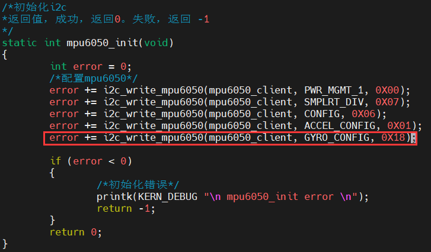
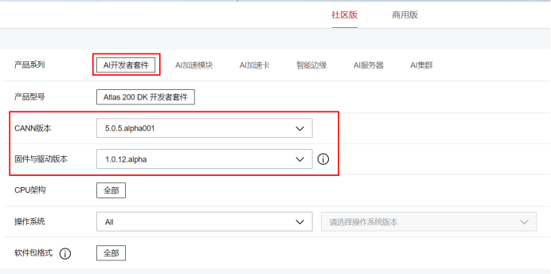
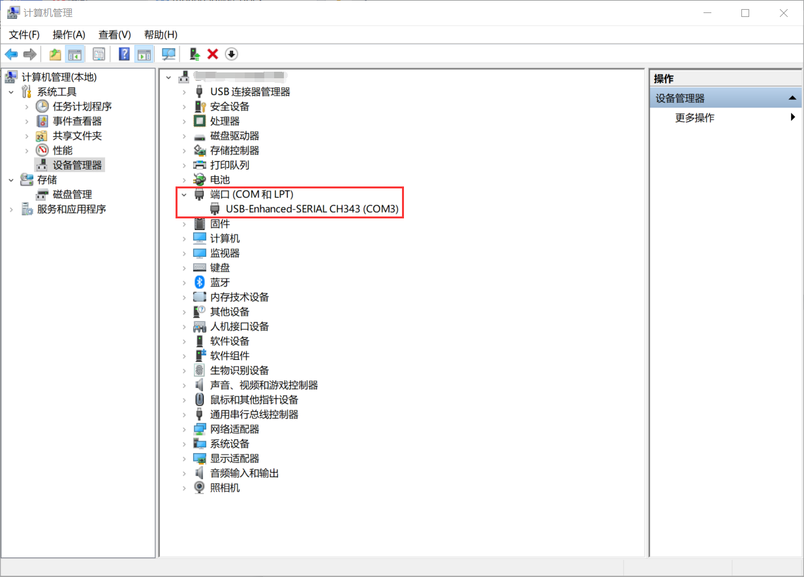
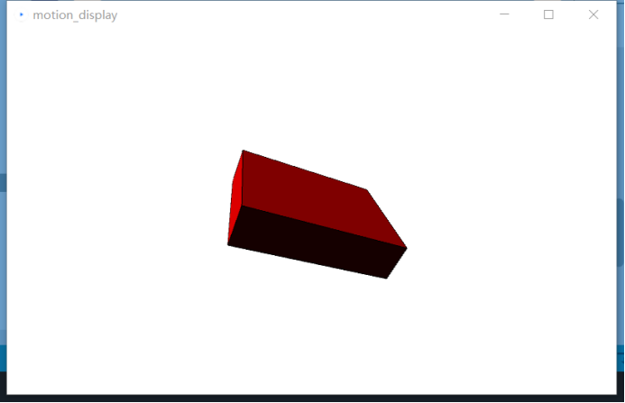

# 基于I2C接口传感器的用户态6轴IMU姿态解算程序

## 1 概述

### 1.1 概要描述
基于MPU6050提供的官方示例完成用户态下传感器的调用和数据处理，结果在LCD上显示，且通过串口在上位机上实现姿态可视化。

## 2 设备属性

### 2.1 ATLAS200DK 40PIN连接器定义
|  管脚  |  名称  |  电平  |  管脚  |  名称  |  电平  |
| :---: | :---: | :---: | :---: | :---: | :---: |
|1|	+3.3V|	3.3V|	2|	+5.0V|	5V|
|3|	I2C2-SDA|	3.3V|	4|	+5.0V|	5V|
|5|	I2C2-SCL|	3.3V|	6|	GND|	-|
|7|	GPIO0|	3.3V|	8|	TXD0|	3.3V|
|9|	GND	|-|	10|	RXD0|	3.3V|
|11|	GPIO1|	3.3V|	12|	NC|	-|
|13|	NC|	-|	14|	GND|	-|
|15|	GPIO2|	3.3V|	16|	TXD1|	3.3V|
|17|	+3.3V|	3.3V|	18|	RXD1|	3.3V|
|19|	SPI-MOSI|	3.3V|	20|	GND|	-|
|21|	SPI-MISO|	3.3V|	22|	NC|	-|
|23|	SPI-CLK|	3.3V|	24|	SPI-CS|	3.3V|
|25|	GND|	-|	26|	GPIO10|	3.3V|
|27|	GPIO8|	3.3V|	28|	GPIO9|	3.3V|
|29|	GPIO3|	3.3V|	30|	GND|	-|
|31|	GPIO4|	3.3V|	32|	NC|	-|
|33|    GPIO5|	3.3V|	34|	GND|	-|
|35|	GPIO6|	3.3V|	36|	+1.8V|	1.8V|
|37|	GPIO7|	3.3V|	38|	TXD-3559|	3.3V|
|39|	GND|	-|	40|	RXD-3559|	3.3V|

### 2.2 MPU6050 功能引脚
| 序号 | 名称 | 说明 |
| :---: | :---: | :---: |
| 1 | VCC | 电源输入 |
| 2 | GND | 地线 |
| 3 | IIC_SDA | 通信数据线 |
| 4 | IIC_SCL | 通信时钟线 |
| 5 | MPU_INT | 中断输出引脚 |
| 6 | MPU_AD0 | IIC 从机地址设置引脚；ID：0X68(悬空/接 GND) ID：0X69(接 VCC)|

## 3 操作流程
### 3.1 ATLAS200DK环境搭建
见Atlas200dk-MindXSDK 开发环境搭建一站式导航 https://gitee.com/ascend/docs-openmind/blob/master/guide/mindx/ascend_community_projects/tutorials/200dk%E5%BC%80%E5%8F%91%E6%9D%BF%E7%8E%AF%E5%A2%83%E6%90%AD%E5%BB%BA.md

环境依赖软件和版本如下表：

|   软件名称    |    版本     |
| :-----------: | :---------: |
|固件与驱动版本|1.0.12|
|CANN版本|5.0.5alpha001| 
|Ubuntu|18.04.4 LTS|

### 3.2 设备接线

见下表

|MPU6050|200DK管脚编号|200DK管脚名称|
| :---: | :---: | :---: |
| VCC | 1 | +3.3V |
| GND | 6 | GND |
| IIC_SDA | 3 | I2C2-SDA |
| IIC_SCL | 5 | I2C2-SCL |
| MPU_INT | / | / |
| MPU_AD0 | / | / |

### 3.3 编译驱动和设备树

**步骤1** 下载内核源码，下载地址：
https://www.hiascend.com/hardware/firmware-drivers?tag=community

在AI加速模块中，选择对应的固件与驱动版本：


选择Atlas-200-sdk_21.0.3.1.zip下载：


解压后，将Ascend310-source-minirc.tar.gz上传至200DK任一目录下，例如/opt。

**步骤2** 200DK上执行如下命令，切换至root用户。

    su root

**步骤3** 通过如下命令进行安装依赖，此步200DK需要联网。

    apt-get install -y python make gcc unzip bison flex libncurses-dev squashfs-tools bc

**步骤4**  执行如下命令，进入源码包所在目录，例如/opt。

    cd /opt

**步骤5** 执行如下命令，解压源码包“Ascend310-source-minirc.tar.gz”。

    tar -xzvf Ascend310-source-minirc.tar.gz

**步骤6** 执行如下命令，进入source目录。

    cd source

**步骤7** 修改设备树。

1.执行如下命令，修改文件hi1910-asic-1004.dts。

    vim dtb/hi1910-asic-1004.dts

修改bootargs字段如下，使能uart0串口配置。

```
chosen {
    bootargs = "console=ttyAMA0,115200 root=/dev/mmcblk1p1 rw rootdelay=1 syslog no_console_suspend earlycon=pl011,mmio32,0x10cf80000  initrd=0x880004000,200M cma=256M@0x1FC00000 log_redirect=0x1fc000@0x6fe04000 default_hugepagesz=2M";
};
```


2.执行如下命令，修改文件hi1910-fpga-i2c.dtsi。

    vim dtb/hi1910-fpga-i2c.dtsi 

在i2c2下添加mpu6050设备节点。

```
mpu6050@68 {
    compatible = "fire,i2c_mpu6050";
    reg = <0x68>;
};
```


**步骤8** 添加驱动文件

下载野火MPU6050驱动代码：https://gitee.com/embedfire-st/embed_linux_driver_tutorial_stm32mp157_code

在目录source/drivers/src下新建文件夹i2c_mpu6050，在其中放入野火驱动代码中linux_driver/I2c_MPU6050目录下的i2c_mpu6050.h、i2c_mpu6050.c，以及本项目中的Makefile。

    mkdir drivers/src/i2c_mpu6050

**步骤9** 执行如下命令，打开文件i2c_mpu6050.c。

    vim drivers/src/i2c_mpu6050/i2c_mpu6050.c

在MPU6050初始化函数mpu6050_init(void)添加如下语句：

    error += i2c_write_mpu6050(mpu6050_client, GYRO_CONFIG, 0X18);

结果如下图：



**步骤10** 执行如下命令，打开source目录下的build.sh，将其中的DRIVER_MODULES的内容改为"i2c_mpu6050"。

    vim build.sh


**步骤11** 在source目录下执行如下命令，将arm中的mach复制到arm64中，否则编译时会提示缺少头文件。

    cp -R kernel/linux-4.19/arch/arm/include/asm/mach kernel/linux-4.19/arch/arm64/include/asm/

**步骤12** 依次编译内核、设备树、驱动。

    bash build.sh kernel
    bash build.sh dtb
    bash build.sh minirc

### 3.4 更新设备树

**步骤1** 下载Atlas200DK驱动包，下载地址：
https://www.hiascend.com/hardware/firmware-drivers?tag=community

在AI开发者套件中，选择对应的CANN版本和固件与驱动版本：



选择A200dk-npu-driver-21.0.3.1-ubuntu18.04-aarch64-minirc.tar下载：


将A200dk-npu-driver-21.0.3.1-ubuntu18.04-aarch64-minirc.tar上传至200DK目录/opt/mini。

**步骤2** 执行如下命令，进入/opt/mini目录。

    cd /opt/mini

**步骤3** 执行如下命令，解压驱动包。

    tar -xzvf A200dk-npu-driver-21.0.3.1-ubuntu18.04-aarch64-minirc.tar.gz

**步骤4** 执行如下命令，将“minirc_install_phase1.sh”拷贝至目标版本驱动包所在目录。

    cp driver/scripts/minirc_install_phase1.sh /opt/mini

**步骤5** 执行如下命令，用重新编译后的设备树替换驱动包的设备树。

    cp /opt/source/output/out_header/dt.img driver

**步骤6** 执行如下命令，压缩新的驱动包。

    tar -zcvf A200dk-npu-driver-21.0.3.1-ubuntu18.04-aarch64-minirc.tar.gz driver

**步骤7** 执行如下命令，升级脚本。

    ./minirc_install_phase1.sh

**步骤8** 执行如下命令，重启Atlas 200 AI加速模块。

    reboot

### 3.5 安装驱动并运行

**步骤1** 进入目录source/output，执行如下命令，安装驱动mpu6050.ko。

    insmod mpu6050.ko

**步骤2** 执行如下命令，安装LCD驱动，详见《基于ATLAS200DK SPI接口LCD的fbtft驱动适配》。

    insmod fbtft_device.ko name=atlas200dk txbuflen=128 fps=60
    insmod fb_st7789v.c

**步骤3** 执行如下命令，编译测试文件test_mpu6050.c。

    gcc test_mpu6050.c -o test_mpu6050

**步骤4** 确保test_mpu6050和display_mpu6050.sh在同一目录下，执行如下命令，运行test_mpu6050，效果如下图。

    ./test_mpu6050


### 3.6 通过串口和Processing在上位机上实现姿态可视化

**步骤1** 硬件准备：USB转串口芯片（以CH343为例）、杜邦线若干。

接线：CH343的TXD连接Atlas200dk的RXD1（18），CH343的RXD连接Atlas200dk的TXD1（16），GND接GND（9）。

驱动安装成功后，右键“此电脑”，选择“管理”，然后选中“设备管理器”，可以在“端口”中找到端口，例如COM3。若显示驱动未安装成功，则需去下载相应驱动。



**步骤2** 姿态解算

1.欧拉角

    绕mpu6050的Z轴旋转：航向角yaw
    绕mpu6050的Y轴旋转：俯仰角pitch
    绕mpu6050的X轴旋转：横滚角row

2.利用加速度计进行姿态解算

加速度计可以测量mpu6050三个方向上的加速度，由于重力加速度，在静止的情况下mpu6050受到一个竖直向下的重力加速度，即三个方向的加速度向量相加等于1g。由此可以推算出：

pitch = arctan($\frac{a_y}{a_x}$)
    
roll = -arctan($\frac{a_x}{\sqrt{a_y^2 + a_z^2}}$)

yaw无法通过加速度计计算出。

3.利用陀螺仪进行姿态解算

陀螺仪可以测量mpu6050三个轴转动的角速度，从而对每个时刻dt内的角速度进行积分运算，累加得出当前的姿态。记当前时刻加速度为g，上一时刻加速度为$g_{last}$，计算方法如下：

pitch += ($g_y$ + $g_{y last}$) * dt / 2;
    
yaw += ($g_z$ + $g_{z last}$) * dt / 2;
    
roll += ($g_x$ + $g_{x last}$) * dt / 2;

利用上一时刻加速度计算dt时刻内梯形的面积累加比单独使用当前加速度a计算的长方形面积a * dt累加会更加准确。

4.数据融合

加速度计和陀螺仪都存在误差，加速度计易受很多噪声（如自身加速度，外在震动）影响，而陀螺仪对角速度的积分运算由于硬件的数据波动而存在累计误差，且无法在仅使用陀螺仪的情况下消除，所以需要对二者进行数据融合，从而减小误差。由于加速度计无法解算出yaw值，所以无法对yaw值进行校准，除非引入磁力计。

引入一个系数K（0<K<1）,令加速度计解算出的俯仰角为$pitch_{accel}$，翻滚角为$roll_{accel}$，陀螺仪解算出的俯仰角为$pitch_{gyro}$，翻滚角为$roll_{gyro}$，则最终的角度为：

pitch = K * $pitch_{accel}$ + (1 - K) * $pitch_{gyro}$
    
roll = K * $roll_{accel}$ + (1 - K) * $roll_{gyro}$

**步骤3** 数据传输和姿态可视化

在Atlas200dk中可以向字符设备dev/ttyAMA1写入数据，从而通过RXD1和RXD1与上位机进行数据传输。依次以字符串的形式传输pitch、yaw、roll的值，并用“,”隔开。

下载Processing：https://processing.org/download ，选择Windows(Intel 64-bit)版本下载。

在Processing文件motion_display.pde中的void setup()中size(800, 480, P3D)创建3D场景，此外创建串口对象myPort = new Serial(this, "COM3", 9600)，其中COM3为端口名，9600为波特率。定义函数void serialEvent (Serial myPort)接收数据，其中使用readStringUntil('\n')读取每行数据，再用split(data, ',')分开三个角度的值。在函数draw()中box(200,50,150)创建一个长方体，使用rotateX(radians(roll))、rotateY(radians(yaw))、rotateZ(radians(pitch))来显示其当前姿态，radians()函数是将角度值转化为弧度制。

**步骤4** 运行步骤

上位机上：

    在Processing中运行文件motion_display.pde。

Atlas200DK上：

    1.在文件mpu6050_motion.c所在目录下执行如下指令，生成可执行文件motion。
        gcc mpu6050_motion.c -lm -o motion
    2.执行如下指令，运行motion。
        ./motion

效果图如下：



## 4 参考链接

> Atlas 200 AI加速模块 1.0.12 软件安装与维护指南（RC场景）：
https://support.huawei.com/enterprise/zh/doc/EDOC1100221707/426cffd9

> Atlas 200 DK开发者套件(1.0.12.alpha)：
https://support.huaweicloud.com/environment-deployment-Atlas200DK1012/atlased_04_0001.html

> Atlas200dk-MindXSDK 开发环境搭建一站式导航：
https://gitee.com/ascend/docs-openmind/blob/master/guide/mindx/ascend_community_projects/tutorials/200dk%E5%BC%80%E5%8F%91%E6%9D%BF%E7%8E%AF%E5%A2%83%E6%90%AD%E5%BB%BA.md

> I2C子系统–mpu6050驱动实验：
https://doc.embedfire.com/linux/stm32mp1/driver/zh/latest/linux_driver/subsystem_i2c.html

> mpu6050姿态解算：
https://blog.csdn.net/hbsyaaa/article/details/108186892

> mpu6050姿态解算：
https://www.bilibili.com/video/BV1sL411F7fu?spm_id_from=333.788.top_right_bar_window_default_collection.content.click&vd_source=ef29df473c7f5bcf6dd109f1aceda1b2

> Processing编程基础：
https://www.bilibili.com/video/BV19y4y1Y7EC?p=13&vd_source=ef29df473c7f5bcf6dd109f1aceda1b2