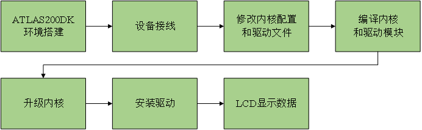
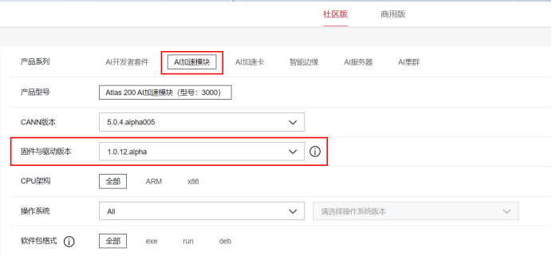
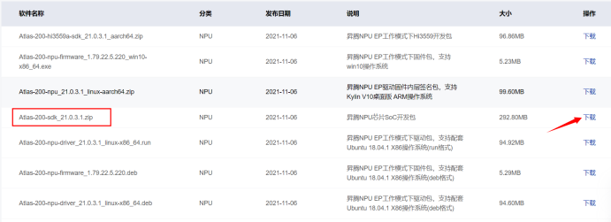
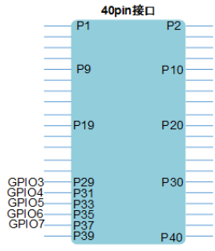
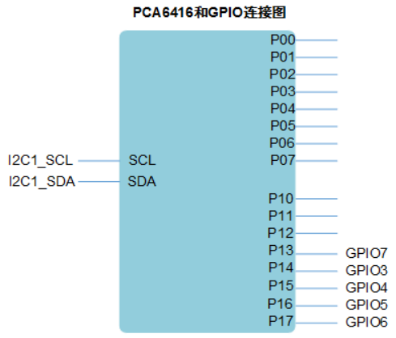
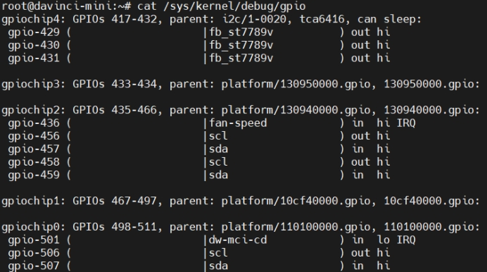
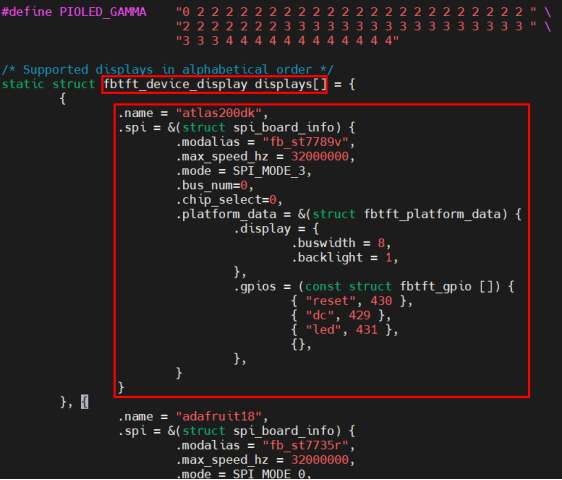
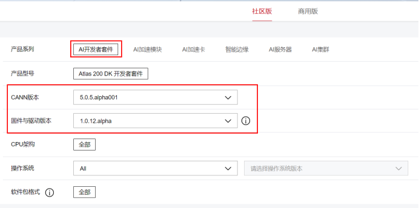
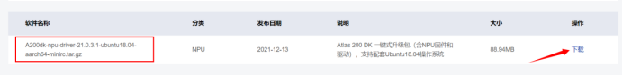
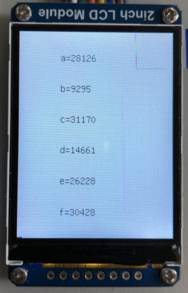

# 基于ATLAS200DK SPI接口LCD的fbtft驱动适配

## 1 概述

### 1.1 概要描述
适配SPI接口的LCD的fbtft驱动，使LCD可以显示ATLAS200DK上传输过来的MPU6050解算出的数据。

### 1.2 适配流程图



## 2 设备属性

### 2.1 ATLAS200DK 40PIN连接器定义
|  管脚  |  名称  |  电平  |  管脚  |  名称  |  电平  |
| :---: | :---: | :---: | :---: | :---: | :---: |
|1|	+3.3V|	3.3V|	2|	+5.0V|	5V|
|3|	I2C2-SDA|	3.3V|	4|	+5.0V|	5V|
|5|	I2C2-SCL|	3.3V|	6|	GND|	-|
|7|	GPIO0|	3.3V|	8|	TXD0|	3.3V|
|9|	GND	|-|	10|	RXD0|	3.3V|
|11|	GPIO1|	3.3V|	12|	NC|	-|
|13|	NC|	-|	14|	GND|	-|
|15|	GPIO2|	3.3V|	16|	TXD1|	3.3V|
|17|	+3.3V|	3.3V|	18|	RXD1|	3.3V|
|19|	SPI-MOSI|	3.3V|	20|	GND|	-|
|21|	SPI-MISO|	3.3V|	22|	NC|	-|
|23|	SPI-CLK|	3.3V|	24|	SPI-CS|	3.3V|
|25|	GND|	-|	26|	GPIO10|	3.3V|
|27|	GPIO8|	3.3V|	28|	GPIO9|	3.3V|
|29|	GPIO3|	3.3V|	30|	GND|	-|
|31|	GPIO4|	3.3V|	32|	NC|	-|
|33|    GPIO5|	3.3V|	34|	GND|	-|
|35|	GPIO6|	3.3V|	36|	+1.8V|	1.8V|
|37|	GPIO7|	3.3V|	38|	TXD-3559|	3.3V|
|39|	GND|	-|	40|	RXD-3559|	3.3V|

### 2.2 LCD

#### 2.2.1 产品参数
工作电压：3.3V/5V

通信接口：SPI

屏幕类型：TFT

控制芯片：ST7789V

分辨率：240(V) x 320(H)RGB

显示尺寸：23.4（H）x 23.4（V）mm

像素大小：0.0975（H）x 0.0975（V）mm

产品尺寸：58 x 35(mm)

#### 2.2.2 功能引脚
|功能引脚|	描述|
| :---: | :---: |
|VCC|	3.3V/5V电源正|
|GND|	电源地|
|DIN|	SPI数据输入|
|CLK|	SPI时钟输入|
|CS|	片选，低电平有效|
|DC|	数据/命令选择|
|RST|	复位|
|BL|	背光|

## 3 操作流程
### 3.1 ATLAS200DK环境搭建
见Atlas200dk-MindXSDK 开发环境搭建一站式导航 https://gitee.com/ascend/docs-openmind/blob/master/guide/mindx/ascend_community_projects/tutorials/200dk%E5%BC%80%E5%8F%91%E6%9D%BF%E7%8E%AF%E5%A2%83%E6%90%AD%E5%BB%BA.md

环境依赖软件和版本如下表：

|   软件名称    |    版本     |
| :-----------: | :---------: |
|固件与驱动版本|1.0.12|
|CANN版本|5.0.5alpha001| 
|Ubuntu|18.04.4 LTS|

### 3.2 设备接线

见下表

|LCD|	200DK管脚编号|	200DK管脚名称|
| :---: | :---: | :---: |
|VCC|	17|	+3.3V|
|GND|	20|	GND|
|DIN|	19|	SPI-MOSI|
|CLK|	23|	SPI-CLK|
|CS|	24|	SPI-CS|
|DC|	29|	GPIO3|
|RST|	31|	GPIO4|
|BL|	33|	GPIO5|

### 3.3 修改内核配置和驱动文件

**步骤1** 下载内核源码，下载地址：
https://www.hiascend.com/hardware/firmware-drivers?tag=community

在AI加速模块中，选择对应的固件与驱动版本：



选择Atlas-200-sdk_21.0.3.1.zip下载：



解压后，将Ascend310-source-minirc.tar.gz上传至200DK任一目录下，例如/opt。

**步骤2** 200DK上执行如下命令，切换至root用户。

    su root

**步骤3** 通过如下命令进行安装依赖，此步200DK需要联网。

    apt-get install -y python make gcc unzip bison flex libncurses-dev squashfs-tools bc

**步骤4**  执行如下命令，进入源码包所在目录，例如/opt。

    cd /opt

**步骤5** 执行如下命令，解压源码包“Ascend310-source-minirc.tar.gz”。

    tar -xzvf Ascend310-source-minirc.tar.gz

**步骤6** 执行如下命令，进入source目录。

    cd source

**步骤7** 修改fbtft驱动文件。

1.执行如下命令，打开文件fbtft_device.c。

    vim kernel/linux-4.19/drivers/staging/fbtft/fbtft_device.c

2.在结构体fbtft_device_display displays[]里面添加对应设备节点，此步要按照实际接线和LCD属性填写，例如：
```
{
    .name = "atlas200dk",	//设备名
    .spi = &(struct spi_board_info) {
        .modalias = "fb_st7789v",	//匹配驱动名
        .max_speed_hz = 32000000,	//最大spi速率
        .mode = SPI_MODE_3,	//spi模式
        .bus_num=0,	//所使用的总线号
        .chip_select=0,	//所使用的片选号
        .platform_data = &(struct fbtft_platform_data) {
            .display = {
                .buswidth = 8,	//总线宽度
                .backlight = 1,	//背光
            },
            .gpios = (const struct fbtft_gpio []) {	//对应gpio引脚编号
                { "reset", 430 },
                { "dc", 429 },
                { "led", 431 },
                {},
            },
        }
    }
},
```
开发者板40pin接口中，存在5个通过PCA6416扩展的GPIO，原理图如下所示：



管脚29、31、33、35、37分别对应PCA6416扩展出来的GPIO3-GPIO7。
PCA6416的对应连接图如下：



PCA6416是通过I2C进行GPIO扩展的芯片，其通过I2C1扩展出16个GPIO，其中，GPIO3-GPIO7连接到40pin接口供开发者使用，开发者可以在用户层程序中直接通过I2C1操作PCA6416，从而控制GPIO3-GPIO7的输入输出。

输入命令cat /sys/kernel/debug/gpio，可以查看gpio的状态（如下图）。Atlas 200 DK 开发者套件（型号 3000）有两种主板，分别为IT21DMDA（旧主板）和IT21VDMB（新主板）。旧主板在执行该命令时检测不到gpiochip4（PCA6416拓展出的GPIO），需要改变接线和配置，详见下文的安装和运行驱动模块部分。根据PCA6416连接图和gpio状态可以看出PCA6416的P00-P17对应gpio编号为417-432，因此200DK的GPIO3、GPIO4、GPIO5、GPIO6、GPIO7对应的编号分别为429、430、431、432、428。



添加设备属性完成后如下所示：



3.按“Esc”键，再执行如下命令，保存修改并按“Enter”键退出。

    :wq

4.执行如下命令，打开文件fb_st7789v.c。

    vim kernel/linux-4.19/drivers/staging/fbtft/fb_st7789v.c

5.参考LCD数据手册，对文件fb_st7789v.c进行修改。

i.修改DEFAULT_GAMMA。

    #define DEFAULT_GAMMA	"1F 1A 18 0A 0F 06 45 87 32 0A 07 02 07 05 00\n" \
                            "00 25 27 05 10 09 3A 78 4D 05 18 0D 38 3A 1F"

ii.修改屏幕初始化函数init_display。
```
static int init_display(struct fbtft_par *par)
{
    par->fbtftops.reset(par);
    mdelay(120);
    write_reg(par, 0x36,0x00);
    write_reg(par, 0x3A,0x05);
    write_reg(par, 0xB2,0x0C,0x0C,0x00,0x33,0x33);
    write_reg(par, 0xB7,0x35);
    write_reg(par, 0xBB,0x1F);
    write_reg(par, 0xC0,0x2C);
    write_reg(par, 0xC2,0x01);
    write_reg(par, 0xC3,0x12);
    write_reg(par, 0xC4,0x20);
    write_reg(par, 0xC6,0x0F);
    write_reg(par, 0xD0,0xA4,0xA1);
    write_reg(par, 0xE0,0xD0,0x08,0x11,0x08,0x0C,0x15,0x39,0x33,0x50,0x36,0x13,0x14,0x29,0x2D);
    write_reg(par, 0xE1,0xD0,0x08,0x10,0x08,0x06,0x06,0x39,0x44,0x51,0x0B,0x16,0x14,0x2F,0x31);
    //write_reg(par, 0x21); //反色
    write_reg(par, 0x11);
    write_reg(par, 0x29);
    return 0;
}
```
iii.删除enum类型的st7789v_command和函数set_gamma。

iv.修改fbtft初始化函数fbtft_display。将gamma_len改成15，删去fbtftops中的“.set_gamma = set_gamma,”。

6.按“Esc”键，再执行如下命令，保存修改并按“Enter”键退出。

    :wq

**步骤8** 配置内核。

1.执行如下命令，进入内核目录。

    cd kernel/linux-4.19

2.执行如下命令，读取内核默认配置。

    make ARCH=arm64 CROSS_COMPILE=aarch64-linux-gnu- mini_defconfig

3.执行如下命令，并使能相关配置。

    make ARCH=arm64 CROSS_COMPILE=aarch64-linux-gnu- menuconfig

```
a.按以下选项配置内核，“Y”键选择*（编译进内核），“M”键选择M（编译成模块）。
    Device Drivers  --->
        Graphic support  --->
            Frame buffer Devices  --->
                <*> Support for frame buffer devices  --->
                    --- Support for frame buffer devices
                    [*] Enable firmware EDID
                    [*] Framebuffer foreign endianness support  --->
                    [*] Enable Video Mode Handling Helpers
                    [*] Enable Tile Blitting Support
            Console display driver support  --->
                [*] Framebuffer Console support
        [*] Staging drivers  --->
            <*> Support for small TFT LCD display modules  --->
                <M> FB driver for the ST7789V LCD Controller
                <M> Module to for adding FBTFT devices
b.选择“Save”，保存配置，系统默认配置文件为.config。
```
4.执行如下命令，保存配置。

    cp -f .config arch/arm64/configs/mini_defconfig

5.返回source目录。

    cd /opt/source

### 3.4 编译内核和驱动模块

**步骤1** 执行如下命令，编译内核。

    bash build.sh kernel

出现如下回显，表示编译内核成功。


编译出的内核文件在文件source/output/out_header中。

**步骤2** 执行如下命令，编译模块。

    bash build.sh modules

编译出的模块在文件source/output中。

### 3.5 升级内核

**步骤1** 下载Atlas200DK驱动包，下载地址：
https://www.hiascend.com/hardware/firmware-drivers?tag=community

在AI开发者套件中，选择对应的CANN版本和固件与驱动版本：



选择A200dk-npu-driver-21.0.3.1-ubuntu18.04-aarch64-minirc.tar下载：



将A200dk-npu-driver-21.0.3.1-ubuntu18.04-aarch64-minirc.tar上传至200DK目录/opt/mini。

**步骤2** 执行如下命令，进入/opt/mini目录。

    cd /opt/mini

**步骤3** 执行如下命令，解压驱动包。

    tar -xzvf A200dk-npu-driver-21.0.3.1-ubuntu18.04-aarch64-minirc.tar.gz

**步骤4** 执行如下命令，将“minirc_install_phase1.sh”拷贝至目标版本驱动包所在目录。

    cp driver/scripts/minirc_install_phase1.sh /opt/mini

**步骤5** 执行如下命令，用重新编译后的内核替换驱动包的内核。

    cp /opt/source/output/out_header/Image driver

**步骤6** 执行如下命令，压缩新的驱动包。

    tar -zcvf A200dk-npu-driver-21.0.3.1-ubuntu18.04-aarch64-minirc.tar.gz driver

**步骤7** 执行如下命令，升级脚本。

    ./minirc_install_phase1.sh

**步骤8** 执行如下命令，重启Atlas 200 AI加速模块。

    reboot

### 3.6 安装驱动

**步骤1** 执行如下命令，进入到驱动模块所在目录，例如/opt/source/output。

    cd /opt/source/output

**步骤2** 执行如下命令，依次安装模块fbtft_device.ko和fb_st7789v.ko。

    （新主板）insmod fbtft_device.ko name=atlas200dk txbuflen=128

参数根据设备参数调整，参数txbuflen为发送缓冲帧的大小，若txbuflen的值过大可能会发生显示屏幕不全且传输内容错误的现象，过小则屏幕刷新会慢一些。此外常用参数还有rotate（值取0,90,180,270，控制屏幕旋转角度）、busnum（总线号）、cs（片选）、speed（SPI速率）、mode（SPI模式）、gpios（gpio列表，格式：reset:23,dc:24）、fps、debug（0-7，值越高返回越多属性）、custom，custom=1时可以修改width、height、buswidth。全部属性可以输入modinfo fbtft_device.ko查看。

鉴于旧主板的200DK不能直接通过管脚编号控制PCA6416拓展的出GPIO，可以将dc改接从昇腾AI处理器上引出的GPIO，必须外置上拉电阻增加驱动能力，建议上拉电阻的值为1K～10K。reset和bl根据lcd的数据手册或接地或接高电平（GPIO3-7默认是高电平），即不对reset和bl进行控制。本实验所使用的的LCD reset和bl皆接高电平。从昇腾AI处理器上引出的GPIO有GPIO0、GPIO1，gpio编号分别为504、444，在ATLAS200DK上管脚编号分别为7、11。注意，安装模块时需要重载gpios属性，例如：

    （旧主板，dc接GPIO0）insmod fbtft_device.ko name=atlas200dk txbuflen=128 gpios=dc:504

    insmod fb_st7789v.ko

此时，LCD屏应被成功驱动，并显示控制台tty1的内容，同时/dev目录下出现设备fb0。输入如下命令，可以看到LCD屏中显示Hello Linux。

    echo Hello Linux > /dev/tty1

### 3.7 LCD显示数据

**步骤1** 假如需要显示6个随机数，编写脚本display.sh，脚本内容如下：
```
#!/bin/bash
a=$RANDOM
b=$RANDOM
c=$RANDOM
d=$RANDOM
e=$RANDOM
f=$RANDOM
echo -e "\n\n\ta="$a > /dev/tty1
echo -e "\n\n\tb="$b > /dev/tty1
echo -e "\n\n\tc="$c > /dev/tty1
echo -e "\n\n\td="$d > /dev/tty1
echo -e "\n\n\te="$e > /dev/tty1
echo -e "\n\n\tf="$f > /dev/tty1
echo > /dev/tty1
```
LCD屏分辨率为240x320，字体大小为8x16，所以显示字符共20行，30列。运行一次此脚本刚好可以刷新一次屏幕。

**步骤2** 执行如下命令，运行脚本display.sh，LCD显示效果如下：

    bash display.sh



## 4 参考链接

> Atlas 200 AI加速模块 1.0.12 软件安装与维护指南（RC场景）：
https://support.huawei.com/enterprise/zh/doc/EDOC1100221707/426cffd9

> Atlas 200 DK开发者套件(1.0.12.alpha)：
https://support.huaweicloud.com/environment-deployment-Atlas200DK1012/atlased_04_0001.html

> Atlas200dk-MindXSDK 开发环境搭建一站式导航：
https://gitee.com/ascend/docs-openmind/blob/master/guide/mindx/ascend_community_projects/tutorials/200dk%E5%BC%80%E5%8F%91%E6%9D%BF%E7%8E%AF%E5%A2%83%E6%90%AD%E5%BB%BA.md

> 2inch LCD Module：https://wiki.diustou.com/cn/2inch_LCD_Module

> 嵌入式Linux fbtft（SPI TFT屏）驱动移植：
https://blog.csdn.net/weixin_38137947/article/details/107087468?ops_request_misc=%257B%2522request%255Fid%2522%253A%2522165899758516781683910008%2522%252C%2522scm%2522%253A%252220140713.130102334..%2522%257D&request_id=165899758516781683910008&biz_id=0&utm_medium=distribute.pc_search_result.none-task-blog-2~all~sobaiduend~default-1-107087468-null-null.142^v35^new_blog_pos_by_title&utm_term=%E5%B5%8C%E5%85%A5%E5%BC%8FLINUX%20FBTFT%EF%BC%88SPI%20TFT%E5%B1%8F%EF%BC%89%E9%A9%B1%E5%8A%A8%E7%A7%BB%E6%A4%8D%E5%8F%8A%E8%B0%83%E8%AF%95&spm=1018.2226.3001.4187
