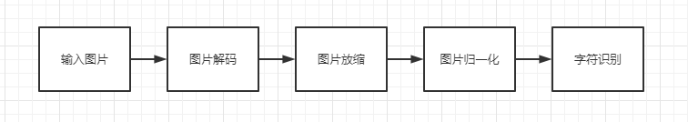

# ChineseOCR

## 1 介绍
本开发样例演示中文字体识别ChineseOCR，供用户参考。 本系统基于昇腾Atlas300卡。主要为单行中文识别系统，系统将图像进行适当的仿射变化，然后送入字符识别系统中进行识别后将识别结果输出。

### 1.1 支持的产品

本系统采用Atlas300-3010作为实验验证的硬件平台，并支持Atlas200RC以及Atlas500的硬件平台.具体产品实物图和硬件参数请参见《Atlas 300 AI加速卡 用户指南（型号 3010）》。由于采用的硬件平台为含有Atlas 300的Atlas 800 AI服务器 （型号3010），而服务器一般需要通过网络访问，因此需要通过笔记本或PC等客户端访问服务器，而且展示界面一般在客户端。

### 1.2 支持的版本

本样例配套的 CANN 版本为 5.1.RC2，支持的 SDK 版本为 3.0.RC2

版本号查询方法，在Atlas产品环境下，运行以下命令：

```
npu-smi info
```


### 1.3 软件方案介绍

软件方案将主要为中文字符识别系统。系统功能具体描述请参考 表1.1 系统方案各功能描述。系统可以实现将字符检测子系统的结果中的文字进行识别。本方案选择使用crnn作为字符识别模型。系统方案中各模块功能如表1.2 所示。

表1.1 系统方案各子系统功能描述：

| 序号 | 子系统   | 功能描述                                                     |
| ---- | -------- | ------------------------------------------------------------ |
| 1    | 字符识别 | 从pipeline中读取到输入的图片，然后将图片放缩为固定大小，放缩的大小与模型的输入有关，然后将放缩后的结果送入字符识别系统，放缩的大小与模型的输入大小有关，之后将结果送入到文字识别模型进行文字识别，并将识别结果进行输出。 |

表1.2 系统方案中各模块功能：

| 序号 | 子模块     | 功能描述                                                     |
| ---- | ---------- | ------------------------------------------------------------ |
| 1    | 输入图像   | 将图像（JPG格式）通过本地代码输入到pipeline中。              |
| 2    | 图像解码   | 通过硬件（DVPP）对图像进行解码，转换为UINT8格式进行后续处理。 |
| 3    | 图形放缩   | 由于文本检测模型的输入大小为固定的维度，需要使用图像放缩插件将图像等比例放缩为固定尺寸。 |
| 4    | 图像归一化 | 将放缩之后的图像送入归一化插件中得到归一化结果。             |
| 5    | 文字识别   | 在图像放缩后，将缓存区数据送入文字识别模型。本方案选用crnn进行文本识别。 |


### 1.4 代码目录结构与说明

本Sample工程名称为ChineseOCR，工程目录如下图1.2所示：

```
├── main.py
├── README.md
├── chineseocr.pipeline
├── model
│   ├── crnn
├── data
│   ├── inputdata
├── cfg
│   ├── crnn.txt
│   ├── ppocr_keys_v1.txt
```

### 1.5 技术实现流程图




### 1.6 特性及适用场景

本案例可以满足单行中文文字识别，但同时对输入图像有以下限制：

1、输入图像要求是jpg,jpeg,JPG,PNG编码格式

2、输入图像尺寸过大或者过小会对图片进行放缩处理


## 2 环境依赖

推荐系统为ubuntu 18.04或centos 7.6，环境依赖软件和版本如下表：

| 软件名称 | 版本   |
| -------- | ------ |
| Python   | 3.9.12 |
| protobuf | 3.19.0 |
| google   | 3.0.0  |


### 3. 模型转换

#### 3.1 使用官方paddle模型

**步骤1** 在github上下载PaddleOCR模型。下载地址：[GitHub - PaddlePaddle/PaddleOCR](https://github.com/PaddlePaddle/PaddleOCR)

**步骤2** 将获取到的PaddleOCR模型文件解压后存放到`model/paddleocr/ch_ppocr_server_v2.0_rec_infer`。

**步骤3** 安装环境依赖。笔者使用docker pull paddlepaddle/paddle:2.3.2-gpu-cuda11.2-cudnn8拉取镜像，建立docker容器并进入容器后运行如下命令

```
 pip install paddle2onnx==1.0.0
```

**步骤4** 将模型文件拷贝进容器里面

```
 docker cp -r model/paddleocr/ch_ppocr_server_v2.0_rec_infer {容器id}:/models/
```

**步骤4 ** 在`/models`目录下执行以下命令

```
paddle2onnx --model_dir ./ch_ppocr_server_v2.0_rec_infer/ --model_filename inference.pdmodel --params_filename inference.pdiparams --save_file ./ch_ppocr_server_v2.0_rec_infer.onnx --opset_version 11 --enable_onnx_checker True
```

如果在成功执行完命令后会生成OCR的onnx模型，如果出现`E16005: The model has [2] [--domain_version] fields, but only one is allowed.`错误，使用[MagicONNX](https://gitee.com/Ronnie_zheng/MagicONNX)调用keep_default_domain这个接口修改onnx解决

由于笔者下载的paddle模型在转换后出现图片识别精度大幅下降的问题，所以尽量使用官方已经转化完成的om模型进行识别

https://gitee.com/link?target=https%3A%2F%2Fmindx.sdk.obs.cn-north-4.myhuaweicloud.com%2Fmindxsdk-referenceapps%2520%2Fcontrib%2FOCR%2Fmodel%2Fmodels_ocr.zip

**步骤5 ** 使用atc命令转单batch模型

将模型从docker容器中拷贝出来上传到昇腾服务器

```bash
atc --model=/model/ch_ppocr_server_v2.0_rec_infer_modify.onnx --framework=5 --output_type=FP32 --output=ch_ppocr_server_v2.0_rec_infer_modify_bs1_om --input_format=NCHW --input_shape="x:1,3,32,100" --soc_version=Ascend310 
```


## 3 依赖安装

使用pip安装所需的插件


## 4 运行

**步骤1** 将经过模型转化的Paddle om模型放到`models/paddlecrnn`文件夹内

**步骤2 ** 配置环境变量，根据自己的环境变量不同，需要配置不同的环境变量，在CANN以及MindX SDK的安装目录找到set_env.sh,并运行脚本：

```
bash ${SDK安装路径}/set_env.sh
bash ${CANN安装路径}/set_env.sh
```

**步骤3** 在main.py`中，更改`pipeline路径

**步骤4** 运行main.py文件得到中文识别结果


## 5 精度测试

#### 使用官方paddle模型在GPU上测试

**步骤1** 导入paddleocr包

**步骤2** 通过paddleocr包内的paddleocr函数将手写图片数据集进行识别，识别后分别写入文档
```python
ocr = paddleocr.PaddleOCR()
ocr.ocr(img_path,rec=True,det=False,cls=False)
```

**步骤3** 将识别结果和标签分别进行比对输出平均相似度

#### 使用经过转化的om模型在NPU上测试

**步骤1** 将官方数据库的手写数据放入datasets输入目录下

**步骤2** 在项目主目录下执行检测命令：python main.py，输出识别结果后分别写入文档

**步骤3** 将识别结果和标签分别进行比对输出平均相似度

```python
for text_path in glob.glob(os.path.join(data_path,'*_pic.txt')):
        text_label= text_path.replace('_pic','')
        with open(text_label,'r',encoding='utf-8') as f:
            ref_list = f.readlines()
            ref = ""
            for line in ref_list:
                ref += line.strip('\n')
        with open(text_path,'r',encoding='utf-8') as f:
            out_list = f.readlines()
            out = ""
            for line in out_list:
                out += line.strip('\n')
        index += 1    
        score += textdistance.hamming.normalized_similarity(out, ref)
print(score/index)
```
| 测试版本 | 相似度 |
| -------- | ------ |
| GPU      | 41.58% |
| NPU      | 41.78% |


## 6 软件依赖说明


| 依赖软件 | 版本   | 说明                                         |
| -------- | ------ | -------------------------------------------- |
| glob     | 0.7    | 数据查找，并将搜索的到的结果返回到一个列表中 |
| protobuf | 3.19.0 | 数据序列化反序列化组件                       |


## 7 常见问题

### 7.1 输入图片大小与模型不匹配问题

**问题描述：**

运行失败：

```
E20220826 10:05:45.466817 19546 MxpiTensorInfer.cpp:750] [crnn recognition][1001][General Failed] The shape of concat inputTensors[0] does not match model inputTensors[0]
...
```

**解决方案：**

在imagedecode插件，设定解码方式的参数为opencv，选择模型格式为RGB，然后再imageresize插件里面设定o解码方式为opencv