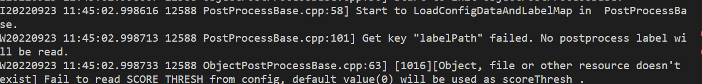

# C++基于MxBase的FCOS目标检测

## 1 介绍
本开发样例是基于mxBase开发的端到端推理的C++应用程序，可在昇腾芯片上进行FCOS目标检测，并把可视化结果保存到本地。其中包含FCOS的后处理模块开发。 该项目的主要处理流程为： Init > ReadImage >Resize > Inference >PostProcess >DeInit。

### 1.1 支持的产品

本产品以昇腾310（推理）卡为硬件平台。

### 1.2 支持的版本

该项目支持的SDK版本为2.0.4，CANN版本为5.0.4。

### 1.3 软件方案介绍

基于C++的FCOS目标检测的业务流程为：

1.将待检测的图片放到相应的文件夹下。

2.首先对图片进行预处理（改变图像大小、归一化、填充操作）。

3.将图片传入FCOS类当中。

4.对图片进行推理。

5.对推理的结果进行后处理。

6.最后在目标图片当中绘制目标框以及类别。

| 序号 | 子系统     | 功能描述                                                                                   |
| ---- | ---------- | ------------------------------------------------------------------------------------------ |
| 1    | 图片输入   | 将图片放到对应的文件夹下                                                                   |
| 2    | 图像前处理 | 对图片进行resize、填充以及归一化等。                                                       |
| 3    | 模型推理   | 对已经处理后的图片进行推理，得到推理的张量数据流。                                         |
| 4    | 模型后处理 | 利用后处理类对图片最后输出的张量进行后处理。对模型输出的目标框进行去重，排序和筛选等工作。 |
| 5    | 绘制目标框 | 将最后的结果绘制到目标图片上。                                                             |

### 1.4 代码目录结构与说明

本项目名为FCOS目标检测，项目的目录如下所示：

```
|- models
|	|- aipp_FCOS.aippconfig	//模型转换配置文件
|	|_ Fcos_tf_bs.cfg
|- FCOSDection
|	|- FCOSDetection.cpp
|	|_ FCOSDetection.h
|- FCOSPostprocess
|	|- FCOSDetectionPostProcess.cpp
|	|_ FCOSDetectionPostProcess.h
|- build.sh
|- CMakeLists.txt
|- main.py
|- binresult
|- evaluate.py
|_ README.md
```

### 1.5 技术实现流程图


### 1.6 特性及适用场景
本项目是一个目标检测项目，用于检测coco数据集中的80种物体类别。并且在结果输出检测出的物体的置信度和目标框信息。在大多数测试样例中，输入的图片物体要清晰并且重叠区域少。另一方面，图片的输入的格式要和模型的规定的输入要求相符合。
但是存在以下检测错误的情况：
1.图片过于模糊；
2.图片中物体重合严重；
3.识别的图片长宽不符合要求。


## 2 环境依赖
推荐系统为ubuntu 18.04,环境软件和版本如下：

| 软件名称            | 版本  | 说明                          | 获取方式                                                          |
| ------------------- | ----- | ----------------------------- | ----------------------------------------------------------------- |
| MindX SDK           | 2.0.4 | mxVision软件包                | [点击打开链接](https://www.hiascend.com/software/Mindx-sdk)       |
| ubuntu              | 18.04 | 操作系统                      | 请上ubuntu官网获取                                                |
| Ascend-CANN-toolkit | 5.0.4 | Ascend-cann-toolkit开发套件包 | [点击打开链接](https://www.hiascend.com/software/cann/commercial) |

在编译运行项目前，需要设置环境变量：

- 环境变量介绍

```
. /usr/local/Ascend/ascend-toolkit/set_env.sh
. ${SDK安装路径}/mxVision/set_env.sh
```
## 3 模型转换

**步骤一**：在ModelZoo上下载FCOS的模型。点击[下载](https://www.hiascend.com/zh/software/modelzoo/models/detail/1/6fcc4747a48245d29351c26cd052dd13)。

**步骤二**：将获取到的模型放置到models文件夹中。

**步骤三**：执行模型转换命令。

转换模型

```
atc --model=fcos.onnx --framework=5 --soc_version=Ascend310 --input_format=NCHW --input_shape="input:1,3,800,1333" --output=fcos_bs1 --insert_op_conf=FCOS.aippconfig --precision_mode=force_fp32
```

执行完该命令之后，会在models文件夹下生成.om模型，并且转换成功之后会在终端输出：

```
ATC start working now, please wait for a moment.
ATC run success, welcome to the next use.
```

## 4 编译与运行
**步骤1** 修改CMakeLists.txt文件 将set(MX_SDK_HOME {SDK安装路径}) 中的{SDK安装路径}替换为实际的SDK安装路径。从https://github.com/pjreddie/darknet/blob/master/data/coco.names  ，下载coco.names,然后将这个文件放到models文件夹下。

**步骤2** cd到FCOS目录下，执行如下编译命令： bash build.sh

**步骤3** 制定jpg图片进行推理，准备一张推理图片放入FCOS 目录下。

```
./mxBase_sample ./test.jpg
```


## 5 精度测试
本项目和 https://gitee.com/ascend/mindxsdk-referenceapps/tree/master/contrib/FCOS 地址处的项目的模型和后处理过程一样。详细的精度测试参考地址处的项目。
## 6 常见问题

### 6.1 类别标签问题

**问题描述：**

在main.cpp中，类别标签路径如下：

```c++
void InitFCOSParam(InitParam &initParam)
{
    initParam.deviceId = 0;
    initParam.labelPath = "./models/coco.names";
    initParam.checkTensor = true;
    initParam.modelPath = "./models/fcos_bs1.om";
    initParam.inputType = 0;
    initParam.classNum = CLASS_NU;
}
```

若没有加入标签，报错如下：


无法运行。

**解决方案：**

这里需要将从网站https://github.com/pjreddie/darknet/blob/master/data/coco.names  处下载相应的标签。
