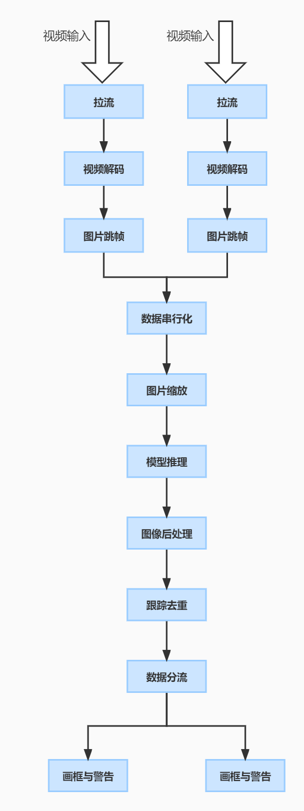
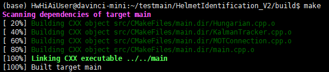
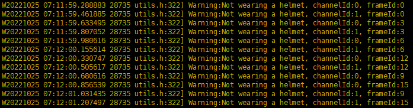
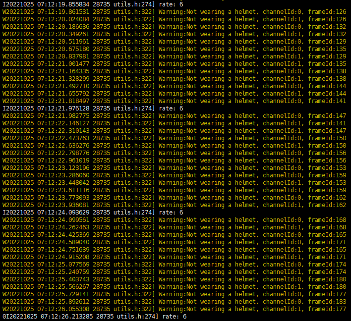
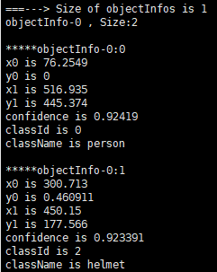

#  安全帽识别

## 1 介绍
安全帽作为工作中一样重要的安全防护用品，主要保护头部，防高空物体坠落，防物体打击、碰撞。通过识别每个人是否戴上安全帽，可以对没戴安全帽的人做出告警。

本项目支持2路视频实时分析，其主要流程为：

​	分两路接收外部输入视频，通过视频解码将264格式视频解码为YUV格式图片，然后对这些图片串行化进行缩放、推理、后处理、跟踪去重等处理。模型推理使用YOLOv5进行安全帽识别，对重复检测出的没戴安全帽的对象进行去重，最后将识别结果输出为两路，并对没佩戴安全帽的情况告警。

### 1.1 支持的产品

本项目以昇腾Atlas 200DK为主要的硬件平台。

### 1.2 支持的版本

本项目配套的CANN版本为 [6.0.RC1](https://www.hiascend.com/software/cann/commercial) ，MindX SDK版本为 [3.0.RC2](https://www.hiascend.com/software/Mindx-sdk) 。

MindX SDK安装前准备可参考《用户指南》中的[安装教程](https://gitee.com/ascend/mindxsdk-referenceapps/blob/master/docs/quickStart/1-1安装SDK开发套件.md)。

### 1.3 软件方案介绍

请先总体介绍项目的方案架构。如果项目设计方案中涉及子系统，请详细描述各子系统功能。如果设计了不同的功能模块，则请详细描述各模块功能。

表1.1 系统方案各子系统功能描述：

| 序号 | 子系统     | 功能描述                                                     |
| ---- | ---------- | ------------------------------------------------------------ |
| 1    | 视频解码   | 从264视频流中解码图像帧                                      |
| 2    | 图像帧缩放 | 将输入的图像帧使用等比例缩放方法缩放到YOLO模型要求的宽高     |
| 3    | 模型推理   | 将缩放后的图像输入模型获得结果（tensor格式）                 |
| 4    | 后处理     | 调用后处理接口根据模型推理结果计算检测出的目标框在原图中的位置 |
| 5    | 跟踪去重   | 使用匈牙利算法和卡尔曼滤波对同一路视频流不同图像中的目标框进行跟踪 |
| 6    | 结果输出   | 如果检测出了未佩戴头盔的情况且跟踪去重模块判断为未重复就输出告警信息并将检测结果按照输入分为两路保存 |

### 1.4 代码目录结构与说明

本工程名称为HelmetIdentification_V2，工程目录如下图所示：

```
.
├── model
	├── Helmet_yolov5.cfg  // 模型转换aipp配置文件
	├── YOLOv5_s.om   	  // 模型文件（需自行下载或转换）
	└── imgclass.names    // label文件
├── src
	├── main.cpp    	  // 安全帽检测的main函数入口
	├── main-image.cpp	   // 读取图片测试精度
	├── utils.h         // 实现多线程的工具类
	├── cropResizePaste.hpp // 自定义的等比例缩放
	├── MOTConnection.h    // 跟踪匹配方法的头文件
	├── MOTConnection.cpp 	// 跟踪匹配方法的实现
	├── KalmanTracker.h    // 卡尔曼滤波方法的头文件
	├── KalmanTracker.cpp  	// 卡尔曼滤波方法的实现
	├── Hungar ian.h	   // 匈牙利算法的头文件
	├── Hungarian.cpp     // 匈牙利算法的实现
	├── DataType.h       // 自定义的数据结构
	└── CMakeLists.txt     // CMake文件
├── result
	├── one         // 文件夹，保存第一路输入的结果（需要新建）
	└── two         // 文件夹，保存第二路输入的结果（需要新建）
└── CMakeLists.txt     // CMake文件
```

### 1.5 技术实现流程图



### 1.6 特性及适用场景

本案例可以满足未佩戴安全帽的目标检测，要求输入的视频为264格式。


## 2 环境依赖

### 2.1 软件依赖

环境依赖软件和版本如下表：

| 软件                | 版本    | 说明                          | 获取方式                                                  |
| ------------------- | ------- | ----------------------------- | --------------------------------------------------------- |
| mxVision            | 3.0.RC2 | mxVision软件包                | [链接](https://www.hiascend.com/software/Mindx-sdk)       |
| Ascend-CANN-toolkit | 6.0.RC1 | Ascend-cann-toolkit开发套件包 | [链接](https://www.hiascend.com/software/cann/commercial) |
| Ubuntu              | 18.04   |                               |                                                           |

### 2.2 环境变量

在编译运行项目前，需要设置环境变量：

MindX SDK环境变量：

. ${SDK-path}/set_env.sh

CANN环境变量：

. ${ascend-toolkit-path}/set_env.sh

环境变量介绍

SDK-path：mxVision SDK安装路径

ascend-toolkit-path：CANN安装路径


## 3 模型转换

模型转换所需ATC工具环境搭建参考链接：https://www.hiascend.com/document/detail/zh/CANNCommunityEdition/600alpha001/infacldevg/atctool/atlasatc_16_0004.html

本项目使用YOLOV5_s模型用于完成目标检测任务，可点击[链接](https://gitee.com/link?target=https%3A%2F%2Fmindx.sdk.obs.cn-north-4.myhuaweicloud.com%2Fmindxsdk-referenceapps%2520%2Fcontrib%2FHelmetIdentification%2Fmodel.zip)下载onnx模型然后使用ATC工具转换。

具体步骤为：将onnx模型上传至服务器任意目录，运行atc-env脚本将onnx转为om模型。

运行命令如下：

```
sh atc-env.sh
```

脚本中包含atc命令：

```
--model=${Home}/YOLOv5_s.onnx --framework=5 --output=${Home}/YOLOv5_s  --insert_op_conf=./aipp_YOLOv5.config --input_format=NCHW --log=info --soc_version=Ascend310 --input_shape="images:1,3,640,640"
```

其参数如下表所示：

| 参数名           | 参数描述                                                     |
| ---------------- | ------------------------------------------------------------ |
| -- framework     | 原始框架类型。当取值为5时，即为ONNX网络模型，仅支持ai.onnx算子域中opset v11版本的算 子。用户也可以将其他opset版本的算子（比如opset v9），通过PyTorch转换成 opset v11版本的onnx算子 |
| --model          | 原始模型文件路径与文件名                                     |
| --output         | 如果是开源框架的网络模型，存放转换后的离线模型的路径以及文件名。 |
| --soc_version    | 模型转换时指定芯片版本。昇腾AI处理器的版本，可从ATC工具安装路径的“/usr/local/Ascend/ascend-toolkit/latest/arm64-linux/atc/data/platform_config”目录下 查看。 ".ini"文件的文件名即为对应的${soc_version} |
| --insert_op_conf | 插入算子的配置文件路径与文件名， 例如aipp预处理算子。        |
| --input_shape    | 模型输入数据的 shape。                                       |
| --out_nodes      | 指定输出节点,如果不指定输出节点（算子名称），则模型的输出默认为最后一层的算子信息，如果 指定，则以指定的为准。 |

其中--insert_op_conf参数为aipp预处理算子配置文件路径。该配置文件aipp_YOLOv5.config在输入图像进入模型前进行预处理。该配置文件保存在源码Models目录下。

注：1. [aipp配置文件教程链接](https://gitee.com/link?target=https%3A%2F%2Fsupport.huaweicloud.com%2Ftg-cannApplicationDev330%2Fatlasatc_16_0015.html) 2.atc-env.sh脚本内 Home 为onnx文件所在路径。

## 4 编译与运行

项目要求实现性能和精度的测试验证，所以提供了两个main文件，根据需求保留其中一个就可以。下面按照性能和精度的测试分开写步骤

### 4.1 测试性能

**步骤1** 修改参数

1. 将HelmetIdentification_V2文件夹及其中代码上传至服务器任意目录，请不要修改文件夹结构

3. 进入src文件夹，修改其中的CMakeLists.txt

   * 第24行需要修改为 对应环境中ascend-toolkit的路径中的include文件夹

   * 第35行需要修改为 对应环境中ascend-toolkit的路径中的lib64文件夹

    注：第34行、第36行应该每个服务器都是一样的，除非有报错不然不需要修改

**步骤2** 选择对应的main文件

测试性能使用main.cpp
需要删除main-image.cpp
可以使用如下命令进行:

```shell
cd src
rm ./main-image.cpp
```

**步骤3** 编译

进入HelmetIdentification_V2文件夹，执行以下命令以完成外部编译

```shell
mkdir build
cd build
cmake ..
make
```

出现如下图所示的结果即表示编译成功



**步骤4** 运行及输出结果

从build文件夹退回到HelmetIdentification_V2文件夹

如果是第一次运行，需要新建result文件夹以及内部的one、two两个文件夹用于存放结果，可以运行以下命令（确保当前在HelmetIdentification_V2层级）:

```
mkdir result
cd result
mkdir one
mkdir two
```

退回到HelmetIdentification_V2文件夹，运行如下命令计算处理的帧率

```
./main ${video0Path} ${video0width} ${video0height} ${video1Path} ${video1width} ${video1height}
```

video0Path和video1Path分别是两路输入视频的路径，目前要求是一个264文件，宽高在第二步中设置（默认宽1920高1080）。

如果检测到某一帧图像中存在未佩戴头盔的情况，会打印告警信息并保存图像。



图片保存在HelmetIdentification_V2/result文件夹中，内部有两个文件夹，文件夹one保存第一路输入的结果，文件夹two保存第二路输入的结果。

图片的文件名命名规则为`result[frameId].jpg`，frameId表示是输入视频中的第几帧。

在运行时会输出跟踪去重线程的**帧率**（每秒处理的图片数量），示例如下：



### 4.2 测试精度

**步骤1** 修改参数

1. 将HelmetIdentification_V2文件夹及其中代码上传至服务器任意目录，请不要修改文件夹结构
2. 进入src文件夹，修改其中的CMakeLists.txt
	第24行需要修改为 对应环境中ascend-toolkit的路径中的include文件夹
	第35行需要修改为 对应环境中ascend-toolkit的路径中的lib64文件夹
	注：第34行、第36行应该每个服务器都是一样的，除非有报错不然不需要修改

**步骤2** 选择对应的main文件

测试精度使用main-image.cpp
需要删除main.cpp，然后将main-image.cpp重命名为main.cpp
可以使用如下命令进行:

```sh
cd src
rm ./main.cpp
cp ./main-image.cpp ./main.cpp
rm ./main-image.cpp
```

**步骤3** 编译

进入HelmetIdentification_V2文件夹，执行以下命令以完成外部编译

```shell
mkdir build
cd build
cmake ..
make
```

出现如下图所示的结果即表示编译成功


**步骤4** 运行及输出结果

**测试精度所用的图片数据集需要自行下载**：[Safety-Helmet-Wearing-Dataset](https://gitee.com/link?target=https%3A%2F%2Fmindx.sdk.obs.cn-north-4.myhuaweicloud.com%2Fmindxsdk-referenceapps%20%2Fcontrib%2FHelmetIdentification%2Fdata.zip)

从build文件夹退回到HelmetIdentification_V2文件夹，运行如下命令读取图片进行检测：

```
./main ${imagePath}
```

imagePath是图片路径（例如 ./main 000023.jpg）

正确执行会输出检测到的目标框的信息，如下所示：



