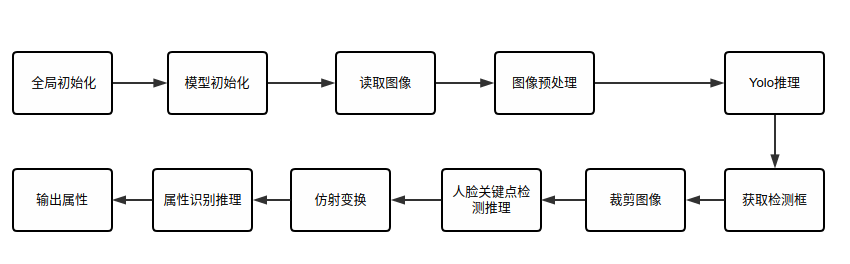

# Individual Attribute Recognition

## 1 介绍

本系统基于mxVision SDK进行开发，以Atlas 200DK为主要的硬件平台，开发端到端准确识别多种人脸属性信息，包括年龄、性别、颜值、情绪、脸型、胡须、发色、是否闭眼、是否配戴眼镜、人脸质量信息及类型等。

本项目的适用场景为：包含人脸的半身图像。其中，图像要求正脸或者微侧脸，允许遮挡嘴部（戴口罩），不支持遮挡鼻子以上的脸部照片，允许佩戴眼镜，但不支持过多遮挡面部。完全侧脸的图像可能存在问题。最大支持范围半身照，全身照可能由于人脸尺寸问题导致识别错误。

本项目在半身正面肖像照表现最佳，如果是大头照，需要填充背景区域以达到人脸能够精确检测的目的，要求人脸必须全部处于图像区域内，且占比不超过80%，部分图像可能需要填充背景。本项目支持的图像尺寸为32x32以上，图片格式为JPEG格式。

最后输出时能够输出一个属性序列，图像存在的属性在序列中的值为1，不存在的属性在序列中的值为0。

### 1.1 支持的产品
本项目以昇腾Atlas 200DK为主要的硬件平台。

### 1.2 支持的版本
本项目配套的CANN版本为 [6.0.RC1](https://www.hiascend.com/software/cann/commercial) ，MindX SDK版本为 [3.0.RC2](https://www.hiascend.com/software/Mindx-sdk) 。

MindX SDK安装前准备可参考《用户指南》中的[安装教程](https://gitee.com/ascend/mindxsdk-referenceapps/blob/master/docs/quickStart/1-1安装SDK开发套件.md)。


### 1.3 软件方案介绍
本系统设计了不同的功能模块。主要流程为：读取图片后，利用Yolov4的检测模型检测人脸，裁剪出人脸后将图像放缩至特定尺寸，再利用提取关键点的模型进行关键点提取，获取人脸关键点后进行对齐，将对齐结果输入到人脸属性识别模型中，最后输出识别结果。各模块功能描述如表1.1所示：

表1.1 系统方案中各模块功能：
| 序号 | 子系统    | 功能描述                           |
|----|--------|-------------------------------------------------|
| 1  | 图像输入   | 将图像文件数据读取进内存                            |
| 2  | 人脸检测   | 利用yolov4的检测模型，检测出图片中人脸                 |
| 3  | 关键点提取  | 通过人脸关键点提取模型，获取人脸图片中的人脸关键点数据      |
| 4  | 人脸对齐   | 通过人脸关键点实现人脸对齐          |
| 5  | 人脸属性识别 | 通过人脸属性识别模型对人脸对齐后的图片提取人脸属性，选取的模型为caffe框架下的FaceAttribute-FAN，需要使用转换工具转化 |
| 6  | 结果输出   | 将人脸属性识别的结果输出           |

### 1.4 代码目录结构与说明

本工程名称为Individual_V2，工程目录如下图所示：

```
.
├── CelebA
│   └── img_align_celeba  // 测试数据集(需自行下载)
├── models
│   ├── attr.names // 属性识别的label文件
│   ├── Attribute_test.om // 属性识别的模型文件(需自行下载或转换)   
│   ├── coco.names // Yolo的label文件
│   ├── face_quality_0605_b1.om // 人脸关键点检测模型(需自行下载或转换)   
│   ├── insert_op3.cfg // 模型转换aipp配置文件
│   ├── resnet50_aipp_tf.cfg  // 模型后处理配置文件
│   ├── yolo4_detection.om // 人脸检测模型(需自行下载或转换)   
│   └── yolov4.cfg  // 模型后处理配置文件
├── src
│   ├── AttrRecognition.cpp // 属性识别的实现
│   ├── AttrRecognition.h // 属性识别的头文件
│   ├── CMakeLists.txt // CMake文件
│   ├── DetectAndAlign.cpp // 检测与对齐人脸的实现
│   ├── DetectAndAlign.h // 检测与对齐人脸的头文件
│   ├── ImageProcess.cpp // 图像处理的工具类实现
│   ├── ImageProcess.h // 图像处理的工具类头文件
│   ├── main.cpp // 主程序
│   └──ParamDataType.h // 通用的配置结构体定义
├── build.sh // 构建程序的脚本
├── cal_accuracy.py // 计算精度的代码
├── CMakeLists.txt // CMake文件
├── README.md
├── test_full.txt // 测试集标签
└── test.jpg // 测试图片(需自行准备)
```

### 1.5 技术实现流程图


### 1.6 特性及适用场景

本案例可以满足目标属性识别，但同时对输入的图像有以下限制:

1.  输入图像要求为jpg编码格式
2.  输入图像要求为彩色的包含人脸的半身图像。本项目在半身正面肖像照表现最佳。其中，图像要求正脸或者微侧脸，允许遮挡嘴部（戴口罩），不支持遮挡鼻子以上的脸部照片，允许佩戴眼镜，但不支持过多遮挡面部。完全侧脸的图像可能存在问题。最大支持范围半身照，全身照可能由于人脸尺寸问题导致识别错误。如果是大头照，需要填充背景区域以达到人脸能够精确检测的目的，要求人脸必须全部处于图像区域内，且占比不超过80%。
3.  本项目支持的图像尺寸为32x32以上

## 2 环境依赖

### 2.1 软件版本
| 软件                 | 版本         | 说明                          | 获取方式                                                     |
| ------------------- | ------------ | ----------------------------- | ------------------------------------------------------------ |
| mxVision            | 3.0.RC2      | mxVision软件包                  | [链接](https://www.hiascend.com/software/Mindx-sdk) |
| Ascend-CANN-toolkit | 6.0.RC1       | Ascend-cann-toolkit开发套件包    | [链接](https://www.hiascend.com/software/cann/commercial)    |
| Ubuntu            | 18.04 |                      |                                                |
| Python           | 3.9.12 |                      |    

| Python软件                 | 版本         | 
| ------------------- | ------------ | 
| numpy            | 1.23.4   |

### 2.2 环境变量

在编译运行项目前，需要设置环境变量：

MindX SDK环境变量：

. ${SDK-path}/set_env.sh

CANN环境变量：

. ${ascend-toolkit-path}/set_env.sh

环境变量介绍

SDK-path：mxVision SDK安装路径

ascend-toolkit-path：CANN安装路径

## 3 模型转换

模型转换所需ATC工具环境搭建参考链接：https://www.hiascend.com/document/detail/zh/CANNCommunityEdition/600alpha001/infacldevg/atctool/atlasatc_16_0004.html

本项目中用到的模型有：yolov4，face_quality_0605_b1.om，resnet50

yolov4模型提供在链接：https://mindx.sdk.obs.cn-north-4.myhuaweicloud.com/mindxsdk-referenceapps%20/contrib/Individual/model.zip

face_quality_0605_b1.om模型下载链接：https://mindx.sdk.obs.cn-north-4.myhuaweicloud.com/mindxsdk-referenceapps%20/contrib/Individual/model.zip

resnet50模型下载链接同上述face_quality_0605_b1.om模型下载链接。

转换离线模型参考昇腾Gitee：https://www.hiascend.com/document/detail/zh/CANNCommunityEdition/600alpha001/infacldevg/atctool/atlasatc_16_0005.html

首先需要配置ATC环境，然后下载提供的模型和待转换模型的caffemodel以及prototxt文件等，放到models文件夹中，按需修改模型转换的cfg配置文件，cfg配置文件已经位于项目目录models下。

进入models文件夹，使用命令
```
atc --input_shape="data:1,3,224,224" --weight="single.caffemodel" --input_format=NCHW --output="Attribute_test" --soc_version=Ascend310 --insert_op_conf=./insert_op3.cfg --framework=0 --model="deploy_single.prototxt" --output_type=FP32
```
转换模型。

注意：转换时，可根据需要修改输出的模型名称。转换成功的模型也同时附在resnet50模型下载链接中。注意模型以及转换所需文件的路径，防止atc命令找不到相关文件。

## 4 编译与运行

**步骤1**
下载项目文件，以及数据集。数据集链接：https://mindx.sdk.obs.cn-north-4.myhuaweicloud.com/mindxsdk-referenceapps%20/contrib/Individual/data.zip

项目运行数据集为Img下img_celeba.7z里的分卷压缩包，运行评测代码所需数据集为Img下img_align_celeba.zip。
将img_celeba.7z里的数据集分卷压缩包解压后，任意取出其中一张图片，命名为test.jpg，并放置于项目根目录下。
在项目根目录新建CelebA文件夹，并将img_align_celeba.zip解压并放置于CelebA文件夹下，即CelebA/img_align_celeba。


**步骤2**
修改src/main.cpp内路径与下载与转换的模型文件、配置文件等路径一致,并同时修改其他配置。

需要修改的配置如下：

src/main.cpp：
```cpp
yoloParam.configPath = "./models/yolov4.cfg";
yoloParam.labelPath = "./models/coco.names";
yoloParam.modelPath = "./models/yolov4_detection.om";
```
```cpp
faceLandmarkParam.modelPath = "./models/face_quality_0605_b1.om";
```
```cpp
attrRecognitionParam.configPath = "./models/resnet50_aipp_tf.cfg";
attrRecognitionParam.labelPath = "./models/attr.names";
attrRecognitionParam.modelPath = "./models/Attribute_test.om";
```
```cpp
std::string outputFile = "infer_result.txt";
const uint32_t deviceId = 0;
```

**步骤3**
在项目根目录下，编译项目
```bash
bash build.sh
```

**步骤4**

### 运行
在项目根目录下，运行主程序，并指定图片路径：

```bash
./main -i test.jpg
```

输出结果：命令行会输出这张测试图像的推理结果，同时会输出单张图片的耗时及模型推理时间。

### 测试
在项目根目录下，运行主程序，指定运行模式为eval，并按**4 编译与运行**中的**步骤1**将测试集数据集放于指定位置。然后运行计算精度脚本。

```bash
# 该命令运行成功后，会在当前目录下生成infer_result.txt文件
./main -d CelebA/img_align_celeba -m eval
# 指定测试集标签和推理结果路径
python3 cal_accuracy.py --gt-file=./test_full.txt --pred-file=./infer_result.txt
```
输出结果：首先得到本模型的推理结果文件，同时命令行会输出整个测试流程的端到端时间和每张图片的平均耗时以及每张图片的平均模型推理耗时。再通过运行脚本代码可以得到原模型输出结果与本模型的结果的对比，最后得到本模型的平均精度指标。

作为对比，目标属性识别v1的19962张图片的端到端总耗时为427.26s，平均每张图片的耗时为21.40ms。

目标属性识别v1的平均精度为90.11709748522192。v2项目精度达标，跟v1的精度完全一致。