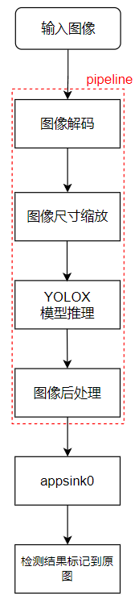
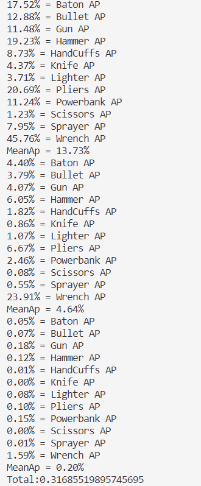
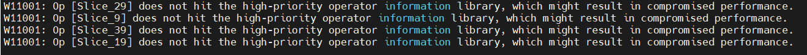

# 行李箱安检
## 1 介绍

本项目利用 YOLOX 目标检测框架，对安检X光图像中的不同类目标进行检测，将检测得到的不同类的目标用不同颜色的矩形框标记。输入一幅图像，可以检测得到图像中大部分类别目标的位置。本方案使用在 SDANet and PIDray dataset 数据集上训练得到的 YOLOX 模型进行目标检测，数据集中共包含 12 个目标类，可以对警棍、老虎钳、榔头、充电宝、剪刀、扳手、枪支、子弹、喷罐、手铐、小刀、打火机以上目标进行检测。

### 1.1 支持的产品

本项目以昇腾Atlas310卡、Atlas 200DK为主要的硬件平台。

### 1.2 支持的版本

支持的SDK版本为 2.0.4, CANN 版本为 5.0.4。


### 1.3 软件方案介绍

整体业务流程为：待检测图片通过 appsrc 插件输入，然后使用图像解码插件 imagedecoder 对图片进行解码，再通过图像缩放插件 imageresize 将图像缩放至满足检测模型要求的输入图像大小要求，缩放后的图像输入模型推理插件 tensorinfer 得到推理结果，推理结果输入 objectpostprocessor 插件进行后处理，得到输入图片中所有的目标框位置和对应的置信度。最后通过输出插件 appsink 获取检测结果，并在外部进行可视化，将检测结果标记到原图上，本系统的各模块及功能描述如表1所示：

表1 系统方案各模块功能描述：

| 序号 | 子系统 | 功能描述     |
| ---- | ------ | ------------ |
| 1    | 图片输入    | 获取 jpg 格式输入图片 |
| 2    | 图片解码    | 解码图片 |
| 3    | 图片缩放    | 将输入图片放缩到模型指定输入的尺寸大小 |
| 4    | 模型推理    | 对输入张量进行推理 |
| 5    | 目标检测后处理    | 从模型推理结果计算检测框的位置和置信度，并保留置信度大于指定阈值的检测框作为检测结果 |
| 6    | 结果输出    | 获取检测结果|
| 7    | 结果可视化    | 将检测结果标注在输入图片上|


### 1.4 代码目录结构与说明

本工程名称为 Luggage-Checker，工程目录如下所示：
```
.
├── build.sh
├── images
│   ├── DetectionPipeline.png
│   ├── EvaluateInfo.png
│   ├── EvaluateInfoPrevious.png
│   ├── warning.png
│   └── VersionError.png
├── postprocess
│   ├── build.sh
│   ├── CMakeLists.txt
│   ├── YoloxPostProcess.cpp
│   └── YoloxPostProcess.h
├── python
│   ├── Main
│   │   ├── eval_pre_post.py
│   │   ├── eval_nopre_post.py
│   │   ├── pre_post.py
│   │   ├── nopre_post.py
│   │   ├── visualize.py
│   │   └── preprocess.py
│   ├── models
│   │   ├── aipp-configs
│   │   │   └── yolox_bgr.cfg
│   │   ├── conversion-scripts              # 下载的onnx模型存放在该文件夹下
│   │   ├── yolox_eval.cfg
│   │   └── coco.names                    
│   ├── test    
│   │   ├── data   
│   │   ├── parse_coco.py                      
│   │   └── map_calculate.py                  
│   ├── test_img
│   │   └── test.jpg                        # 需要用户自行添加测试数据
│   └── pipeline
│       └── pre_post.pipeline
└── README.md

```
onnx模型下载地址：https://mindx.sdk.obs.cn-north-4.myhuaweicloud.com/ascend_community_projects/Xray_detect/best.onnx

om模型下载地址： https://mindx.sdk.obs.cn-north-4.myhuaweicloud.com/ascend_community_projects/Xray_detect/yolox_pre_post.om

### 1.5 技术实现流程图

YOLOX 的后处理插件接收模型推理插件输出的特征图，该特征图为三张不同分辨率的特征图拼接而成，形状大小为1 x n x 17,其中 n 为三张网络模型输出特征图的像素点数总和，17 为 12 （数据集分类数）+ 4 （目标框回归坐标点）+ 1 （正类置信度）。

<center>
    
    <br>
</center>

### 1.6 特性及适用场景

该项目适用于x光安检图象的监测，对单个清晰目标图像、高分辨率图像、大量目标图像、存在部分遮挡图象有较好的检测效果，对于存在大量遮挡的图象有轻微漏检现象，只支持jpg格式图象。

在以下几种情况下，检测效果不够理想：
1.在对某些尖锐物品，如剪刀和刀具，形状重合度较高，容易出现重复鉴别的情况，但是不影响实际应用时对危险物品的判别。
2.由于训练集中包含的隐蔽性较高的样例以及角度特殊的样例图片较少，对于此类物品进行辨识置信度较低。

## 2 环境依赖

推荐系统为ubuntu 18.04，环境依赖软件和版本如下表：

| 软件名称 | 版本   |
| -------- | ------ |
| cmake    | 3.5+   |
| mxVision | 2.0.4  |
| python   | 3.9.2  |

确保环境中正确安装mxVision SDK。

在编译运行项目前，需要设置环境变量：

MindSDK 环境变量:

```
. ${SDK-path}/set_env.sh
```

CANN 环境变量：

```
. ${ascend-toolkit-path}/set_env.sh
```

- 环境变量介绍

```
SDK-path: mxVision SDK 安装路径
ascend-toolkit-path: CANN 安装路径
```  
## 3. 模型转换

本项目中采用的模型是 YOLOX-m 模型，参考实现[代码](https://github.com/Megvii-BaseDetection/YOLOX)，通过对[训练数据集](https://github.com/bywang2018/security-dataset) 中29458张图片数据训练得到模型，通过export_onnx.py文件得到[onnx模型](https://mindx.sdk.obs.cn-north-4.myhuaweicloud.com/ascend_community_projects/Xray_detect/best.onnx)。使用模型转换工具 ATC 将 onnx 模型转换为 [om模型](https://mindx.sdk.obs.cn-north-4.myhuaweicloud.com/ascend_community_projects/Xray_detect/yolox_pre_post.om)，模型转换工具相关介绍参考[链接](https://support.huawei.com/enterprise/zh/doc/EDOC1100234054/6dfa6beb)


1. 从链接中下载 onnx 模型 best.onnx 至 ``python/models`` 文件夹下。

2. 将该模型转换为om模型，具体操作为： ``python/models`` 文件夹下,执行atc指令：

1)加预处理
```
atc --model=best.onnx --framework=5 --output=./yolox_pre_post --output_type=FP32 --soc_version=Ascend310  --input_shape="images:1, 3, 640, 640" --insert_op_conf=./aipp-configs/yolox_bgr.cfg
```
2)不加预处理
```
atc --model=best.onnx --framework=5 --output=./yolox_nopre_post --output_type=FP32 --soc_version=Ascend310  --input_shape="images:1, 3, 640, 640" 
```
注：两种方法区在于对之后的图片是否进行缩放，会导致验证精度不同。

若终端输出：
```
ATC start working now, please wait for a moment.
ATC run success, welcome to the next use.
W11001: Op [Slice_30] does not hit the high-priority operator information library, which might result in compromised performance.
W11001: Op [Slice_10] does not hit the high-priority operator information library, which might result in compromised performance.
W11001: Op [Slice_40] does not hit the high-priority operator information library, which might result in compromised performance.
W11001: Op [Slice_20] does not hit the high-priority operator information library, which might result in compromised performance.

```

表示命令执行成功。

## 4. 编译与运行
**步骤1** 在项目根目录执行命令：
 
```
bash build.sh  
```   

**步骤2** 放入待测图片。将一张图片放在路径``python/test_img``下，命名为 test.jpg。

**步骤3** 图片检测。在项目路径``python/Main``下运行命令：

```
python3 pre_post.py
python3 nopre_post.py
```     

命令执行成功后在目录``python/test_img``下生成检测结果文件 pre_post_bgr.jpg(nopre_post.py)，查看结果文件验证检测结果。

## 5. 精度测试

1. 下载COCO VAL 2017[验证数据集和标注文件](https://github.com/bywang2018/security-dataset)，此数据集文件夹组织形式如下图所示

```
pidray
├── annotations                                                                                 
│    ├── xray_test_easy.json
│    ├── xray_test_hard.json
│    ├── xray_test_hidden.json
│    └── xray_train.json                                                                             
├── easy
├── hard
├── hidden
└── train                                                                                                                  
```
其中，easy,hard,hidden,train中存放的都是png格式的图片

将hard文件夹和annotations中的xray_test_hard.json文件保存在项目目录``python/test/data``下，其中将hard文件夹名改成val2017，xray_test_hard.json改成instances_val2017.json此文件夹下的组织形式应如下图所示：


```
├── annotations                                                                                                                                                                             
│    └── instances_val2017.json                                                                             
└──val2017                                                                                                                  
```

其中val2017文件夹下应存放jpg格式的待检测图片。

2. 使用以下指令运行路径``python/test``下的文件 parse_coco.py                         
```
python3 parse_coco.py --json_file=data/annotations/instances_val2017.json --img_path=data/val2017
```              
若运行成功，会在该目录下生成文件夹ground_truth，其中包含每张图像上提取的目标框真实位置与类别的txt文件。                         
                                              
接下来将每张图的预测结果转为txt文件，并保存在同一文件夹下，其步骤如下：

3. 进入``python/Main``路径，运行命令：
```
python3 eval_pre_post.py
python3 eval_nopre_post.py
```                      
若运行成功，会在``python/test`` 路径下生成 test_pre_post(test_nopre_post) 文件夹，该目录下包含有每张图像上的检测结果的 txt 文件。

4. 在``python/test``路径下，运行命令: 
```                                                        
python3 map_calculate.py  --npu_txt_path="./test_pre_post" 
python3 map_calculate.py  --npu_txt_path="./test_nopre_post" 
``` 
若运行成功则得到最终检测精度，结果如下：

<center>
    
    <br>
</center>
挑选的是hard中的图片验证精度，精度为31.68%与源项目精度31.82%误差为0.14%。精度对齐。

注：在pipeline中加图像预处理后验证结果与原框不同的原因为：YOLOX的图像预处理中，Resize方式为按长边缩放，而Mindx SDK默认使用dvpp的图像解码方式，没有按长边缩放的方法，因此本项目将"resizeType"属性设置为 "Resizer_KeepAspectRatio_Fit"，这样会导致精度下降。
我们同时给出了一套不加图像预处理的推理流程，见上文，不加预处理流程精度结果与源项目可以保持一致。

## 6 常见问题

### 6.1 模型转换时会警告缺slice算子

YOLOX在图像输入到模型前会进行slice操作，而ATC工具缺少这样的算子，因此会报出如图所示的警告：

<center>
    
    <br>
</center>

**解决方案：**

常规的做法是修改slice算子，具体操作可参考[安全帽检测](https://gitee.com/booyan/mindxsdk-referenceapps/tree/master/contrib/HelmetIdentification)的开源项目。

由于在本项目下是否修改算子并不影响检测结果，因此默认不做处理。

### 6.2 图片无法识别

**解决方案：**

png格式图片需要转换成jpg格式图片再进行检测。