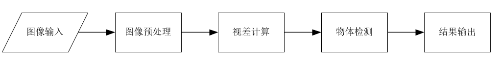
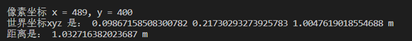

# 基于双目视觉的目标定位

## 1 介绍

利用OpenCV对两幅视差图进行图像畸变矫正、视差求解，并基于MindXSDK进行目标检测，计算得到相机坐标系下的物体三维坐标度

样例输入：双目相机拍摄的两张jpg图片

样例输出：物体的三维坐标

### 1.1 支持的产品

项目所用的硬件平台：Ascend310，Atlas 200DK板卡

### 1.2 支持的版本

支持的CANN版本为 5.0.4
支持的SDK版本为 MindX SDK 3.0.RC3

### 1.3 软件方案介绍

本方案中，利用Opencv对输入图片进行畸变矫正，然后采用yolov3预训练模型对矫正图片进行物体识别，最终根据识别得到的生成框坐标输出物体的三维坐标。

表1.1 系统方案中各模块功能：

| 序号 | 子系统 | 功能描述     |
| ---- | ------ | ------------ |
| 1    | 图像输入    | 使用Opencv的imread读入图片 |
| 2    | 图像放缩    | 使用Opencv的resize放缩检测图片到416*416大小 |
| 3    | 畸变矫正    | 利用Opencv和相机参数重构图片 |
| 4    | 视察计算    | 使用Opencv的SGBM方法计算图片视差 |
| 5    | 物体检测    | 利用Yolov3的检测模型，检测图片中物体并得到检测框坐标 |
| 6    | 结果输出    | 根据检测框坐标输出物体的三维坐标 |


### 1.4 代码目录结构与说明

本sample工程名称为MobileStereoNet，工程目录如下图所示：

```
├── models
│   ├── yolov3.names
│   ├── yolov3_tf_bs1_fp16.cfg		# yolov3后处理配置
│   └── yolov3_tf_aipp.om
├── image                           # 存放测试图片
|── camera_configs.py               # 相机参数文件
|── yolov3_infer.py                 # 获取坐标文件
|── yolov3_infer.py                 # yolov3模型推理文件
├── ExportStereoParams.m            # matlab导出xml函数
└── README.md
```


### 1.5 技术实现流程图




### 1.6 特性及适用场景

本案例可以满足物体三维坐标获取，但同时有以下限制：

1、由于yolov3模型限制，仅支持获取在`./models/yolov3.names`文件中的**80**种物体的三维坐标。

2、对超出相机标定范围的物体定位，结果不是很理想。

3、不同标定相机需要对`yolo_deep.py`文件中函数**stereo_match**的**numDisparities**和**uniquenessRatio**这两个主要参数进行调整。


## 2 环境依赖

请列出环境依赖软件和版本。

推荐系统为ubuntu 18.04或centos 7.6，环境依赖软件和版本如下表：

|   软件名称    |    版本     |
| :-----------: | :---------: |
|    Python     |    3.9.2    |
|     numpy     |   1.23.4    |
| opencv-python |    4.6.0    |

在编译运行项目前，需要设置环境变量：

```
. ${sdk_path}/set_env.sh
. ${ascend_toolkit_path}/set_env.sh
```

## 依赖安装

创建虚拟环境后运行如下命令：

```
pip install opencv-python
```


## 3 编译与运行

示例步骤如下：

**步骤1** 

[下载YOLOv3模型](https://www.hiascend.com/zh/software/modelzoo/models/detail/C/210261e64adc42d2b3d84c447844e4c7/1)放入`./model`文件夹中。

**步骤2** 

将matlab标定导出的xml相机参数文件放入项目根目录中。

**步骤3** 

自行选择两张jpg文件，放入`./image`文件夹中，再执行

```
python yolo_deep.py
```

结果展示：



## 4 常见问题

### 4.1 输入图片大小与模型不匹配问题

**问题描述：**

```
E20221122 15:43:32.365693  9866 MxOmModelDesc.cpp:741] InputTensor Shape mismatches.
E20221122 15:43:32.366047  9866 MxOmModelDesc.cpp:742] No.0 inputTensor, No.1 dim: modelInputShape is 624, actualInputShape is 416
E20221122 15:43:32.366075  9866 MxOmModelDesc.cpp:138] Infer failed, result is null
```

**解决方案：**

同时使用dvpp和`yolov3_tf_aipp.om`模型时会报上述错误。解决方式一，将B_USEDVPP设置为False，使用opencv处理图片。解决方式二，将模型换成`yolov3_tf_bs1_fp16.om`