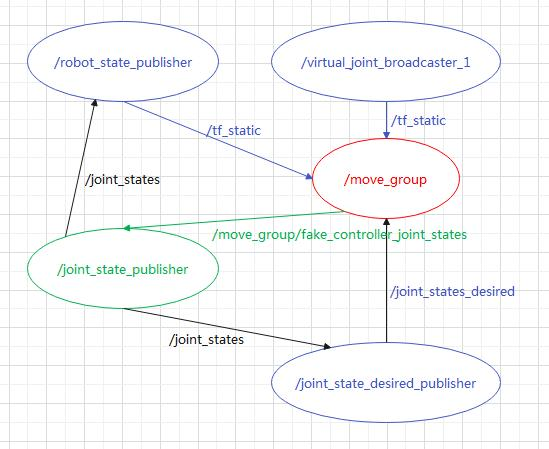
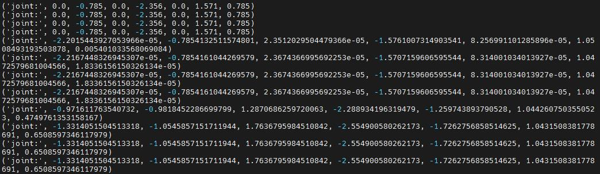

# 基于MoveIt的机械臂路径规划

## 1 介绍

基于昇腾边缘硬件，在昇腾平台上，基于ROS和MoveIt工具包，开发端到端的机械臂路径规划仿真平台，实现其功能。在工业分拣场景中，bin picking是一项常见任务，对于机器人自主操作是一个比较复杂的问题，其中涉及机械臂的路径轨迹规划、干涉检测和壁障等功能。本项目主要针对路径规划模块，基于ROS和MoveIt工具包实现一个仿真平台，可以在仿真平台进行机械臂路径规划的端到端流程验证，并使用VNC、RDP的方式进行图形可视化输出。

### 1.1 支持的产品

昇腾310(推理),昇腾200dk

### 1.2 支持的版本

本样例配套的CANN版本为[5.0.5](https://www.hiascend.com/software/cann/commercial)。支持的SDK版本为[2.0.4](https://www.hiascend.com/software/Mindx-sdk)。

### 1.3 软件方案介绍

表1.1 系统方案各子系统功能描述：

| 序号 | 子系统               | 功能描述                                                     |
| ---- | -------------------- | :----------------------------------------------------------- |
| 1    | panda moveit config node  | panda机械臂组 |
| 2    | move group python interface tutorial node             | 控制panda机械臂节点，发送控制msg                      |
| 3    | state check node             | 检测panda机械臂状态参数节点，并把数据写入串口输出                            |

### 1.4 代码目录结构与说明

本工程名称为MoveitMechanicalArmSimulation，工程目录如下图所示：

```
├── README.md
└── state_note.py
```

### 1.5 技术实现流程图




## 2 环境依赖

200dk开发板环境搭建可参考[200dk开发板环境搭建](https://gitee.com/ascend/docs-openmind/blob/master/guide/mindx/ascend_community_projects/tutorials/200dk%E5%BC%80%E5%8F%91%E6%9D%BF%E7%8E%AF%E5%A2%83%E6%90%AD%E5%BB%BA.md)

200dk ROS环境搭建可参考[ROS环境搭建](https://gitee.com/ascend/docs-openmind/blob/master/guide/mindx/ascend_community_projects/tutorials/200dk-ROS%E7%B3%BB%E7%BB%9F%E7%A7%BB%E6%A4%8D.md)


## 3 准备步骤

**步骤1** 按照第2小结**环境依赖**中的步骤设置环境变量。

**步骤2** 安装ROS后，确保您拥有最新的软件包：

```
rosdep update
sudo apt-get update
sudo apt-get dist-upgrade
```

**步骤3** 在ROS构建系统中安装catkin：

```
sudo apt-get install ros-melodic-catkin python-catkin-tools
```

**步骤4** 安装MoveIt：

```
sudo apt install ros-melodic-moveit
```

**步骤5** 创建Catkin工作区,您需要有一个catkin工作区设置：

```
mkdir -p ~/ws_moveit/src
```

**步骤6** 下载样例代码：

```
cd ~/ws_moveit/src
git clone https://github.com/ros-planning/moveit_tutorials.git -b melodic-devel
git clone https://github.com/ros-planning/panda_moveit_config.git -b melodic-devel
```

**步骤7** 建立你的catkin工作区:

```
cd ~/ws_moveit/src
rosdep install -y --from-paths . --ignore-src --rosdistro melodic
```

下一个命令将配置catkin工作区： 

```
cd ~/ws_moveit
catkin config --extend /opt/ros/${ROS_DISTRO} --cmake-args -DCMAKE_BUILD_TYPE=Release
catkin build
```

Source catkin 工具区:

```
source ~/ws_moveit/devel/setup.bash
```

可选项: 加source命令到你的 .bashrc:

```
echo 'source ~/ws_moveit/devel/setup.bash' >> ~/.bashrc
```

ps:
moveit搭建参考链接：http://docs.ros.org/en/melodic/api/moveit_tutorials/html/doc/getting_started/getting_started.html

## 4 运行

**步骤1** 开启RViz与MoveGroup节点：

打开两个shell,启动RViz并等待所有东西在第一个shell中完成加载： 

```
roslaunch panda_moveit_config demo.launch~/ws_moveit/src/moveit_tutorials/doc/move_group_python_interface/scripts
```

现在，使用rosrun在另一个shell中直接运行Python代码。注意：在某些情况下，您可能需要使python脚本可执行： 

```
rosrun moveit_tutorials move_group_python_interface_tutorial.py
```

**步骤2** 启动检测节点，把state_note.py拷贝到~/ws_moveit/src/moveit_tutorials/doc/move_group_python_interface/scripts下，改变添加可执行权限并且运行。

```
rosrun moveit_tutorials state_note.py
```

**步骤3** 在move_group_python_interface_tutorial.py的端口按提示改变机械臂的状态，并且实时地检测并且写入串口设备



