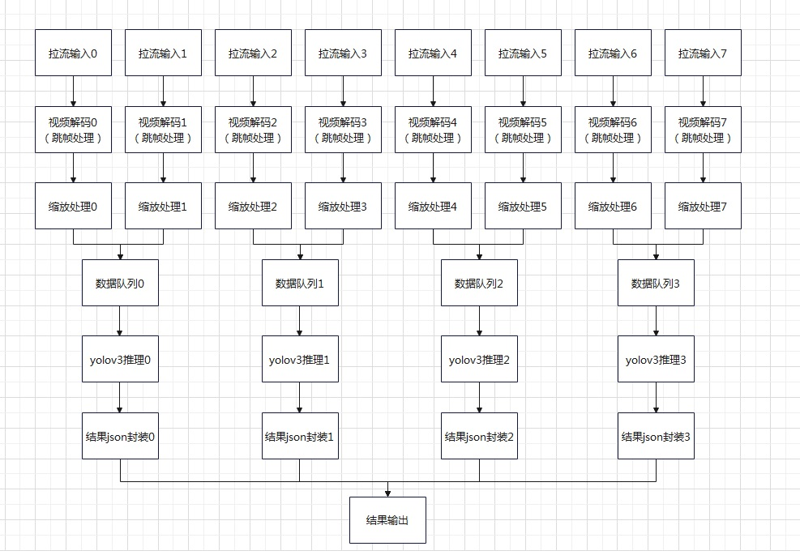

# 多路视频流推理

## 1 介绍

多路视频流推理基于MindXSDK开发，在晟腾芯片上进行目标检测，可以对常见的80类物件行框选和分类，将检测结果可输出。项目主要流程为：通过live555服务器进行多流输入视频，然后进行视频解码将264格式的视频解码为YUV格式的图片，图片缩放后经过模型推理进行物件框选与分类，识别结果可输出，包括分类的类型与方框的对角点信息。本样例支持8路视频流推理。 

### 1.1 支持的产品

昇腾310(推理),昇腾200dk

### 1.2 支持的版本

本样例配套的CANN版本为[5.0.5](https://www.hiascend.com/software/cann/commercial)。支持的SDK版本为[2.0.4](https://www.hiascend.com/software/Mindx-sdk)。

MindX SDK安装前准备可参考《用户指南》，[安装教程](https://gitee.com/ascend/mindxsdk-referenceapps/blob/master/docs/quickStart/1-1安装SDK开发套件.md)

### 1.3 软件方案介绍

表1.1 系统方案各子系统功能描述：

| 序号 | 子系统               | 功能描述                                                     |
| ---- | -------------------- | :----------------------------------------------------------- |
| 1    | 视频输入             | 接收外部调用接口的输入视频路径，对视频进行拉流，并发送到下游插件。 |
| 2    | 视频解码             | 用于视频解码，当前只支持H264/H265格式。                      |
| 3    | 数据跳帧             | 数据进行跳帧处理，跳过的帧数为2。                                     |
| 4    | 图像处理             | 对解码后的YUV格式的图像进行指定宽高的缩放，暂时只支持YUV格式 的图像。 |
| 5    | 模型推理插件         | 目标分类或检测。 |
| 6    | 模型后处理插件       | 实现对yolov3模型输出的tensor解析，获取目标检测框以及分类类型。 |
| 7    | 输出插件             | 输入推理结果数据。                 |


### 1.4 代码目录结构与说明

本工程名称为MultiChannelVideoInfer，工程目录如下图所示：

```
├── models
│   └── yolov3
│       ├── coco.names
│       ├── yolov3_tf_bs1_fp16.cfg
│       └── yolov3_tf_bs1_fp16.om
├── pipeline
│   ├── multi_infer1_8.pipeline
│   └── multi_infer2_4.pipeline
├── README.md
└── main_infer.py
```

### 1.5 技术实现流程图




## 2 环境依赖

环境搭建可参考[200dk开发板环境搭建](https://gitee.com/ascend/docs-openmind/blob/master/guide/mindx/ascend_community_projects/tutorials/200dk%E5%BC%80%E5%8F%91%E6%9D%BF%E7%8E%AF%E5%A2%83%E6%90%AD%E5%BB%BA.md)

在编译运行项目前，需要设置环境变量：
1、根据自己安装的ascend-toolkit下的set_env.sh以及sdk下的set_env.sh设置环境变量。
2、通过命令把全局日志级别设置为error级别
'''
export ASCEND_GLOBAL_LOG_LEVEL=3
'''

## 3 软件依赖

推理中涉及到第三方软件依赖如下表所示。

| 依赖软件 | 版本       | 说明                           | 使用教程                                                     |
| -------- | ---------- | ------------------------------ | ------------------------------------------------------------ |
| live555  | 1.09       | 实现视频转rstp进行推流         | [链接](https://gitee.com/ascend/mindxsdk-referenceapps/blob/master/docs/%E5%8F%82%E8%80%83%E8%B5%84%E6%96%99/Live555%E7%A6%BB%E7%BA%BF%E8%A7%86%E9%A2%91%E8%BD%ACRTSP%E8%AF%B4%E6%98%8E%E6%96%87%E6%A1%A3.md) |
| ffmpeg   | 2021-07-21 | 实现mp4格式视频转为264格式视频 | [链接](https://gitee.com/ascend/mindxsdk-referenceapps/blob/master/docs/%E5%8F%82%E8%80%83%E8%B5%84%E6%96%99/pc%E7%AB%AFffmpeg%E5%AE%89%E8%A3%85%E6%95%99%E7%A8%8B.md#https://ffmpeg.org/download.html) |


## 4 模型获取

本项目中适用的模型是yolov3模型，om模型可以直接[下载](https://mindx.sdk.obs.cn-north-4.myhuaweicloud.com/mindxsdk-referenceapps%20/contrib/ActionRecognition/models.zip)。


## 5 准备

按照第3小结**软件依赖**安装live555和ffmpeg，按照 [Live555离线视频转RTSP说明文档](https://gitee.com/ascend/mindxsdk-referenceapps/blob/master/docs/%E5%8F%82%E8%80%83%E8%B5%84%E6%96%99/Live555%E7%A6%BB%E7%BA%BF%E8%A7%86%E9%A2%91%E8%BD%ACRTSP%E8%AF%B4%E6%98%8E%E6%96%87%E6%A1%A3.md)将mp4视频转换为h264格式。并将生成的264格式的视频上传到`live/mediaServer`目录下，然后修改`MultiChannelVideoInfer/pipeline`目录下的multi_infer2_4.pipeline和multi_infer1_8.pipeline文件中mxpi_rtspsrc插件的内容。如下：

```
        "mxpi_rtspsrc0": {
            "factory": "mxpi_rtspsrc",
            "props": {
                "rtspUrl":"rtsp://xxx.xxx.xxx.xxx:xxxx/xxx.264",      // 修改为自己所使用的的服务器和文件名
                "channelId": "0"
            },
            "next": "mxpi_videodecoder0"
        },
```


## 6 编译与运行

**步骤1** 按照第2小结**环境依赖**中的步骤设置环境变量。

**步骤2** 按照第 4 小节 **模型获取** 中的步骤获得模型文件，把yolov3放置在 `models` 目录下。

**步骤3** 运行。进入 `MultiChannelVideoInfer` 目录，在目录下执行命令：

```
python3 main_infer.py
```

命令执行成功后会在终端输出检测框的信息已经分类信息。


## 7 性能测试

**测试帧率：**

本样例统计出每秒处理的帧数，输入为25帧率的视频，8路推理，3帧里面取一帧，理应每秒处理25 / 3 * 8 = 66.6帧，如统计每秒的帧率达到66.6则性能达标。本样例中提供4路推理和8路模型推理的pipeline，读者可以在main_infer.py中修改。经实验，更多路数模型推理可以提高并发，从而提高推理的性能。

注：输入视频帧率应高于25，否则无法发挥全部性能；性能测试可以把后面的print(retStr)代码注释掉，方便观察。

