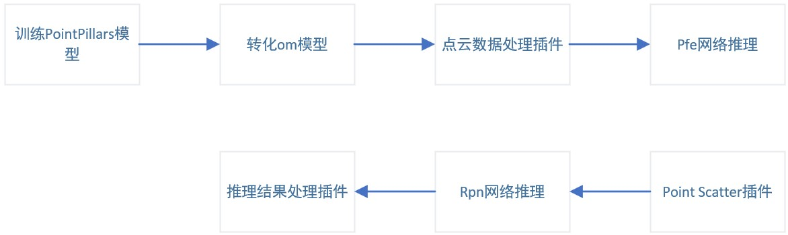

# 基于PointPillars的3D点云目标检测模型

## 1 介绍

  基于PointPillars的3D点云目标检测模型在晟腾芯片上进行目标检测，可对3D点云数据进行目标检测，并把检测结果输出。

  项目主要流程为：首先获取KITTI数据集中四维点数据，之后将其转化为pillars数据，送入PFE模型进行推理，获取pillar feature数据，并经由Pillar Scatter转化为二维图像信息，然后将其送入RPN网络进行推理，获取预测候选框信息数据,最后结合anchor进行解码、NMS等操作获取最终预测框信息，并结合第三方库Mayavi进行3-D点云目标检测结果的可视化。

### 1.1 支持的产品

昇腾310(推理),昇腾200dk

### 1.2 支持的版本

本样例配套的CANN版本为[5.0.5](https://www.hiascend.com/software/cann/commercial)。支持的SDK版本为[2.0.4](https://www.hiascend.com/software/Mindx-sdk)。

### 1.3 软件方案介绍

表1.1 系统方案各子系统功能描述：

| 序号 | 子系统         | 功能描述                                         |
| ---- | -------------- | :----------------------------------------------- |
| 1    | 数据输入       | 获取bin数据，从中提取4-D Point数据               |
| 2    | pillar数据提取 | 用于将4-D Point数据转化为8-D Pillar数据          |
| 3    | PFE模型推理    | 对Pillar数据进行推理，获取64-D特征数据           |
| 4    | Scatter处理    | 处理PFE推理结果，将其转化为64通道的伪图像        |
| 5    | RPN模型推理    | 对64通道伪图像数据进行推理，获取检测结果数据信息 |
| 6    | 候选框处理     | 从候选框中获取最终预测框数据                     |

### 1.4 代码目录结构与说明

本工程名称为PointPillars，工程目录如下图所示：

```
PointPillars/
├── image
│   └── operations.jpg
├── README.md
├── pipeline
│   ├── pfe.pipeline
│   └── rpn.pipeline
├── requirments
│   └── requiements.txt
├── src
│   ├── eval.py
│   ├── get_preds.py
│   ├── infer.py
│   └── point_to_pillars.py
├── eval.sh
├── infer.sh
└── view.sh
```

### 1.5 技术实现流程图



## 2 环境依赖

| 软件名称            | 版本          |
| ------------------- | ------------- |
| MindX SDK           | 2.0.4         |
| ubuntu              | 18.04.5 LTS   |
| Ascend-CANN-toolkit | 5.0.5alpha001 |
| python              | 3.7.10        |

环境搭建可参考[200dk开发板环境搭建](https://gitee.com/ascend/docs-openmind/blob/master/guide/mindx/ascend_community_projects/tutorials/200dk%E5%BC%80%E5%8F%91%E6%9D%BF%E7%8E%AF%E5%A2%83%E6%90%AD%E5%BB%BA.md)

在编译运行项目前，需要设置环境变量：
1、根据自己安装的ascend-toolkit下的set_env.sh设置环境变量。

```
. ${SDK-path}/set_env.sh
. ${ascend-toolkit-path}/set_env.sh
```

2、通过命令把全局日志级别设置为error级别

```
export ASCEND_GLOBAL_LOG_LEVEL=3
```

环境变量介绍

```
SDK-path: SDK mxVision 安装路径  
ascend-toolkit-path: CANN 安装路径  
```

## 3 软件依赖

推理中涉及到第三方软件依赖详见PointPillars/requirments/requirments.txt。

其中，PyQt5、traits以及VTK为mayavi安装所需依赖，在安装时，可从[镜像网站](https://www.lfd.uci.edu/~gohlke/pythonlibs/)预先下载各whl包，之后***依次***安装，完成后可成功安装mayavi。

注：安装软件及依赖后，本项目可完全在Atlas 200DK上运行，若使用者不便在开发板上安装，则可在本地完成配置后，将数据预处理、精度验证以及结果可视化的部分在本地进行。

## 4 模型准备

本项目中适用的模型是[Pointillars](https://arxiv.org/abs/1812.05784)模型，该模型源码可从[gitee仓](https://gitee.com/shy718/nutonomy_pointpillars?_from=gitee_search)中下载。
下载后，按照[流程](https://gitee.com/shy718/nutonomy_pointpillars/blob/master/README.md)下载配置KITTI数据集，搭建训练环境进行模型的训练，并将tckpt模型转化为onnx模型，并将onnx模型存储在 `PointPillars/models/model_onnx/`目录下。
之后使用ATC工具，将onnx模型转化为om模型，转化指令如下：

```
atc  --input_shape="pillar_x:1,1,12000,100;pillar_y:1,1,12000,100;pillar_z:1,1,12000,100;pillar_i:1,1,12000,100;num_points_per_pillar:1,12000;x_sub_shaped:1,1,12000,100;y_sub_shaped:1,1,12000,100;mask:1,1,12000,100" --input_fp16_nodes="pillar_x;pillar_y;pillar_z;pillar_i;num_points_per_pillar;x_sub_shaped;y_sub_shaped;mask" --check_report=/home/bronyale/modelzoo/pfe/Ascend310/network_analysis.report --input_format=NCHW --output="/home/bronyale/modelzoo/pfe/Ascend310/pfe" --soc_version=Ascend310 --framework=5 --model="PointPillars/model/model_onnx/pfe.onnx" 
```

```
atc  --input_shape="input.1:1,64,496,432" --input_fp16_nodes="input.1" --check_report=/home/bronyale/modelzoo/rpn/Ascend310/network_analysis.report --input_format=NCHW --output="/home/bronyale/modelzoo/rpn/Ascend310/rpn" --soc_version=Ascend310 --framework=5 --model="PointPillars/model/model_onnx/rpn.onnx 
```

注：该操作步骤适用于手动训练模型并进行模型转换，除此之外，可通过接下来 `编译与运行`中 `步骤3`中的操作，直接下载训练后的onnx模型与转换后的om模型。

## 5 编译与运行

**步骤1** 按照第2小结**环境依赖**中的步骤设置环境变量。

**步骤2** 按照第4小节 **模型获取** 中的步骤获取模型文件，把模型放置在 `./models/model_om/` 目录下。

**步骤3** 执行模型推理。
首先将推理所用的输入数据从[数据下载地址](https://mindx.sdk.obs.cn-north-4.myhuaweicloud.com/ascend_community_projects/pointpillar/data.zip)中下载，将推理所需模型从[模型下载地址](https://mindx.sdk.obs.cn-north-4.myhuaweicloud.com/ascend_community_projects/pointpillar/models.zip)中下载，将精度验证所需的标杆推理结果从[标杆下载地址](https://mindx.sdk.obs.cn-north-4.myhuaweicloud.com/ascend_community_projects/pointpillar/benchmark.rar)中下载，并将下载的目录置于PointPillars目录中，完成后目录结构如下所示：

```
PointPillars/
├── benchmark
│   └── test
├── data
│   └── test
├── image
├── models
│   ├── model_om
│   └── model_onnx
├── README.md
├── pipeline
├── requirments
├── src
├── eval.sh
├── infer.sh
└── view.sh
```

之后在 `PointPillars` 目录下执行命令：

```
bash infer.sh
```

之后候选框信息将保存在 `PointPillars/data/test/`中。

**步骤4**处理候选框信息及可视化。在 `PointPillars`目录下执行：

```
bash view.sh
```

之后检测结果将显示到控制台，检测结果的可视化将通过mayavi显示。

注：由于不同操作系统的文件路径表示方法不同，使用者需根据自身情况修改view.sh以及get_preds.py中的文件路径。

## 6 精度测试

进入 `PointPillars` 目录下执行命令：

```
bash eval.sh
```

执行后om模型相比于原模型推理结果的精度损失将显示到控制台。  

## 7 适用场景

PointPillars网络模型用于3-D点云数据的目标检测，其在检测过程中衡了检测速度与精度，因此适用于自动驾驶领域，用于实时检测目前场景中需要进行避障的目标物体。
