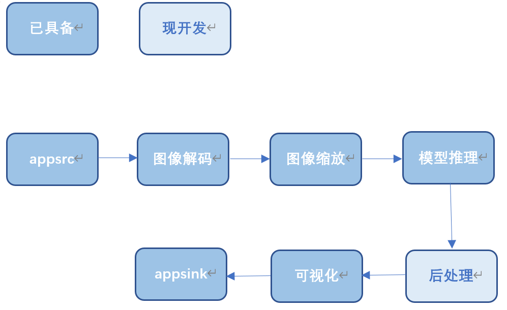
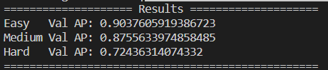
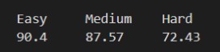

## Retinaface目标检测

## 1 介绍

本开发样例是基于mxBase开发的端到端推理的C++应用程序，可在昇腾芯片上进行 Retinaface目标检测，并把可视化结果保存到本地。其中包含Retinaface的后处理模块开发。

### 1.1 支持的产品

本产品以昇腾310（推理）卡为硬件平台。

### 1.2 支持的版本

该项目支持的SDK版本为2.0.4，CANN版本为5.0.4。


### 1.3 软件方案介绍

表1.1 系统方案各子系统功能描述：

| 序号 | 子系统         | 功能描述                                                                                                   |
| ---- | -------------- | ---------------------------------------------------------------------------------------------------------- |
| 1    | 图片输入       | 接收外部调用接口的输入视频路径，对视频进行拉流，并将拉去的裸流存储到缓冲区（buffer）中，并发送到下游插件。 |
| 2    | 模型推理插件   | 目标检测。                                                                                                 |
| 3    | 模型后处理插件 | 对模型输出的张量进行后处理，得到物体类型数据。                                                             |


### 1.4 代码目录结构与说明

本项目名为Retinaface目标检测，项目目录如下所示：

````
.
├── build.sh
├── config
│   ├── aipp.cfg
├── CMakeLists.txt
├── main.cpp
├── models
│   ├── newRetinaface.om
│   └── run.sh
├── README.md
├── RetinafaceDetection
│   ├── RetinafaceDetection.cpp
│   └── RetinafaceDetection.h
├── RetinafacePostProcess
│   ├── RetinafacePostProcess.cpp
│   └── RetinafacePostProcess.h
````


### 1.5 技术实现流程图




### 1.6 特性及适用场景

本项目根据widerface数据集训练得到，适用于人脸检测，并且将人脸位置与五官位置标出。

适用于测试图片中有人脸的情况。若测试图片中没有人脸则无法运行


## 2 环境依赖

推荐系统为ubuntu  18.04,环境软件和版本如下：

| 软件名称            | 版本  | 说明                          | 获取方式                                                  |
| ------------------- | ----- | ----------------------------- | :-------------------------------------------------------- |
| MindX SDK           | 2.0.4 | mxVision软件包                | [链接](https://www.hiascend.com/software/Mindx-sdk)       |
| ubuntu              | 18.04 | 操作系统                      | 请上ubuntu官网获取                                        |
| Ascend-CANN-toolkit | 5.0.4 | Ascend-cann-toolkit开发套件包 | [链接](https://www.hiascend.com/software/cann/commercial) |


在编译运行项目前，需要设置环境变量：

MindSDK 环境变量：

```
. ${SDK-path}/set_env.sh
```

CANN 环境变量：

```
. ${ascend-toolkit-path}/set_env.sh
```

- 环境变量介绍

```
SDK-path: SDK mxVision 安装路径
ascend-toolkit-path: CANN 安装路径
```


## 3 软件依赖说明

本项目无特定软件依赖。


## 4 模型转化

本项目中使用的模型是Retinaface模型，onnx模型可以直接[下载](https://www.hiascend.com/zh/software/modelzoo/models/detail/1/7270b02a457d4c4ab262277a646517f9)。下载后解包，得到`Retinaface.onnx`，使用模型转换工具ATC将onnx模型转换为om模型，模型转换工具相关介绍参考[链接](https://support.huaweicloud.com/tg-cannApplicationDev330/atlasatc_16_0005.html)

模型转换步骤如下：

1、按照2环境依赖设置环境变量

2、`cd`到`model`文件夹，运行

````
bash run.sh
````

3、执行该命令后会在指定输出.om模型路径生成项目指定模型文件newRetinaface.om。若模型转换成功则输出：

```
ATC start working now, please wait for a moment.
ATC run success, welcome to the next use.
```

aipp文件配置如下：

```
aipp_op {
aipp_mode: static

input_format :RGB888_U8
src_image_size_w :1000
src_image_size_h :1000

mean_chn_0 :104
mean_chn_1 :117
mean_chn_2 :123

var_reci_chn_0 :1
var_reci_chn_1 :1
var_reci_chn_2 :1
}

```


## 5 编译运行

**步骤1** 修改`CMakeLists.txt`文件 将`set(MX_SDK_HOME ${SDK安装路径})` 中的`${SDK安装路径}`替换为实际的SDK安装路径

**步骤2** 按照**2环境依赖**设置环境变量。

**步骤3** 在项目主目录下执行如下编译命令：

````
bash build.sh
````

**步骤4** 制定jpg图片进行推理，准备一张推理图片放入主目录下。eg:推理图片为test.jpg

```
./Retinaface ./test.jpg
```

得到`result.jpg`即为输出结果。

## 6 精度测试

在进行本项目的测试之前，需要手动修改几处代码。
1.进入CMakeLists.txt:
将
```
add_executable(retinaface main.cpp ${Retinaface_DETECTION} ${Retinaface_POSTPROCESS})
```
中的main.cpp改为testmain.cpp。


将
```
file(GLOB_RECURSE Retinaface_DETECTION ${PROJECT_SOURCE_DIR}/RetinafaceDetection/RetinafaceDetection.cpp)
```
中的RetinafaceDetection.cpp改为RetinafaceDetectionFortest.cpp。
2.执行命令bash build.sh。

3.在Retinaface目录下创建一个文件夹命名为widerface_txt。

4.[下载](https://mindx.sdk.obs.cn-north-4.myhuaweicloud.com/mindxsdk-referenceapps%20/contrib/Retinaface/widerface.zip)数据集放到Retinaface目录下。

5.执行指令：
```
./retinaface {$Retinaface目录路径}/widerface/val/images
```
之后生成的测试集结果将会放到widerface_txt文件夹下。也就是说在./retinaface后面接上widerface的测试数据集路径。

6.进入到项目根目录，执行以下命令：
```
mkdir include
mkdir evaluate
```
然后下载本模型官方源码：
```
git clone https://github.com/biubug6/Pytorch_Retinaface.git
```
7.准备include目录中的文件
将Pytorch_Retinaface项目中的
```
Pytorch_Retinaface/layers/functions/prior_box.py

Pytorch_Retinaface/utils/box_utils.py

Pytorch_Retinaface/utils/nms/py_cpu_nms.py
```
放入本项目include文件夹下。

8.准备evaluate目录文件
将Pytorch_Retinaface项目中的
```
Pytorch_Retinaface/widerface_evaluate
```
放到本项目evaluate文件夹下。

9.编译测试依赖代码 进入evaluate/widerface_evaluate路径下：
```
python3 setup.py build_ext --inplace
```
10.准备模型以及标签文件在ModelZoo社区[下载](https://gitee.com/link?target=https%3A%2F%2Fwww.hiascend.com%2Fzh%2Fsoftware%2Fmodelzoo%2Fmodels%2Fdetail%2F1%2F7270b02a457d4c4ab262277a646517f9) “ATC Retinaface(FP16) from Pytorch.zip”模型代码包并上传至服务器进行解压。将模型代码包中的"Retinaface/data/widerface/val/wider_val.txt"标签文件拷贝至"evaluate"目录下。

11.进入evaluate/widerface_evaluate目录下：
运行指令
```
python3 evaluation.py -p <your prediction dir> -g <groud truth dir>
```
其中\<your prediction dir\>即是模型推理的结果,\<groud truth dir\>是widerface_evaluate中的groun_truth文件夹。
例如：
```
python3 evaluation.py -p ../widerface_txt -g ground_truth/
```
最终得到的精度如下图所示：



原图片精度如下：
