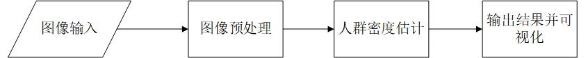
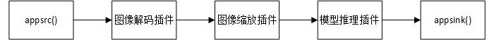

# UAV_CrowdCounting无人机场景下人群密度估计

## 1 介绍
对于人群密集场景，本项目开发端到端的**无人机场景下人群密度估计**算法，并基于MindX SDK将其部署于昇腾平台上，实现无人机在线**人群密度估计**，满足项目任务功能和精度指标要求。

### 1.1 支持的产品

昇腾310(推理),昇腾200dk

### 1.2 支持的版本

支持的SDK版本为 2.0.4, CANN 版本为 5.0.4。

eg：版本号查询方法，在Atlas产品环境下，运行命令：

```
npu-smi info
```


### 1.3 软件方案介绍

本项目整体业务流程：将无人机场景下的人群图像通过appsrc插件输入，然后使用图像解码插件 mxpi_imagedecoder 对图片进行解码，再通过图像缩放插件 mxpi_imageresize 将图像缩放至640\*512输入图像大小，再对缩放后的图像使用模型推理插件 mxpi_tensorinfer 得到推理结果，并将推理结果可视化，本系统的各模块及功能描述如表1所示：

表1 系统方案各子系统功能描述：


| 序号 | 子系统       | 功能描述                                                                    |
| ---- | ----------- | -------------------------------------------------------------------------- |
| 1    | 图片输入    | 获取jpg或png格式输入图片数据                                                     |
| 2    | 图片解码    | 调用MindX SDK的 mxpi_imagedecoder使用OpenCV方式解码图片并将图片转成RGB颜色模型      |
| 3    | 图片缩放    | 调用MindX SDK的 mxpi_imageresize将输入图片放缩到模型指定输入640*512的尺寸大小       |
| 4    | 模型推理    | 调用MindX_SDK的mxpi_tensorinfer插件对输入张量进行推理                            |
| 5    | 结果输出    | 获取人数统计结果                                                              |
| 6    | 结果可视化  | 将统计结果以人群密度图展示                                                       |


### 1.4 代码目录结构与说明

本工程名称为UAV_CrowdCounting，工程目录如下图所示：

```
├─data
│  ├─test.jpg                       # 待检测图片，需要用户自行添加的测试数据
│  ├─visdrone_test.txt              # VisDrone2021测试数据集所用到的图片名称
│  ├─VisDrone2021                   # VisDrone2021测试数据集，需要用户自行下载的测试数据
├─main
│  ├─main.py                        # 主程序
│  ├─evaluation.py                  # 测试模型在VisDrone2021数据集上的精度
├─models
│  ├─aipp.cfg                       # 模型转换aipp配置文件
├─pipeline
│  ├─crowdcount.pipeline            # pipeline文件
│  README.md
│  eval.sh                          # 精度测试脚本
│  flowcharts.jpg                   # 流程图
│  pipeline.jpg                     # pipeline示意图
│  run.sh                           # 图片测试脚本
```
**注意Gitee不能创建空文件夹，在测试精度时需下载VisDrone2021数据集**


### 1.5 技术实现流程图



<p align="center">图1 无人机场景下人群密度估计流程图</p>



<p align="center">图2 无人机场景下人群密度估计pipeline示意图</p>


### 1.6 特性及适用场景

本项目满足白天或者夜间（包括夜间低光照）场景下的人群密度估计，但是仅适用于无人机场景下的人群密度

## 2 环境依赖


推荐系统为ubuntu 18.04，环境依赖软件和版本如下表：

| 软件名称    | 版本   |
| ---------- | ------ |
| MindX SDK  |   2.04 |
|   python   |  3.9.2 |
|    CANN    |  5.0.4 |
|   opencv   |        |
|    numpy   |        |

在编译运行项目前，需要设置环境变量：

- 环境变量介绍

```bash
. ${sdk_path}/set_env.sh
. ${ascend_toolkit_path}/set_env.sh
```

## 3 模型转换

本项目中使用的模型是DM-Count模型,其参考链接为：[Pytorch 实现版本](https://github.com/cvlab-stonybrook/DM-Count)。onnx模型可以直接[下载](https://mindx.sdk.obs.cn-north-4.myhuaweicloud.com/ascend_community_projects/UAV_CrowdCounting/UAV_CrowdCounting.onnx)。下载后使用模型转换工具ATC将onnx模型转换为om模型，模型转换工具相关介绍参考[链接](https://www.hiascend.com/document/detail/zh/canncommercial/51RC2/inferapplicationdev/atctool/atctool_0001.html)

下载或转换成onnx模型之后，将onnx文件移至models目录下,并在终端执行如下命令：

```bash
# 可直接用如下命令下载onn模型，在完成转换
wget https://mindx.sdk.obs.cn-north-4.myhuaweicloud.com/ascend_community_projects/UAV_CrowdCounting/UAV_CrowdCounting.onnx  --no-check-certificate
atc  --model=./UAV_CrowdCounting.onnx  --framework=5  --output=./uav_crowdcounting_norm   --soc_version=Ascend310   --input_shape="input:1,3,512,640"  --input_format=NCHW   --insert_op_conf=./aipp.cfg
```

执行该命令后会在指定输出.om模型路径生成项目指定模型文件`uav_crowdcounting_norm.om`

```
ATC start working now, please wait for a moment.
ATC run success, welcome to the next use.
```

aipp文件配置如下：

```
aipp_op{
    aipp_mode: static
    input_format : YUV420SP_U8
    csc_switch : true
    rbuv_swap_switch : false
    matrix_r0c0 : 256
    matrix_r0c1 : 0
    matrix_r0c2 : 359
    matrix_r1c0 : 256
    matrix_r1c1 : -88
    matrix_r1c2 : -183
    matrix_r2c0 : 256
    matrix_r2c1 : 454
    matrix_r2c2 : 0
    input_bias_0 : 0
    input_bias_1 : 128
    input_bias_2 : 128
    min_chn_0 : 123.675
    min_chn_1 : 116.28
    min_chn_2 : 103.53
    var_reci_chn_0: 0.01712
    var_reci_chn_1: 0.01751
    var_reci_chn_2: 0.01743
}
```

已经转换好的om可通过[模型om地址](https://mindx.sdk.obs.cn-north-4.myhuaweicloud.com/ascend_community_projects/UAV_CrowdCounting/uav_crowdcounting_norm.om)获取。

## 4 编译与运行

**步骤1** 按照第2小节**环境依赖中**的步骤设置环境变量。

**步骤2** 按照第3小节**模型转换**中的步骤获得om模型文件，放置在`./models`目录下。

**步骤3** 将待测试的图片重命名为`test.jpg`或`test.png`，并放置在`./data`目录下

**步骤4** 图像测试，在主目录下执行命令：

```bash
. run.sh
```

运行成功后会在当前目录下生成`vis_img.jpg`，即测试图片的人群密度图

**步骤5** 精度测试：

在`./data`目录下载[VisDrone2021测试数据集](https://mindx.sdk.obs.myhuaweicloud.com/ascend_community_projects/UAV_CrowdCounting/VisDrone2021.zip)（满足均方误差（MSE）不大于35，绝对误差（MAE）不大于20，且FPS不低于20最低实时检测帧数。），并解压，最后在主目录下执行命令：
```bash
. eval.sh
```
## 5 常见问题

### 5.1 库路径问题

**问题描述：**

报错：ImportError: libstreammanager.so: cannot open shared object file: No such file or directory

**解决方案：**

```
export LD_LIBRARY_PATH=${sdk_path}/mxVision/lib:${sdk_path}/mxVision/opensource/lib: ${ascend_toolkit_path}/latest/atc/lib64
```