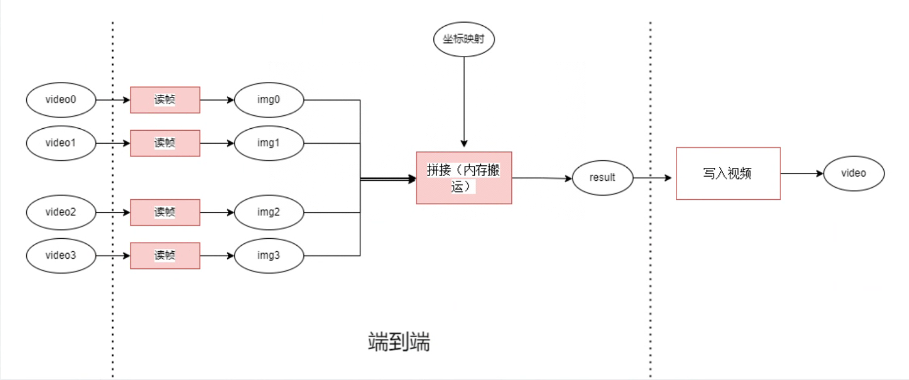

# 多路视频拼接

## 1. 简介
本开发样例基于opencv实现了对4路视频流的拼接，其端到端处理流程如下：

## 2. 适用场景
多路视频拼接将多路具有重叠区域的小视频拼接为一路完整大视野场景，有效解决单个摄像头视野局限性的问题，在智能监控，虚拟现实等领域有着广泛应用
## 3. 目录结构
本工程名称为VideoStitch，工程目录如下图所示：
```
VideoStitch
|---- src                               // 源文件脚本文件夹
|   |---- main.cpp
|   |---- stitch.cpp
|   |---- util.h
|---- run.sh                            // 运行脚本
|---- test.sh                           // 测试脚本
|---- README.md
|---- build.sh                          // 编译脚本
|---- flow.png
```
## 4. 依赖
### 4.1 依赖版本
| 软件名称 | 版本   |
| :--------: | :------: |
|ubuntu 18.04|18.04.1 LTS   |
|gcc|7.5.0|
|C++ | 11 |
|opencv|4.5.2|
|opencv_contrib|4.5.2|

### 4.2 200dk上opencv和opencv_contrib安装流程
因200dk上网络配置可能遇到问题且编译较慢，可以采用同架构机器编译安装opencv之后移植到200dk上的方式。

#### 4.2.1 在aarch64平台上编译安装opencv和opencv_contrib
a. 安装可能需要的依赖
```
sudo apt-get update
sudo apt-get install build-essential
sudo apt-get install cmake git libgtk2.0-dev pkg-config libavcodec-dev libavformat-dev libswscale-dev
sudo apt-get install python-dev python-numpy libtbb2 libtbb-dev libjpeg-dev libpng-dev libtiff-dev libjasper-dev libdc1394-22-dev
```
b. 下载并解压opencv及opencv_contrib源码包
```
wget https://github.com/opencv/opencv/archive/4.5.2.zip -O opencv-4.5.2.zip
wget https://github.com/opencv/opencv_contrib/archive/refs/tags/4.5.2.zip -O opencv_contrib-4.5.2.zip
unzip opencv-4.5.2.zip
unzip opencv_contrib-4.5.2.zip
```
c. 编译安装
```
mkdir opencv-4.5.2/build && cd opencv-4.5.2/build
cmake -D CMAKE_BUILD_TYPE=Release -D BUILD_opencv_world=ON -D OPENCV_DOWNLOAD_MIRROR_ID=gitcode -D OPENCV_ENABLE_NONFREE=ON -D BUILD_TIFF=ON -D OPENCV_GENERATE_PKGCONFIG=ON -D CMAKE_INSTALL_PREFIX=xxx/opencv_install -D OPENCV_EXTRA_MODULES_PATH=../../opencv_contrib-4.5.2/modules ..
# CMAKE_INSTALL_PREFIX参数指定目标安装路径，可根据实际情况配置
# OPENCV_EXTRA_MODULES_PATH参数为解压后的opencv_contrib-4.5.2目录下modules的路径，可根据实际情况配置
make -j20
make install
```
>若遇到下载文件失败问题，可从OBS手动下载模型等文件到opencv-4.5.2/.cache下。
>下载链接：https://mindx.sdk.obs.cn-north-4.myhuaweicloud.com/ascend_community_projects/VideoStitch/cache.zip
#### 4.2.2 将编译安装的opencv(包括了opencv_contrib)移植到200dk
a. 安装可能需要的依赖
```
sudo apt-get update
sudo apt-get install build-essential
sudo apt-get install cmake git libgtk2.0-dev pkg-config libavcodec-dev libavformat-dev libswscale-dev
sudo apt-get install python-dev python-numpy libtbb2 libtbb-dev libjpeg-dev libpng-dev libtiff-dev libjasper-dev libdc1394-22-dev
```
注意，需要保证依赖版本和编译时一致，否则可能导致依赖库无法正确链接

b. 将已经编译安装的目标目录(即CMAKE_INSTALL_PREFIX配置的目录opencv_install）上传到200dk的任意位置。
注意，为防止破环lib文件软连接，建议打包压缩后进行传输
```
# 压缩命令
tar -zcvf opencv_install.tar.gz opencv_install/
#解压命令
tar -zxvf opencv_install.tar.gz
```
c. 配置环境变量

找到200dk上的目标目录下pc文件 opencv_install/lib/pkgconfig/opencv4.pc并修改prefix为当前opencv_install路径
在/etc/profile文件末尾添加如下环境变量
```
export PKG_CONFIG_PATH=xxx/opencv_install/lib/pkgconfig:$PKG_CONFIG_PATH
export LD_LIBRARY_PATH=$LD_LIBRARY_PATH:XXX/opencv_install/lib
```
更新配置
```
source /etc/profile
```

## 5. 数据准备
### 5.1 限制说明
- 输入视频规格为：格式：mp4，分辨率：1920*1080;
- 传入数据需为4路的固定机位的同步1080P视频，即4个机位的相对位置为近似四宫格且是固定的视频;
- 视频之间需要存在少部分重叠以作为拼接配准依据;
- 位于左上角的视频为基准，做为第一个视频输入。

### 5.2 准备数据
执行以下命令创建“data”目录，并将待拼接的4个视频放入创建的目录中：
```
cd ${VideoStitch代码根目录}
mkdir data
```
注：若需人工制作简单视频数据用于测试，可使用视频编辑工具对分辨率较高的完整视频按“16:9”的宽高比进行裁剪、旋转、缩放后导出四个互相之间有重叠的MP4格式、分辨率为1920*1080的视频，作为样例输入。

## 6.编译及运行
### 6.1 编译
执行以下命令进行编译，并在${VideoStitch代码根目录}下生成“main”的二进制文件：
```
cd ${VideoStitch代码根目录}
bash build.sh
```

### 6.2 运行
对"run.sh"脚本做以下修改：
```
    VIDEO0="${左上角视频及路径}"   # 左上角视频路径，作为拼接基准
    VIDEO1="${右上角视频及路径}"
    VIDEO2="${左下角视频及路径}"
    VIDEO3="${右下角视频及路径}"
```
保存后，执行以下命令进行视频拼接，并在当前目录下生成分辨率为3840*2160的“output.avi”视频：
```
bash run.sh
```
注：

1、因该操作会输出视频，受限于200DK环境内存，测试时建议输入视频时长在2分钟以内，防止系统卡死；

2、本样例对于（非）旋转缩放视频均有良好的拼接能力；

脚本中的参数说明：
```
    VIDEO(0-3)：待拼接的4路视频及路径；
    FRAMES：需要拼接的帧数，“0”表示拼接完整视频所有帧；
    VIDEO_GLAG：是否保存拼接的视频，“0”表示只执行拼接过程，不输出视频；“1”表示执行拼接并输出视频；
    MINHESSIAN：特征提取算法阈值，默认“2000”，若视频特征点较不明显，或视频重叠部分较少，可适当减小该值,可调整范围(0, 10000)；
```

## 7. 性能测试

对“test.sh”脚本做以下修改（修改可参考6.2节中的参数说明）：
```
    VIDEO0="${左上角视频及路径}"   # 左上角视频路径，作为拼接基准
    VIDEO1="${右上角视频及路径}"
    VIDEO2="${左下角视频及路径}"
    VIDEO3="${右下角视频及路径}"
    FRAMES=40  # 可根据需要进行修改
```
保存后，执行以下命令进行性能测试，性能结果将在回显中体现：
```
bash test.sh
```
测试数据如下：
| 拼接帧数 | 耗时 |
| :--------: | :------: |
|40|0.558s|
|100|0.561s|

## 8 Q&A
### 8.1 运行脚本时出现“读取视频失败”
> 可能是因为视频路径错误
### 8.2 输出的视频出现黑色区域
>边缘出现黑色或黑色区域属于正常结果，因为拼接后的视频小于画布size,默认用0，0，0填充

### 8.3 运行拼接时出现“OpenCV(4.5.2) xxx/opencv-4.5.2/modules/core/src/matrix_wrap.cpp:1667: error: (-215:Assertion failed) !fixedSize() in function 'release'”
>可能是因为基准帧指定错误或视频重叠部分提取相同特征点失败导致拼接失败，请检查输入视频或减小MINHESSIAN参数,