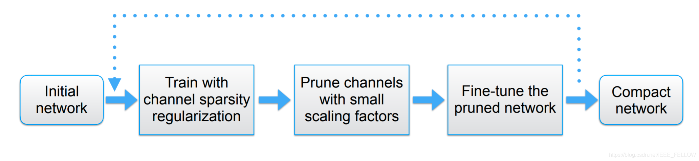
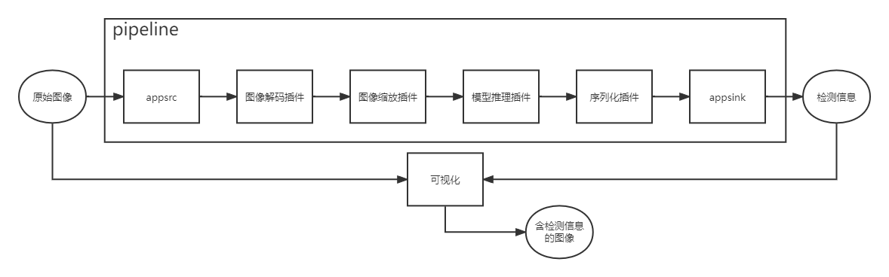
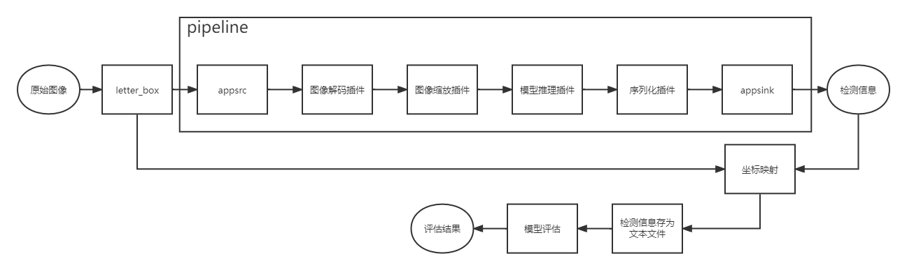
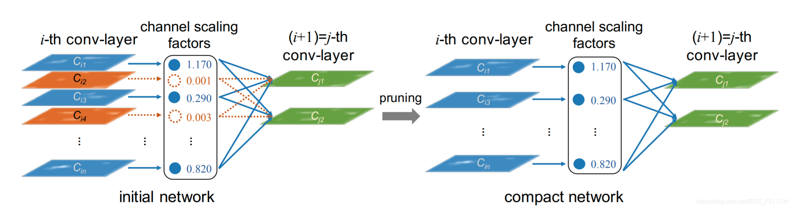
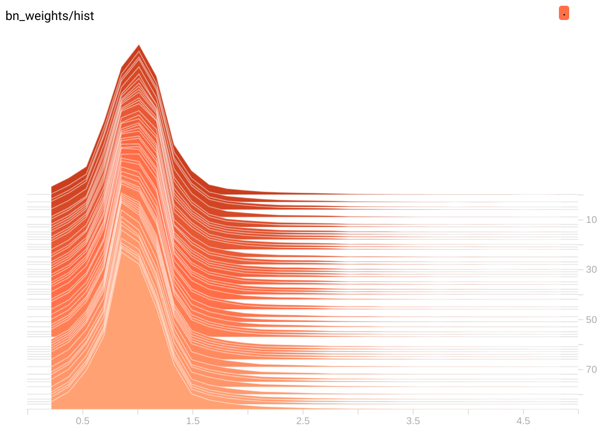
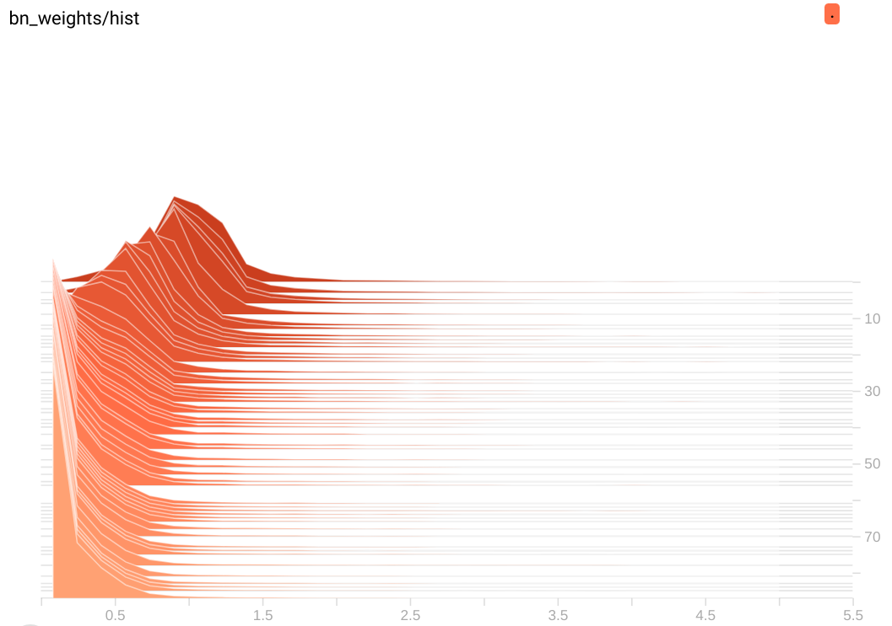

# YOLOv5目标检测模型的剪枝

## 1 介绍

基于[yolov5](https://so.csdn.net/so/search?q=yolov5&spm=1001.2101.3001.7020) v5.0分支进行剪枝，采用yolov5s模型，原理为Learning Efficient Convolutional Networks Through Network Slimming（https://arxiv.org/abs/1708.06519）。

yolov5s是非常优秀的轻量级检测网络，但是有时候模型依然比较大，使得我们不得不缩减网络输入大小，但是单纯降低输入来减少运算，例如640降低到320，对检测效果损失很大，同时模型体积依然是14M左右，所以可以通过添加L1正则来约束BN层系数，使得系数稀疏化，通过稀疏训练后，裁剪掉稀疏很小的层，对应激活也很小，所以对后面的影响非常小，反复迭代这个过程，可以获得很compact的模型，步骤基本是这样。



剪枝完成后的模型使用MindX SDK开发部署，在昇腾芯片上进行对图片中目标的检测与最终推理结果的评估，可将结果进行可视化并保存。主要处理流程为：输入图片->图片解码->图片缩放->模型推理->模型后处理->输出推理结果。

### 1.1 支持的产品

昇腾310(推理),昇腾200dk

### 1.2 支持的版本

本样例配套的CANN版本为[5.0.4](https://www.hiascend.com/software/cann/commercial)。支持的SDK版本为[2.0.4](https://www.hiascend.com/software/Mindx-sdk)。

MindX SDK安装前准备可参考《用户指南》，[安装教程](https://gitee.com/ascend/mindxsdk-referenceapps/blob/master/docs/quickStart/1-1安装SDK开发套件.md)

### 1.3 软件方案介绍

表1.1 系统方案各子系统功能描述：

| 序号 | 子系统         | 功能描述                                                     |
| ---- | -------------- | :----------------------------------------------------------- |
| 1    | 输入插件       | 向Stream中发送数据，appsrc将数据发给下游插件。               |
| 2    | 图像解码       | 用于视频解码，当前只支持H264/H265格式。                      |
| 4    | 图像处理       | 对解码后的YUV格式的图像进行指定宽高的缩放，暂时只支持YUV格式 的图像。 |
| 5    | 模型推理插件   | 目标分类或检测。                                             |
| 6    | 模型后处理插件 | 实现对yolov5模型输出的tensor解析，获取目标检测框以及分类类型。 |
| 7    | 输出插件       | 输入推理结果数据。                                           |

### 1.4 代码目录结构与说明

```
├── CMakeLists.txt
├── compute_mAP
│   ├── reval_voc.py
│   └── voc_eval.py
├── main.cpp
├── models
│   └── yolov5
│       ├── aipp_yolov5.cfg
│       ├── voc.names
│       ├── yolov5_detect.cfg
│       └── yolov5_eval.cfg
├── pipeline
│   ├── detect.pipeline
│   └── eval.pipeline
├── README.md
├── build.sh
└── run.sh
```

###  1.5 技术实现流程图

detect：



evaluate：




letterbox：在大多数目标检测算法中，由于 **卷积核为方形**（不排除卷积核有矩形的情况），所以模型输入图片的尺寸也需要为方形。然而大多数数据集的图片基本上为 **矩形**，直接将图片 resize 到正方形，会导致图片失真，比如细长图片中的物体会变畸形。

letterbox操作：在对图片进行resize时，保持原图的长宽比进行等比例缩放，当长边 resize 到需要的长度时，短边剩下的部分采用灰色填充。

###  1.6 特性及适应场景  
本案例可以满足对图片的目标检测，但有以下限制：  
1、图片格式应为JPEG编码格式，后缀为(.jpg)。  
2、当前模型目标类别为VOC数据集的20个类别，包括：aeroplane、bicycle、bird、boat、bottle、bus、car、cat、chair、cow、diningtable、dog、horse、motorbike、person、pottedplant、sheep、sofa、train、tvmonitor。  
3、可参考模型训练部分，使用自己的数据集训练模型，以获得更好的检测结果。
##  2 环境依赖

部署环境搭建可参考[200dk开发板环境搭建](https://gitee.com/ascend/docs-openmind/blob/master/guide/mindx/ascend_community_projects/tutorials/200dk开发板环境搭建.md)

在编译运行项目前，需要设置环境变量:  
1、根据自己安装的ascend-toolkit下的set_env.sh以及sdk下的set_env.sh设置环境变量。  
2、通过命令把全局日志级别设置为error级别 ''' export ASCEND_GLOBAL_LOG_LEVEL=3 '''

训练环境搭建可参考https://github.com/ultralytics/yolov5

## 3 模型训练

### 3.1 代码获取

https://github.com/midasklr/yolov5prune

### 3.2 数据集准备

VOC2007数据集，训练集为VOC07 trainval， 验证集为VOC07 test。
数据集地址：http://host.robots.ox.ac.uk/pascal/VOC/voc2007/VOCtest_06-Nov-2007.tar 或者 http://pjreddie.com/media/files/VOCtest_06-Nov-2007.tar

### 3.3 训练命令示例

```shell
#稀疏训练
python train_sparsity.py --st --sr 0.0001 --weights yolov5s.pt --adam --epochs 100
#剪枝
python prune.py --weights runs/train/exp1/weights/best.pt --percent 0.5 --cfg models/yolov5s.yaml
#微调
python finetune_pruned.py --weights pruned_model.pt --adam --epochs 100
```

### 3.4 原理

相关论文：Learning Efficient Convolutional Networks through Network Slimming


BN层的计算是这样的：
$$
\hat{z} =  \frac{z_{in} - \mu_\beta}{\sqrt{\sigma^2_\beta + \epsilon}};z_{out} = \gamma \hat{z} + \beta
$$
所以每个channel激活值$z_{out}$大小和系数$\gamma$（pytorch对应bn层的weights，$\beta$对应bias）正相关，如果$\gamma$太小接近于0，那么激活值也非常小：



那么拿掉那些$\gamma$趋于0的channel是可以的，但是一般情况下，训练一个网络后，bn层的系数是类似正态分布：



0附近的值是很少的，所以没法剪枝。

通过添加$L1$正则约束，可以将参数稀疏化：
$$
L=\sum_{(x,y)}\ l(f(x,W),y)+\lambda \sum_{\gamma \in \Gamma}g(\gamma)
$$
上面第一项是正常训练的loss函数，第二项是约束，其中$g(s)=|s|$，λ是正则系数。反向传播时:
$$
L'=\sum l'+\lambda\sum g'(\gamma)=\sum l'+\lambda\sum |\gamma|'=\sum l'+\lambda \sum sign(\gamma)
$$

```python
            # Backward
            loss.backward()
            # scaler.scale(loss).backward()
            # # ============================= sparsity training ========================== #
            srtmp = opt.sr*(1 - 0.9*epoch/epochs)
            if opt.st:
                ignore_bn_list = []
                for k, m in model.named_modules():
                    if isinstance(m, Bottleneck):
                        if m.add:
                            ignore_bn_list.append(k.rsplit(".", 2)[0] + ".cv1.bn")
                            ignore_bn_list.append(k + '.cv1.bn')
                            ignore_bn_list.append(k + '.cv2.bn')
                    if isinstance(m, nn.BatchNorm2d) and (k not in ignore_bn_list):
                        m.weight.grad.data.add_(srtmp * torch.sign(m.weight.data))  # L1
                        m.bias.grad.data.add_(opt.sr*10 * torch.sign(m.bias.data))  # L1
            # # ============================= sparsity training ========================== #

            optimizer.step()
                # scaler.step(optimizer)  # optimizer.step
                # scaler.update()
            optimizer.zero_grad()
```

稀疏训练后的分布：



可以明显看到，随着训练进行（纵轴是epoch），BN层参数逐渐从最上面的正太分布趋向于0附近。

稀疏训练完成后可以进行剪枝，一个基本的原则是阈值不能大于任何通道bn的最大$\gamma$。然后根据设定的裁剪比例剪枝。

### 3.5 训练结果

| model                      | size | mAP@.5 | mAP@.5:.95 | train                  | params(M) |
| -------------------------- | ---- | ------ | ---------- | ---------------------- | --------- |
| yolov5s                    | 512  | 0.743  | 0.481      | bs64，adam， 100epochs | 13.79     |
| yolov5s-sparse 0.001       | 512  | 0.741  | 0.482      | bs64，adam， 100epochs | 13.79     |
| finetune-yolov5s-50%-prune | 512  | 0.742  | 0.477      | bs64，adam， 100epochs | 5.08      |
| finetune-yolov5s-55%-prune | 512  | 0.731  | 0.461      | bs64，adam，100epochs  | 4.39      |
| finetune-yolov5s-60%-prune | 512  | 0.721  | 0.443      | bs64，adam，100epochs  | 3.80      |

## 4 模型转换

ONNX模型可通过[地址](https://mindx.sdk.obs.cn-north-4.myhuaweicloud.com/ascend_community_projects/yolov5prune/prune_onnx.rar)获取，下载后使用模型转换工具 ATC 将 pb 模型转换为 om 模型，模型转换工具相关介绍参考链接：[https://www.hiascend.com/document/detail/zh/CANNCommunityEdition/60RC1alpha02/infacldevg/atctool/atlasatc_16_0001.html](https://www.hiascend.com/document/detail/zh/CANNCommunityEdition/60RC1alpha02/infacldevg/atctool/atlasatc_16_0001.html) 。

模型转换，步骤如下：

1. 将上述 onnx 模型移动至 `models/yolov5`文件夹下。
2. 执行命令：

```
atc \
--model=prune60_t.onnx \
--framework=5 \
--output=./prune60_t \
--input_format=NCHW \
--input_shape="images:1,3,512,512" \
--enable_small_channel=1 \
--insert_op_conf=./aipp_yolov5.cfg \
--soc_version=Ascend310 \
--out_nodes="Transpose_260:0;Transpose_520:0;Transpose_780:0"  #a  
#--out_nodes="Transpose_260:0;Transpose_556:0;Transpose_825:0" #b 
#可通过netron工具查看out_nodes,不同权重可能会存在差异。  
#如果使用本仓提供的权重，a对应prune55和prune60，b对应prune50。
```

执行该命令后会在当前文件夹下生成项目需要的模型文件 `prune60_t.om`。执行后终端输出为：

```
ATC run success, welcome to the next use.
```

表示命令执行成功。

## 5 编译与运行

**步骤1** 按照第 2 小结**环境依赖**中的步骤设置环境变量。

**步骤2** 按照第 4 小节**模型获取**中的步骤获得模型文件，放置对应目录下。

**步骤3** 运行。执行命令：

```shell
#task_type为detect、speed或eval
#task_type为detect或speed时：
#image_set是一个文本文件，每一行是一个不包含后缀的图片名，例如，VOCdevkit/VOC2007/ImageSets/Main/test.txt
#image_dir为image_set中图片所在目录，例如，VOCdevkit/VOC2007/JPEGImages/
bash run.sh [task_type][image_set][image_dir]
#task_type为eval时：
#dataset_path为标准VOC数据集路径，例如，./data/VOCdevkit/
bash run.sh eval [dataset_path]
```
1、执行detect任务，会在当前目录下生成image_result目录，其中存放推理生成的图片结果。  
2、执行speed任务，不会保存图片结果，会在终端打印推理性能信息。  
3、执行eval任务，会将目标检测的结果保存到txt_result目录下，然后根据保存的检测结果计算精度，并将结果打印到当前终端。

