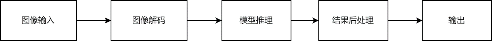
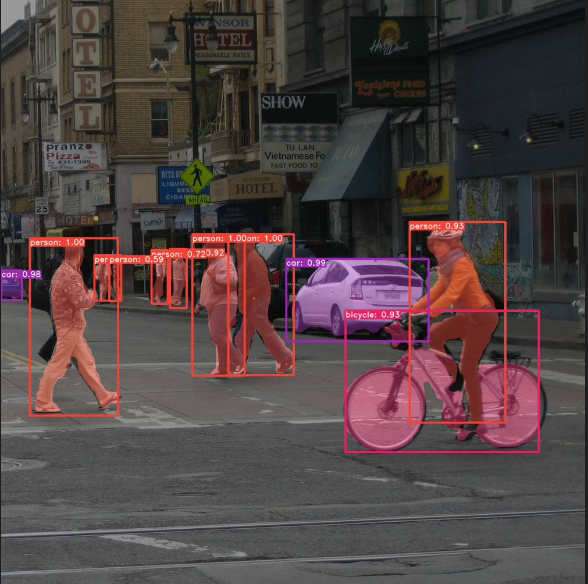
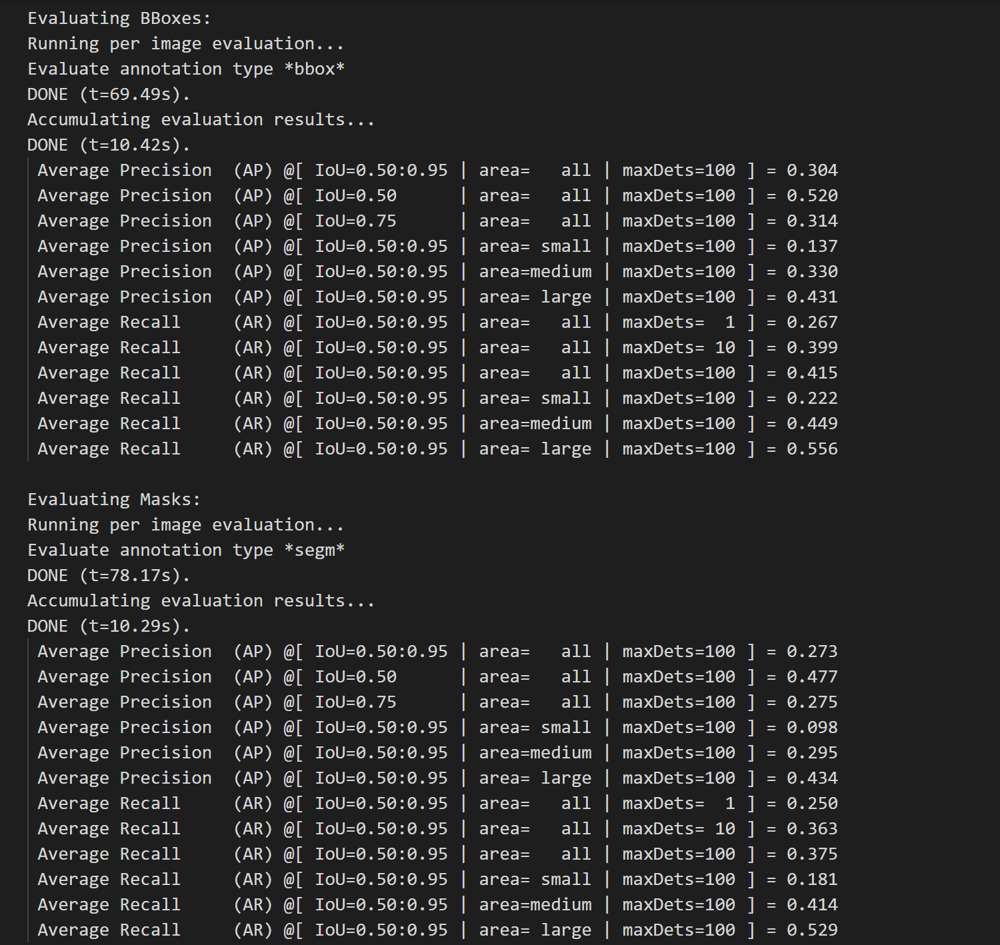

# 基于Yolact的实例分割模型

## 1 介绍
在本系统中，目的是基于MindX SDK，在华为云昇腾平台上，开发**基于Yolact的实例分割模型**的参考设计，实现**对图像中的实例的分割和目标识别的功能**的功能，，达到功能要求样例输入：生活场景的图片。样例输出：带有目标识别框精度和实例分割结果的jpg图片。

### 1.1 支持的产品

支持昇腾310芯片,昇腾200dk

### 1.2 支持的版本

支持21.0.4版本

eg：版本号查询方法，在Atlas产品环境下，运行命令：

```
npu-smi info
```
本样例配套的CANN版本为[5.0.4](https://www.hiascend.com/software/cann/commercial)。支持的SDK版本为[2.0.4](https://www.hiascend.com/software/Mindx-sdk)。

MindX SDK安装前准备可参考《用户指南》，[安装教程](https://gitee.com/ascend/mindxsdk-referenceapps/blob/master/docs/quickStart/1-1安装SDK开发套件.md)

### 1.3 软件方案介绍

本系统设计了不同的功能模块。主要流程为：图片传入流中,利用Yolact的实例分割模型推理，最后输出识别结果。各模块功能描述如表2.1所示：

表1 系统方案中各模块功能：

| 序号 | 子系统   | 功能描述                                                     |
| :--- | :------- | :----------------------------------------------------------- |
| 1    | 图像输入 | 调用appsrc插件，输入tensor                          |
| 2    | 模型推理 | 调用mxpi_tensorinfer插件，将tensor传入Yolact模型中进行推理           |
| 3    | tensor化 | 调用mxpi_dataserialize插件，得到推理结果 |
| 4    | 结果输出 | 调用appsink插件，得到输出结果           |
### 1.4 代码目录结构与说明

    工程目录如下图所示：

```
├── convert
│   └── -----
├── model_data	
│   └── -----
├── utils	
│   └── -----
├── images	
│   └── -----
├── main.py	
├── README.md			
```

### 1.5 技术实现流程图


图1 Yolact模型流程图



图2 Yolact模型pipeline示意图

### 1.6 特性及适用场景

项目适用于光照条件较好，背景简单，且图片较清晰的测试图片

## 2 环境依赖

eg：推荐系统为ubuntu 18.04或centos 7.6，环境依赖软件和版本如下表：

|   软件名称    |    版本     |
| :-----------: | :---------: |
|    ubantu     | 18.04.1 LTS |
|   MindX SDK   |    2.0.4    |
|    Python     |    3.9.2    |
|     CANN      |    5.0.4    |
|     numpy     |   1.22.3    |
| opencv-python |    4.5.5    |

在编译运行项目前，需要设置环境变量：

- 环境变量介绍

```bash
# 执行如下命令，打开.bashrc文件
vim ~/.bashrc
# 在.bashrc文件中添加以下环境变量
. ${MX_SDK_HOME}/set_env.sh
. ${HOME}/Ascend/ascend-toolkit/set_env.sh
# 其中${MX_SDK_HOME}为MindX SDK安装目录，${HOME}为用户目录（如果CANN 开发包装在用户目录，否则为/usr/local/），配置的时候请自行替换成相应目录
# 保存退出.bashrc文件
# 执行如下命令使环境变量生效
source ~/.bashrc

#查看环境变量
env
```

## 3 模型转换

**步骤1** 从Yolact代码仓库中下载源码与已训练的pth模型文件。

> 模型链接：https://mindx.sdk.obs.cn-north-4.myhuaweicloud.com/ascend_community_projects/Yolact/yolact_weights_coco.pth

**步骤2** 将pth模型文件转换成onnx，利用原仓库中pytorch代码可以实此功能。

> 仓库链接：https://github.com/bubbliiiing/yolact-pytorch

**步骤3** 将转化后的Yolact模型onnx文件存放至`./convert`。


**步骤4** 模型转换
在`./convert`目录下执行以下命令。

```bash
# 执行前需确保环境变量正确配置
# 执行，转换Yolact模型
# Execute, transform Yolact model.

bash convert_om.sh  [INPUT_ONNX_PATH]  [OUTPUT_OM_PATH_NAME]
```

执行完模型转换脚本后，会生成相应的om模型文件。 

> 模型转换使用了ATC工具，如需更多信息请参考: https://mindx.sdk.obs.cn-north-4.myhuaweicloud.com/ascend_community_projects/Yolact/yolact_second.om

## 4 运行

**步骤1** 

将需要推理的图像放到文件夹中

**步骤2**

执行推理时指定输入图像路径

```bash
python3 main.py --image='path_to_image'
```

结果展示：



## 5 精度测试

**步骤1**：准备测试数据和om模型文件,测试集选择使用COCO数据集。数据集放置遵循上文所讲目录结构。

	> 测试数据集链接:https://cocodataset.org/#home
	>
	> om模型文件链接：https://mindx.sdk.obs.cn-north-4.myhuaweicloud.com/ascend_community_projects/Yolact/yolact_second.om
数据集放置结构
```
├── data
│   ├── coco_test
│   │   ├── annotations     
│   │   ├── images    
├── convert
│   └── -----
├── model_data	
│   └── -----
├── utils	
│   └── -----
├── images	
│   └── -----
├── main.py	
├── README.md	
```
**步骤2**：执行如下命令循环输入测试数据集图片

```bash
python3 main.py
```

执行完推理后推理结果会保存到map_out文件夹下，bbox精度相关数据会写入bbox_detections.json文件里，mask精度相关数据会写入mask_detections.json文件里，之后会自动进行精度计算。

结果如下图所示：


