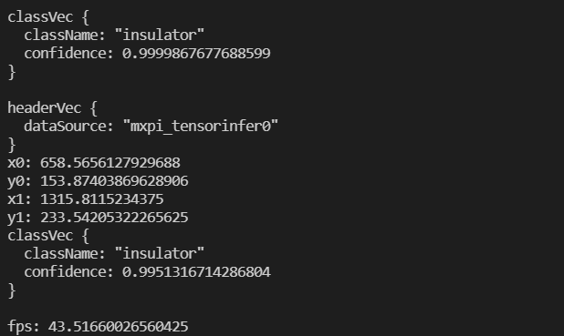

# insualtorDetection
## 1.介绍
本开发样例基于mindSDK开发，在昇腾芯片上对输入的图片进行电力绝缘子的检测，并将检测结果进行保存。


### 1.1 支持的产品
本项目以昇腾Atlas310卡为主要的硬件平台。

### 1.2 支持的版本
支持的SDK版本为 2.0.4, CANN 版本为 5.0.4。

### 1.3 软件方案介绍
基于mindSDK的电力绝缘子检测模型的推理流程为：<br>
<br>
待检测图片通过appsrc插件输入，然后使用mxpi_imagedecoder将图片进行解码，再通过图像缩放插件mxpi_imageresize将图片缩放至合适的分辨率，缩放后的图像输入模型推理插件mxpi_tensorinfer得到输出，随后将得到的输出输入后处理插件mxpi_objectpostprocessor进行后处理，最后将结果输出给appsink完成整个pipeline流程，最后在外部使用python对得到的结果进行绘制完成可视化显示，本系统的各模块及功能如表所示:
<br><br>
表1 系统方案各功能模块描述:
|序号|子系统|功能描述|
|-----|-----|-----|
|1|图片输入|获取jpg格式图片
|2|图片解码|解码图片为YUV420p
|3|图片缩放|将图片缩放到合适的分辨率
|4|模型推理|对输入的张量进行推理
|5|电力绝缘子检测后处理|对模型推理输出进行计算得到检测框
|6|结果可视化|将电力绝缘子检测结果保存为可视化图片
<br>

### 1.4 代码目录结构与说明
项目名为insualtorDetection，项目目录如图所示

``` 
│  README.md
├─python
│      colorlist.txt
│      visualize.py
│      main.py
│
├─data (自行创建，存放测试图片)
│
├─img   
│      test_output.png 
│      fps.png
│      precision.png
│
├─model
│      label.names
│      yolo.cfg  
│      run.sh
│      yolo_aipp.cfg
│
├─test
│      map_calculate.py
│      parse_COCO.py  
│      testmain.py
│
├─pipeline
│      detect.pipeline
```

### 1.5 特性即适用场景
项目适用于光照条件较好，背景简单，且图片较清晰的测试图片

以下几种情况下，检测效果不够理想：1.图片中的绝缘子很小，使得检测置信度偏低或者检测不到。


## 2. 环境依赖


### 2.1 环境变量


运行模型前要设置环境变量，命令如下,请自行修改bash脚本中的SDK_PATH和ascend_toolkit_path

```bash
. ${SDK-path}/set_env.sh  ## 修改${SDK-path}为你自己的SDK安装路径
. ${ascend_toolkit_path}/set_env.sh ## 修改${ascend_toolkit_path}为自己Ascend的ascend_toolkit路径

```
<br>

### 2.2 软件依赖

|依赖软件|版本|
|-----|-----|
CANN|20.4.0
python|3.9.2
MINDX_SDK|2.0.4
opencv-python|4.5.3
numpy|1.21.2
webcolors|1.12

<br>

## 3.模型转换

模型转换是将onnx文件转成MindX_SDK可以使用的om模型，om模型的链接已上传至 https://mindx.sdk.obs.cn-north-4.myhuaweicloud.com/ascend_community_projects/Insulator_detection/insulator.om
。用户可以直接下载使用，如需将onnx转化成om，请按下列步骤进行操作。

#### 步骤1 下载onnx模型文件
本工程原型是pytorch模型，需要使用atc工具转换为om模型，模型权重文件已上传至
https://mindx.sdk.obs.cn-north-4.myhuaweicloud.com/ascend_community_projects/Insulator_detection/insulator.onnx

<br>

#### 步骤2 将模型放到models目录下
<br>

#### 步骤3 AIPP配置
由于pipeline中的解码格式为YUV，而模型的输入格式为RGB，所以需要在atc模型转换的时候配置AIPP，AIPP配置的内容如下

```
aipp_op {
    aipp_mode: static
    input_format : YUV420SP_U8
    csc_switch : true
    rbuv_swap_switch : false
    matrix_r0c0 : 256
    matrix_r0c1 : 0
    matrix_r0c2 : 359
    matrix_r1c0 : 256
    matrix_r1c1 : -88
    matrix_r1c2 : -183
    matrix_r2c0 : 256
    matrix_r2c1 : 454
    matrix_r2c2 : 0
    input_bias_0 : 0
    input_bias_1 : 128
    input_bias_2 : 128
    var_reci_chn_0 : 0.003921568627451
    var_reci_chn_1 : 0.003921568627451
    var_reci_chn_2 : 0.003921568627451
}


```

#### 步骤4 转换模型
跳转到models目录，运行如下命令，进行模型转换。

```
bash run.sh
```

模型转换结果如下，如果出现ATC run success，说明转换模型成功

```bash
ATC start working now, please wait for a moment.
ATC run success, welcome to the next use.
```


## 4.编译运行
<br>

### 4.1 获取测试图片
<br>
新建一个data文件夹，将需要测试的jpg图片放入该文件夹。
<br> 
<br>


### 4.2 修改pipeline的后处理路径

本应用使用的是MindX_SDK提供的后处理库，将${MX_SDK_HOME}改为自己SDK安装的路径

```
"mxpi_objectpostprocessor0": {
            "props": {
                "dataSource": "mxpi_tensorinfer0",
                "postProcessConfigPath":"../models/yolo.cfg",
                "labelPath": "../models/label.names",
                "postProcessLibPath":  "${MX_SDK_HOME}/lib/modelpostprocessors/libyolov3postprocess.so"
            },
            "factory": "mxpi_objectpostprocessor",
            "next": "appsink0"
        },        
```

### 4.3 运行推理工程
进入python目录，打开main.py，其中有个FILENAME为输入的图片路径，RESULTNAME为输出的图片路径，将其修改为自己需要的路径。执行python文件

```
python main.py
```
图片结果保存在自己设置的RESULTFILE目录下。


<br>


## 5.评估精度
<br>

数据集链接 https://mindx.sdk.obs.myhuaweicloud.com/ascend_community_projects/Insulator_detection/dataset.zip


在test目录下创建dataset文件夹，把下载的coco数据集的JPGIMAGES和json放到该文件夹下。JPGIMAGES下有一个README文件，将他删除，运行如下代码

```bash
python parse_coco.py

python testmain.py

python map_calculate.py

```

精度评估的结果会存放到output文件下，评估的结果如下图


精度与原模型精度相差0.5%，目标精度要求精度与原模型精度相差不超过1%，符合精度要求。


## 6.FPS测试
选择一张1080P的图片放到data目录下，跳转至python目录

```
python main.py
```

结果如下

目标要求是1080P的图片检测fps达到10以上，符合要求。


